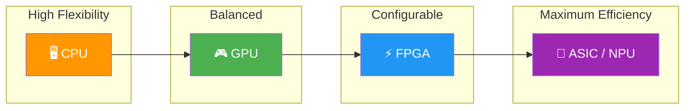
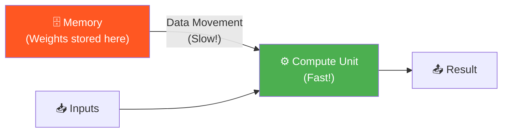

# Why Custom Hardware for AI?

> **Learning Objectives**
> - Understand why general-purpose processors (CPUs/GPUs) fall short for AI workloads
> - Compare the compute platforms available for AI: CPU, GPU, FPGA, and ASIC
> - Recognize the computation vs. communication bottleneck that drives accelerator design
> - Learn key performance metrics: TOPS, FPS, and GOPS/Watt

---

## 1. The AI Hardware Problem

Artificial intelligence workloads — from image classification to language models — share a common trait: they require an **enormous number of mathematical operations** (primarily multiplications and additions) to be performed quickly and efficiently.

Consider a simple image classification task. A model receives a photograph and must determine what it contains — a car, a dog, a building. Under the hood, the image passes through layers of mathematical transformations, each involving thousands to millions of multiply-and-add operations.

The critical question is: **What hardware should run these operations?**


The answer is not as obvious as it might seem. Let's explore why.

---

## 2. The Computing Platform Spectrum

There are four major platforms for running AI workloads, each with distinct trade-offs:



### CPU (Central Processing Unit)
A CPU has a small number of **powerful, versatile cores** (typically 4–16). Each core can handle complex logic, branching, and diverse instructions. However, a CPU has limited parallelism — it excels at sequential tasks but struggles when thousands of identical operations must be performed simultaneously.

### GPU (Graphics Processing Unit)
A GPU flips the CPU's design philosophy. Instead of a few powerful cores, it packs **thousands of simpler cores**. Each individual GPU core is less capable than a CPU core, but when a task can be decomposed into thousands of parallel sub-tasks — as happens with pixel-level image processing — the GPU delivers massive throughput.

> **Key Insight**: A GPU provides speedup **only** when there is scope for parallelism. Running a serial program on a GPU will actually be *slower* than on a CPU, because each GPU core is individually weaker.

### FPGA (Field-Programmable Gate Array)
An FPGA is a chip with reconfigurable logic blocks. You can **program the hardware itself** to implement exactly the circuit you need. This gives near-ASIC performance with the flexibility to reprogram for different workloads. FPGAs excel in energy efficiency for AI tasks.

### ASIC (Application-Specific Integrated Circuit)
An ASIC is a chip designed for **one specific task**. If you build an ASIC for image classification, that's all it does — but it does it with maximum efficiency. Google's TPU (Tensor Processing Unit) and Apple's Neural Engine are examples of AI-specific ASICs.

### Comparison at a Glance

| Platform | Cores | Per-Core Power | Parallelism | Flexibility | Energy Efficiency |
|:---|:---|:---|:---|:---|:---|
| **CPU** | 4–16 (powerful) | High | Low | Very High | Low |
| **GPU** | 1000s (simple) | Low | Very High | Medium | Medium |
| **FPGA** | Configurable | Medium | High | High | High |
| **ASIC/NPU** | Fixed (optimized) | Optimized | Very High | Very Low | Very High |

---

## 3. The Computation vs. Communication Bottleneck

Here is the fundamental insight that drives all accelerator design:

> **Every computing system must do two things: Computation and Communication.**

Consider a single artificial neuron with `M` inputs. The neuron must:
1. **Multiply** each input `x_i` by its weight `w_i` → `M` multiplications
2. **Add** all the products together → `M-1` additions  
3. **Apply** an activation function → 1 operation

If `M = 200`, we need 200 multiplications to happen **in parallel** for low latency. A CPU with 10 multipliers would need 20 serial rounds. Even 10 GPU cores only give us 100 parallel multipliers — the remaining 100 must wait.

But there is a deeper problem. The weights `w_0, w_1, ..., w_M` are stored in **memory**, not inside the compute units. They must be *fetched* from memory and *transported* to the ALU before any computation can begin:



**This data movement is often the bottleneck, not the computation itself.** Even GPUs, with thousands of cores, spend significant time waiting for data to arrive from memory. Custom accelerators address this by:
- Placing memory **closer** to compute units
- **Reusing** data that has already been fetched
- Designing **dataflows** that minimize total data movement

---

## 4. Why Inference Hardware Matters Most

AI has two phases:

| Phase | What Happens | Frequency | Typical Platform |
|:---|:---|:---|:---|
| **Training** | Model learns from data | One-time (or rare) | GPU clusters in the cloud |
| **Inference** | Trained model makes predictions | Continuous, real-time | Edge devices, phones, servers |

**Training is a one-time affair. Inference is an everyday business.**

Consider a facial recognition system at a cafeteria serving 500 people, each eating 4 meals per day:
- **Training**: Process 500 faces once → 2 days on GPUs → done for the year
- **Inference**: 500 × 4 × 365 = **730,000 inferences per year**, each requiring < 5 seconds latency

This is why the AI hardware industry focuses heavily on **inference accelerators** — they must be fast, power-efficient, and ideally small enough to fit on edge devices (phones, cameras, IoT sensors) without constant cloud connectivity.

> **Edge Computing**: Running AI models locally on the device, without needing an internet connection. This improves latency, privacy, and reliability.

---

## 5. Performance Metrics for AI Hardware

When evaluating AI hardware, these are the key metrics:

### TOPS — Tera Operations Per Second
- Measures raw computational throughput
- 1 TOPS = 10¹² operations/second
- An "operation" is typically one multiply or one add

### FPS — Frames Per Second
- For vision tasks: how many images can be classified per second
- Directly reflects real-world usefulness

### GOPS/Watt — Energy Efficiency
- Giga operations per second per watt of power consumed
- **The most critical metric for edge devices**
- A design consuming 2W at 4 TOPS achieves 2,000 GOPS/Watt

### Commercial AI Hardware Comparison

| Platform | Performance | Power | Best For |
|:---|:---|:---|:---|
| Qualcomm Hexagon DSP | 52 TOPS | ~10W | Mobile applications |
| Apple Neural Engine (A17) | ~35 TOPS | ~6W | iPhone/iPad on-device AI |
| NVIDIA Jetson AGX | 275 TOPS | 60W | Robotics, autonomous vehicles |
| Google Edge TPU | 4 TOPS | 2W | IoT, smart cameras |
| STM32 Microcontroller | 462 MIPS | 0.36W | Ultra-low-power TinyML |
| FPGA Accelerators | 2.7–3.8 TOPS | 12–60W | Research, prototyping |

> **Key Trend**: Higher performance always costs more power. The art of accelerator design is maximizing TOPS while minimizing watts.

---

## 6. Code Example: Measuring Compute Requirements

```python
def estimate_compute(input_size, num_layers, params_per_layer):
    """
    Estimate the total multiply-accumulate (MAC) operations
    for a simple feedforward neural network.
    """
    total_macs = 0
    current_size = input_size
    
    for i, output_size in enumerate(params_per_layer):
        # Each fully connected layer: input_size × output_size MACs
        layer_macs = current_size * output_size
        total_macs += layer_macs
        print(f"Layer {i+1}: {current_size} × {output_size} = {layer_macs:,} MACs")
        current_size = output_size
    
    print(f"\nTotal MACs: {total_macs:,}")
    print(f"Total FLOPs (≈2× MACs): {total_macs * 2:,}")
    
    # Estimate time on different platforms
    cpu_tops = 0.001  # 1 GOPS
    gpu_tops = 10     # 10 TOPS  
    asic_tops = 100   # 100 TOPS
    
    for name, tops in [("CPU", cpu_tops), ("GPU", gpu_tops), ("ASIC", asic_tops)]:
        time_sec = (total_macs * 2) / (tops * 1e12)
        print(f"{name}: {time_sec*1000:.4f} ms per inference")

# Example: A small network for image classification
# Input: 224×224×3 = 150,528 pixels
# Hidden layers: 1024, 512, 256
# Output: 10 classes
estimate_compute(150528, 4, [1024, 512, 256, 10])
```

---

## Key Takeaways

- **CPUs** are versatile but lack the parallelism needed for AI workloads
- **GPUs** offer massive parallelism but are power-hungry and suffer from memory bottlenecks
- **FPGAs** provide a middle ground: reconfigurable hardware with good energy efficiency
- **ASICs/NPUs** deliver peak efficiency but are designed for specific tasks only
- The **computation vs. communication bottleneck** is the central challenge — fast ALUs are useless if data can't reach them quickly enough
- **Inference** (not training) is the primary target for custom hardware because it runs continuously at the edge

---

## Practice Problems

### Problem 1: Selecting the Right Platform

> **Context**: You are the CTO of *SmartLens*, an AI startup building real-time object detection for battery-powered security cameras. The camera must classify 30 frames per second from a 640×480 sensor, using a CNN model requiring 500 million MACs per frame.
>
> **Constraints**:
> - Battery budget: Maximum 3W continuous power
> - Latency per frame: ≤ 33 ms
> - No internet connectivity (fully edge-based)
> - Camera must operate for 8 hours on a 50 Wh battery
>
> **Tasks**:
> - (a) Calculate the minimum TOPS required to meet the throughput target. [2]
> - (b) From the commercial platforms listed in this chapter, which platform(s) could meet the power constraint? Justify. [2]
> - (c) Why would a GPU-based solution (e.g., Jetson AGX) be unsuitable despite exceeding the compute requirement? [1]

<details>
<summary><b>Solution</b></summary>

**(a)** Minimum TOPS:
- 500M MACs/frame × 2 FLOPs/MAC = 1 GFLOP/frame
- At 30 FPS: 1 GFLOP × 30 = 30 GFLOPs = 0.03 TOPS

**(b)** Platforms meeting ≤ 3W:
- **Google Edge TPU**: 4 TOPS at 2W ✅ — exceeds compute requirement by >100×, within power budget
- **STM32 Microcontroller**: 462 MIPS at 0.36W ✅ — within power budget, but at ~0.000462 TOPS, it may not meet real-time requirements without significant model optimization (quantization, pruning)
- All other platforms (Hexagon DSP ~10W, Apple NE ~6W, Jetson ~60W) exceed the 3W budget ❌

**(c)** Jetson AGX at 275 TOPS massively exceeds compute needs, but:
- Consumes **60W** — 20× the power budget
- Battery life: 50 Wh ÷ 60W = **0.83 hours** — far short of the 8-hour requirement
- Designed for robotics/vehicles with continuous power, not battery-operated cameras

</details>

### Problem 2: Computation vs. Communication Analysis

> **Context**: You are designing a single artificial neuron with 512 inputs for *NeuroChip Inc*. Each input is an 8-bit integer and each weight is an 8-bit integer. The neuron performs: `y = f(Σ(x_i × w_i))`.
>
> **Hardware specs**:
> - 64 parallel multipliers, each completing one 8-bit multiply per clock cycle
> - Clock frequency: 1 GHz
> - Memory bandwidth: 2 GB/s
>
> **Tasks**:
> - (a) How many clock cycles does the computation (multiply-accumulate) take? [1.5]
> - (b) How many bytes must be fetched from memory (all weights + all inputs)? [1]
> - (c) How long does the memory transfer take? Is this neuron compute-bound or memory-bound? [2.5]

<details>
<summary><b>Solution</b></summary>

**(a)** Computation cycles:
- 512 multiplications needed, 64 multipliers available
- Rounds needed: 512 ÷ 64 = **8 cycles** for multiplications
- 511 additions (can be pipelined with a tree adder in ~log₂(64) = 6 cycles per round)
- Total computation: **~8 cycles** (dominated by multiplication rounds)

**(b)** Memory transfer:
- Weights: 512 × 1 byte = 512 bytes
- Inputs: 512 × 1 byte = 512 bytes
- **Total: 1,024 bytes**

**(c)** Memory transfer time:
- 1,024 bytes ÷ 2 GB/s = 1,024 ÷ (2 × 10⁹) = **512 ns**
- Computation time: 8 cycles ÷ 1 GHz = **8 ns**
- Memory time (512 ns) >> Compute time (8 ns)
- **This neuron is memory-bound** — it spends 64× more time waiting for data than computing. This is why accelerators focus heavily on data reuse and on-chip memory.

</details>

### Problem 3: Edge vs. Cloud Trade-off

> **Context**: *MediScan AI* offers a diagnostic imaging service where hospital X-rays are analyzed by a 110M-parameter model (similar to BERT-base). Currently, images are sent to a cloud GPU for inference. The company is considering on-device inference using an edge ASIC.
>
> **Given**:
> - Cloud inference: 50 ms latency (including 40 ms network round-trip)
> - Edge ASIC inference: 15 ms latency, 5W power, $200 per unit
> - Cloud GPU cost: $0.001 per inference
> - Hospital processes 2,000 X-rays per day
>
> **Tasks**:
> - (a) Calculate the annual cloud inference cost. [1]
> - (b) At what point (in months) does the edge ASIC pay for itself, assuming $0.05/kWh electricity? [2]
> - (c) Beyond cost, list two reasons why a hospital might prefer edge inference for medical imaging. [2]

<details>
<summary><b>Solution</b></summary>

**(a)** Annual cloud cost:
- 2,000 inferences/day × 365 days × $0.001 = **$730/year**

**(b)** Edge cost analysis:
- ASIC cost: $200 (one-time)
- Daily power: 5W × 24h (assuming always-on) = 0.12 kWh/day
- Daily electricity: 0.12 × $0.05 = $0.006/day
- Annual electricity: $0.006 × 365 = **$2.19/year**
- Cloud savings per year: $730 - $2.19 = ~$728/year
- Break-even: $200 ÷ ($730/12 months) ≈ **3.3 months**

**(c)** Non-cost reasons for edge inference:
1. **Patient data privacy**: Medical images never leave the hospital network — critical for HIPAA/GDPR compliance
2. **Reliability**: Inference works even during internet outages — critical for healthcare settings where connectivity cannot be guaranteed

</details>
