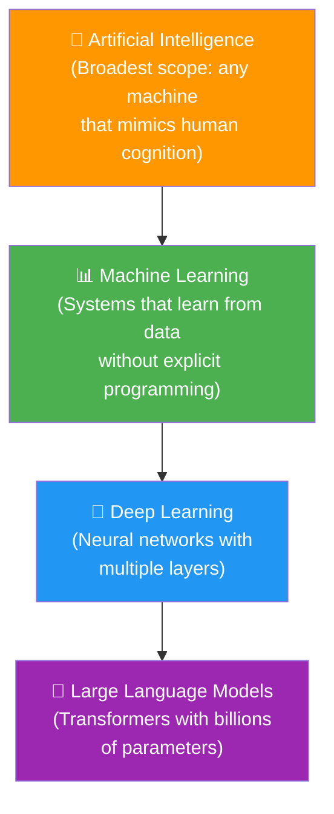
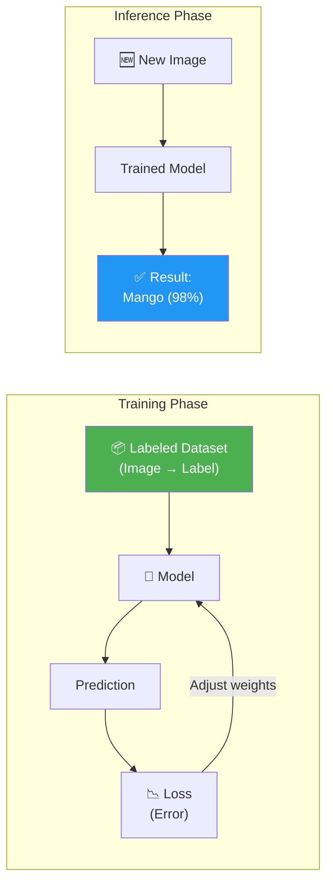
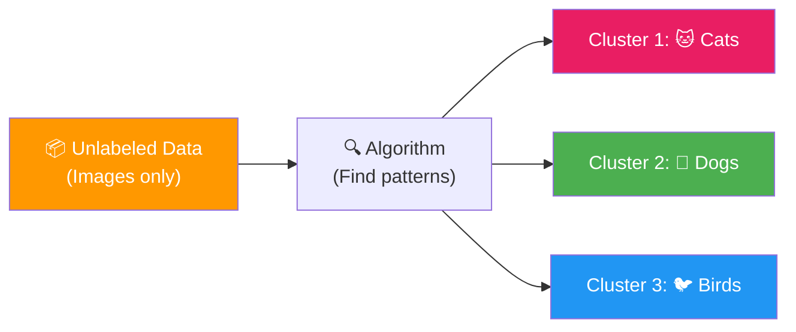
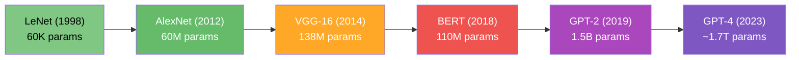

# AI, ML, and Deep Learning Taxonomy

> **Learning Objectives**
> - Distinguish between AI, ML, Deep Learning, and Large Language Models
> - Understand the three core learning paradigms: supervised, unsupervised, and reinforcement learning
> - Know what libraries and tools power each paradigm in practice
> - Appreciate the trajectory from classical ML to modern LLMs

---

## 1. The AI Hierarchy

Artificial Intelligence is not a single technology — it's a nested hierarchy of increasingly specialized fields. Understanding where each piece fits is essential for designing the right hardware.



### AI (Artificial Intelligence)
The broadest circle. Any system that exhibits behavior we'd call "intelligent" — playing chess, recognizing speech, driving a car. AI includes rule-based systems, expert systems, and statistical methods.

### ML (Machine Learning)
A subset of AI where systems **learn patterns from data** rather than following hand-coded rules. Instead of programming "if pixel color is green and shape is round, it's a watermelon," an ML system learns to recognize watermelons by seeing thousands of examples.

### Deep Learning (DL)  
A subset of ML that uses **neural networks with multiple layers** (hence "deep"). These networks can automatically discover complex features in data. While classical ML algorithms (like decision trees, SVMs, K-Means) require manual feature engineering, deep learning learns features automatically.

### Large Language Models (LLM)
The latest frontier within deep learning. Models like GPT, BERT, and LLaMA use the **Transformer architecture** with billions of parameters to understand and generate human language. These models have driven the current AI revolution but demand enormous computational resources.

> **Hardware Implication**: As we move deeper into this hierarchy (from ML → DL → LLM), the computational requirements grow exponentially. This is precisely why custom hardware accelerators exist.

---

## 2. The Three Learning Paradigms

Every ML algorithm falls into one of three learning paradigms. Each has different computational patterns — and therefore different hardware requirements.

### 2.1 Supervised Learning

In supervised learning, the training data includes both **inputs and correct answers** (labels).

**Analogy**: Like studying with a textbook that has an answer key. For every practice problem (input), you know the correct answer (label). You learn by comparing your answers to the correct ones and adjusting your understanding.



**How it works**:
1. Assemble a dataset of (input, label) pairs — e.g., 10,000 fruit images each tagged as "mango," "apple," or "pear"
2. Feed each image through the model, which produces a prediction
3. Compare the prediction to the correct label and compute the error (loss)
4. Adjust the model's internal parameters (weights) to reduce the error  
5. Repeat for many **epochs** (passes through the entire dataset)

**Common algorithms**: Linear regression, logistic regression, SVMs, decision trees, CNNs, Transformers

**Hardware pattern**: High compute during training (millions of weight updates), moderate compute during inference

### 2.2 Unsupervised Learning

In unsupervised learning, the training data has **no labels**. The algorithm must discover patterns and structure on its own.

**Analogy**: Like being shown a box of 1,000 mixed buttons and told "organize these however makes sense." Nobody tells you the categories — you discover them yourself based on color, size, shape, and material.



**How it works** (using clustering as an example):
1. The algorithm examines features of each data point (ear shape, tail length, body size)
2. It discovers that some data points are **more similar** to each other than to others
3. It groups similar points into **clusters**
4. When a new data point arrives, the algorithm checks which cluster it falls nearest to

**Common algorithms**: K-Means clustering, PCA, autoencoders, GANs

**Hardware pattern**: Heavy distance computations (many subtractions, multiplications, comparisons), iterative convergence

### 2.3 Reinforcement Learning (RL)

In reinforcement learning, an **agent** interacts with an **environment**, taking actions and receiving **rewards or penalties** based on outcomes.

**Analogy**: Like training a dog. You don't show the dog a textbook of correct behaviors (supervised). You don't let it figure out categories (unsupervised). Instead, you let it try things — sit, roll over, jump — and give treats for good behavior and corrections for bad behavior. Over time, it learns the optimal strategy.


**How it works**:
1. The agent observes the current **state** of the environment
2. It chooses an **action** based on its current strategy (policy)
3. The environment transitions to a new state and provides a **reward** (or penalty)
4. The agent updates its policy to maximize cumulative reward over time

**Common algorithms**: Q-Learning, Deep Q-Networks (DQN), PPO, A3C

**Hardware pattern**: Sequential decision-making with many inference steps; often requires both training and inference to happen simultaneously

---

## 3. The ImageNet Moment: Why Deep Learning Won

The history of AI hardware is inseparable from a pivotal event in 2012.

The **ImageNet Large Scale Visual Recognition Challenge (ILSVRC)** was a competition where teams built models to classify images into 1,000 categories. The metric: **Top-5 Error Rate** (how often the correct label wasn't in the model's top 5 guesses).

| Year | Best Model | Error Rate | Notes |
|:---|:---|:---|:---|
| 2010 | Hand-crafted features | ~28% | Traditional computer vision |
| 2011 | Improved features | ~25% | Marginal improvement |
| **2012** | **AlexNet** | **16.4%** | ⚡ Deep CNN — quantum leap |
| 2013 | ZFNet | 11.7% | Refined CNN architecture |
| 2014 | GoogLeNet / VGG | 6.7% | Deeper networks |
| 2015 | ResNet | 3.6% | 152 layers (!), skip connections |
| 2017 | SENet | 2.3% | **Surpassed human accuracy (5.1%)** |

**The 2012 drop from 25% to 16.4% was the "eureka moment"** that launched the deep learning revolution. AlexNet demonstrated that deep neural networks, trained on GPUs, could dramatically outperform hand-crafted approaches.

> **Hardware Connection**: AlexNet's success was enabled by GPUs. But as models grew deeper (VGG: 138M parameters, ResNet-152: 60M parameters), even GPUs began to struggle — creating demand for dedicated AI accelerators.

---

## 4. From CNN to LLM: The Hardware Challenge Grows

The progression from simple classifiers to large language models has driven an exponential increase in compute requirements:



| Model | Parameters | FLOPs per Inference | Year |
|:---|:---|:---|:---|
| LeNet-5 | 60K | ~0.4M | 1998 |
| AlexNet | 60M | ~720M | 2012 |
| VGG-16 | 138M | ~15.5B | 2014 |
| BERT-base | 110M | ~22B | 2018 |
| GPT-2 | 1.5B | ~350B | 2019 |

> **The takeaway**: If you understand how to design hardware for GPT-level models, you have the foundational skills to build accelerators for any AI workload. That's the trajectory this tutorial follows.

---

## 5. Code Example: Supervised vs. Unsupervised in Practice

```python
# Supervised Learning: Image Classification
from sklearn.datasets import load_digits
from sklearn.model_selection import train_test_split
from sklearn.svm import SVC
from sklearn.metrics import accuracy_score

# Load labeled dataset (images of digits 0-9)
digits = load_digits()
X_train, X_test, y_train, y_test = train_test_split(
    digits.data, digits.target, test_size=0.2, random_state=42
)

# Train a supervised classifier
clf = SVC(kernel='rbf')
clf.fit(X_train, y_train)  # Learning from labeled data

# Inference
predictions = clf.predict(X_test)
print(f"Supervised Accuracy: {accuracy_score(y_test, predictions):.2%}")
# Output: ~98.6% accuracy


# Unsupervised Learning: Clustering (no labels used!)
from sklearn.cluster import KMeans
import numpy as np

# Same data, but we throw away the labels
kmeans = KMeans(n_clusters=10, random_state=42, n_init=10)
kmeans.fit(digits.data)  # No labels provided!

# Check what clusters were discovered
print(f"Cluster centers shape: {kmeans.cluster_centers_.shape}")
print(f"Discovered {len(np.unique(kmeans.labels_))} clusters")
# The algorithm discovers 10 natural groupings — one per digit
```

---

## Key Takeaways

- **AI ⊃ ML ⊃ DL ⊃ LLM** — each layer is more computationally demanding
- **Supervised learning** uses labeled data (input + answer); most common for classification
- **Unsupervised learning** discovers patterns without labels; used for clustering and dimensionality reduction
- **Reinforcement learning** learns through trial-and-error with rewards/penalties
- The **2012 ImageNet moment** proved deep learning's superiority and launched the GPU-powered AI era
- Model complexity has grown from 60K to 1.7T parameters in 25 years — hardware must keep pace

---

## Practice Problems

### Problem 1: Learning Paradigm Selection

> **Context**: You are the AI architect at *AgriVision*, a precision agriculture startup. You have three separate projects:
>
> - **Project A**: Classify drone images of crops as "healthy," "diseased," or "pest-infested" using a dataset of 50,000 labeled images
> - **Project B**: Group customer purchase patterns into market segments for a farm supply store, with no predefined categories
> - **Project C**: Train an autonomous spraying drone to navigate fields and spray pesticide only on diseased plants, learning from trial runs
>
> **Tasks**:
> - (a) Identify the appropriate learning paradigm for each project. Justify briefly. [3]
> - (b) Which project would require the most computational resources during training? Why? [2]

<details>
<summary><b>Solution</b></summary>

**(a)**
- **Project A**: **Supervised learning** — labeled dataset with 3 known classes (healthy/diseased/pest-infested). A CNN classifier would train on (image, label) pairs.
- **Project B**: **Unsupervised learning** — no predefined categories exist. K-Means or hierarchical clustering would discover natural customer segments from purchase data.
- **Project C**: **Reinforcement learning** — the drone agent must learn an optimal navigation + spraying policy through interaction with the field environment. Correct spraying = reward, missed plants or wasted pesticide = penalty.

**(b)** **Project C** (RL) requires the most compute because:
- It requires running inference during training (the drone must make decisions in real-time)
- Training involves thousands of trial episodes, each consisting of hundreds of sequential decisions
- The model must learn both perception (vision) and action (navigation) simultaneously
- Project A requires significant compute but processes data in fixed batches; Project B (K-Means on tabular data) is computationally lightweight

</details>

### Problem 2: Hardware Requirements Estimation

> **Context**: *VisionCore Technologies* is evaluating whether to deploy a VGG-16 model (138M parameters, 15.5 billion FLOPs per inference) on different hardware platforms for a real-time video surveillance system processing 1080p video at 25 FPS.
>
> **Given**:
> - Each frame requires one full model inference
> - Available platforms and their peak performance:
>   - Platform A: 2 TOPS, 5W
>   - Platform B: 50 TOPS, 30W
>   - Platform C: 275 TOPS, 60W
>
> **Tasks**:
> - (a) Calculate the minimum TOPS required to sustain 25 FPS. [1]
> - (b) Which platform(s) can meet the real-time requirement? Show your work. [2]
> - (c) Calculate the energy efficiency (GOPS/Watt) for each platform. Which is most efficient? [2]

<details>
<summary><b>Solution</b></summary>

**(a)** Minimum TOPS:
- 15.5B FLOPs/frame × 25 frames/sec = 387.5 GFLOPs/sec = **0.3875 TOPS**

**(b)** Platform evaluation:
- Platform A: 2 TOPS > 0.3875 TOPS ✅ — can sustain 25 FPS
- Platform B: 50 TOPS > 0.3875 TOPS ✅ — easily meets requirement  
- Platform C: 275 TOPS > 0.3875 TOPS ✅ — massively exceeds requirement
- **All three platforms can meet the compute requirement**, as even 2 TOPS is ~5× the minimum needed.

**(c)** Energy efficiency:
- Platform A: 2,000 GOPS ÷ 5W = **400 GOPS/W**
- Platform B: 50,000 GOPS ÷ 30W = **1,667 GOPS/W**
- Platform C: 275,000 GOPS ÷ 60W = **4,583 GOPS/W**

Platform C is most efficient in raw GOPS/W. However, it consumes 60W — unsuitable for battery-powered deployment. For this application, **Platform A** provides the best practical efficiency: it meets the compute requirement with only 5W power draw, giving the longest battery life.

</details>
