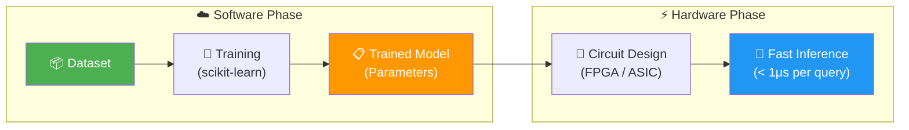
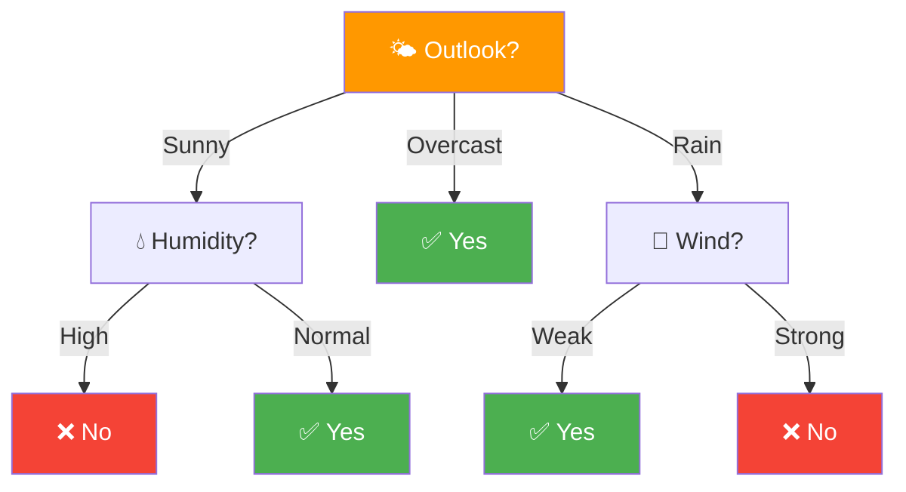
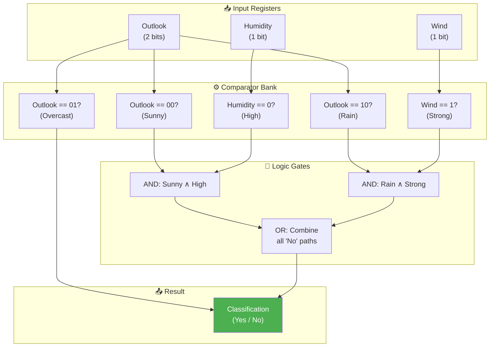
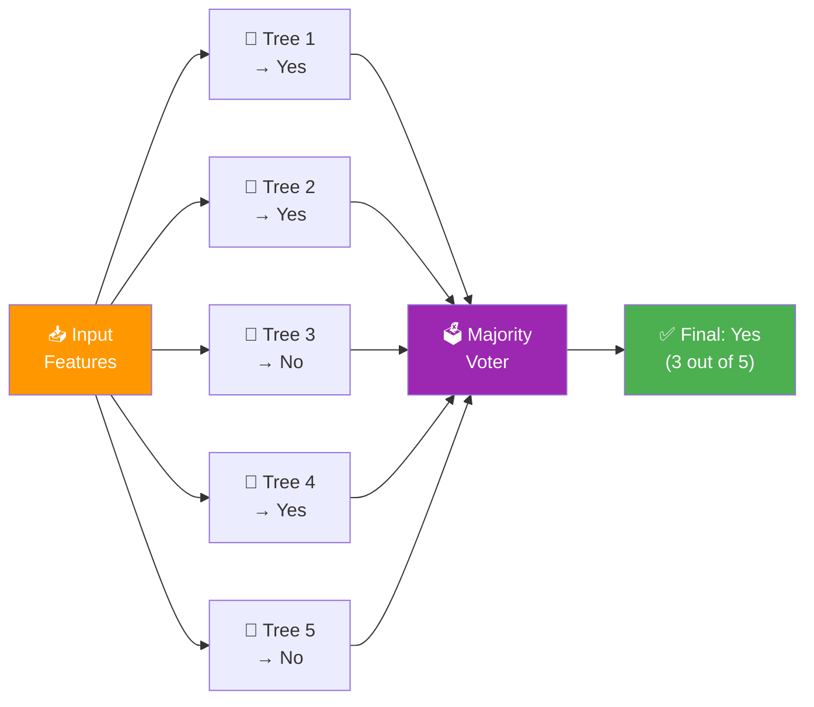
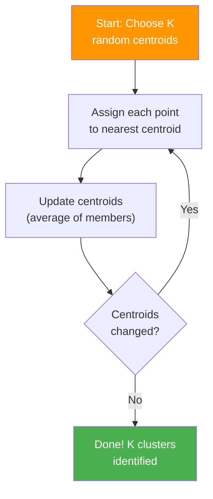
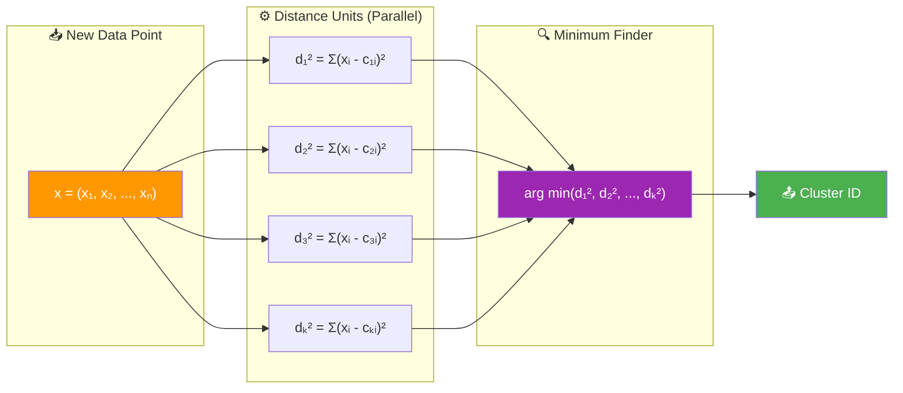
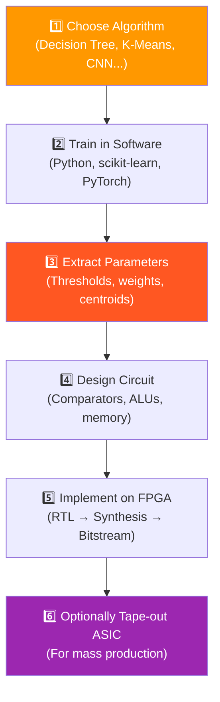

# From Algorithm to Hardware: Your First ML Accelerators

> **Learning Objectives**
> - Understand how a trained ML model becomes a hardware circuit
> - Design hardware for a Decision Tree classifier using comparators and logic gates
> - Design hardware for K-Means clustering using distance computation units
> - Recognize the difference between training hardware and inference hardware
> - Grasp fundamental hardware concepts: registers, comparators, flip-flops, and FP32

---

## 1. The Key Insight: Training vs. Inference in Hardware

Before designing any ML hardware, we must understand a critical distinction:

| Phase | What Happens | Where It Runs | Hardware Complexity |
|:---|:---|:---|:---|
| **Training** | Learn model parameters from data | Software (Python, scikit-learn) | Very high — iterative optimization |
| **Inference** | Apply learned model to new data | **Custom hardware (FPGA/ASIC)** | Manageable — fixed operations |

**We design hardware for inference, not training.** Training happens once in software and produces a fixed model (parameters, thresholds, structure). Our job is to take that trained model and implement it as a circuit that runs inference as fast and efficiently as possible.



> **Analogy**: Training is like writing a recipe (slow, iterative, creative). Inference is like cooking from that recipe (fast, repetitive, optimizable). We build a special kitchen (hardware) optimized for the recipe, not for the recipe-writing process.

---

## 2. Decision Tree: From Software to Silicon

### 2.1 The Algorithm

A decision tree classifies data by making a series of comparisons, organized as a tree structure. At each node, one feature is compared against a threshold. The result directs the data down the true or false branch until a leaf node is reached, which gives the final classification.

**Example — "Should I play tennis today?"**

Four weather features determine the outcome:
- **Outlook**: Sunny, Overcast, Rain
- **Temperature**: Hot, Mild, Cool
- **Humidity**: High, Normal
- **Wind**: Weak, Strong

After training on historical data, the algorithm discovers:



**Key observations**:
- **Outlook = Overcast** → always **Yes**, regardless of other features (temperature, humidity, wind become "don't care")
- **Outlook = Sunny** → depends on **Humidity** (not wind, not temperature)
- **Outlook = Rain** → depends on **Wind** (not humidity, not temperature)
- **Temperature** never appears in the tree — it has no significant information gain

### 2.2 Why "Outlook" is the Root: Information Gain

How does the training algorithm decide which feature to place at the root? It uses **Information Gain**, derived from entropy theory.

**Entropy** measures uncertainty in a dataset:

```
H(S) = -Σ pᵢ · log₂(pᵢ)
```

For our tennis dataset with 14 samples (9 "Yes", 5 "No"):

```
H(S) = -(9/14)·log₂(9/14) - (5/14)·log₂(5/14) ≈ 0.940
```

**Information Gain** = how much entropy decreases when we split on a particular feature:

```
Gain(S, A) = H(S) - Σ (|Sv|/|S|) · H(Sv)
```

After computing gains for all features:

| Feature | Information Gain | Chosen? |
|:---|:---|:---|
| Outlook | **0.246** | ✅ Root node |
| Humidity | 0.151 | After "Sunny" |
| Wind | 0.048 | After "Rain" |
| Temperature | 0.029 | ❌ Not useful |

> **The feature with the highest gain becomes the root.** After each split, we recursively compute gains for the remaining features to determine the next comparison.

### 2.3 Expressing the Tree as a Function

Once training is complete, the entire decision tree can be written as a simple function:

```python
def classify_tennis(outlook, temperature, humidity, wind):
    """
    Decision tree inference — the 'function' learned during training.
    This is exactly what the hardware will implement.
    """
    if outlook == "overcast":
        return "Yes"
    elif outlook == "sunny":
        if humidity == "high":
            return "No"
        else:  # humidity == "normal"
            return "Yes"
    elif outlook == "rain":
        if wind == "weak":
            return "Yes"
        else:  # wind == "strong"
            return "No"

# Test inference
result = classify_tennis("sunny", "hot", "high", "weak")
print(f"Play tennis? {result}")  # Output: No
```

This function is nothing but **nested if-else comparisons** — and comparisons are exactly what hardware does best.

### 2.4 The Hardware Implementation

To build the circuit, we encode each feature as a binary number:

| Feature | Encoding |
|:---|:---|
| Outlook: Sunny = `00`, Overcast = `01`, Rain = `10` | 2 bits |
| Humidity: High = `0`, Normal = `1` | 1 bit |
| Wind: Weak = `0`, Strong = `1` | 1 bit |

The hardware consists of **comparators** (to check feature values) and **logic gates** (AND, OR, NOT) to combine decisions:



**Boolean equations** for the classification:

```
YES = Overcast OR (Sunny AND NOT High_Humidity) OR (Rain AND NOT Strong_Wind)
NO  = (Sunny AND High_Humidity) OR (Rain AND Strong_Wind)
```

In hardware, each Boolean term maps directly to a gate:
- `AND` gate → intersection of conditions
- `OR` gate → union of paths
- `NOT` gate (inverter) → negation of a condition

### 2.5 Hardware Components Used

| Component | Purpose | Symbol |
|:---|:---|:---|
| **Register** | Stores input feature values | 32 flip-flops connected together |
| **Flip-flop** | Stores 1 bit of data | Basic memory element |
| **Comparator** | Tests if register value equals a threshold | `A == B?` → 1 or 0 |
| **AND gate** | Returns 1 only if ALL inputs are 1 | Combines conditions |
| **OR gate** | Returns 1 if ANY input is 1 | Merges classification paths |
| **Inverter (NOT)** | Flips 0↔1 | Represents "false" branch |

### 2.6 Critical Path and Latency

The **critical path** is the longest chain of operations from input to output. For our tree:

```
Input Register → Comparator → AND gate → OR gate → Output
     1 cycle       1 cycle      1 cycle     1 cycle
     
Total: ~4 clock cycles
```

At 1 GHz clock: **4 ns per inference** — orders of magnitude faster than software!

> **Key Hardware Insight**: A deeper tree means a longer critical path and higher latency. This is why training algorithms try to produce **balanced, shallow trees** — it directly impacts hardware performance.

---

## 3. Scaling Up: Random Forest in Hardware

A single decision tree may not be accurate enough for complex problems. A **Random Forest** combines multiple trees and takes a **majority vote**:



In FPGA hardware:
- Each tree is implemented as a separate comparator network
- All trees operate **in parallel** — no additional latency
- A simple counter tallies "Yes" votes
- The final comparator checks if `Yes_count > N/2`

> **Real-World Application**: High-Frequency Trading (HFT) firms implement decision trees and random forests on FPGAs to classify stock signals in **nanoseconds**, far faster than any CPU or GPU solution.

---

## 4. K-Means Clustering: Unsupervised Learning in Hardware

### 4.1 The Algorithm

K-Means groups data points into `K` clusters based on **distance** to cluster centers (centroids):



**Step-by-step**:
1. **Initialize**: Randomly place K centroids in the feature space
2. **Assign**: For each data point, compute distance to all K centroids; assign to the nearest one
3. **Update**: Recalculate each centroid as the average of all points assigned to it
4. **Repeat**: Steps 2–3 until centroids stabilize (converge)

### 4.2 The Key Operation: Distance Computation

The most computationally expensive operation in K-Means is computing distances. For two points `a = (a₁, a₂, ..., aₙ)` and `b = (b₁, b₂, ..., bₙ)`:

**Euclidean Distance**:
```
d(a, b) = √(Σ (aᵢ - bᵢ)²)
```

For hardware purposes, we usually skip the square root (it doesn't change which centroid is closest):

```
d²(a, b) = Σ (aᵢ - bᵢ)²
```

### 4.3 Hardware Architecture for K-Means Inference

During inference, we only need the **assign** step: compute distances from the new data point to all K centroids and pick the minimum:



**Hardware building blocks**:
- **Subtractors**: Compute `(xᵢ - cᵢ)` for each dimension
- **Multipliers**: Square each difference `(xᵢ - cᵢ)²`
- **Adder tree**: Sum all squared differences
- **Comparator chain**: Find the minimum distance among K candidates

### 4.4 Hardware Cost Analysis

For K clusters with N-dimensional data:

| Component | Count | Operation |
|:---|:---|:---|
| Subtractors | K × N | One per dimension per cluster |
| Multipliers | K × N | Square each difference |
| Adders | K × (N-1) | Sum differences per cluster |
| Comparators | K-1 | Find minimum distance |

**Example**: K=4 clusters, N=10 features:
- 40 subtractors, 40 multipliers, 36 adders, 3 comparators
- Total: 119 arithmetic units

If each unit takes 1 clock cycle and we pipeline the computation:
- Latency: ~3 cycles (subtract → multiply → add)
- Throughput: 1 classification per cycle after pipeline fills

---

## 5. Number Representation: The FP32 Standard

When features have decimal values (like temperature = 100.7°), we need a standardized way to represent them in hardware. The **IEEE 754 FP32** (32-bit floating point) format is the universal solution:

```
| Sign (1 bit) | Exponent (8 bits) | Mantissa (23 bits) |
|     0/1      |     biased exp.   |    fractional part  |
```

**Example**: Representing 100.7 in FP32:
1. Convert to binary: 100.7₁₀ = 1100100.1011...₂
2. Normalize: 1.1001001011... × 2⁶
3. Encode:
   - Sign: 0 (positive)
   - Exponent: 6 + 127 (bias) = 133 = 10000101₂
   - Mantissa: 10010010110011... (23 bits)

```python
import struct

def float_to_binary32(value):
    """Show how a decimal number is stored in FP32 format."""
    packed = struct.pack('!f', value)
    binary = ''.join(f'{byte:08b}' for byte in packed)
    
    sign = binary[0]
    exponent = binary[1:9]
    mantissa = binary[9:32]
    
    print(f"Value: {value}")
    print(f"Sign:     {sign} ({'positive' if sign == '0' else 'negative'})")
    print(f"Exponent: {exponent} (biased: {int(exponent, 2)}, actual: {int(exponent, 2) - 127})")
    print(f"Mantissa: {mantissa}")
    print(f"Full:     {binary}")

float_to_binary32(100.7)
# Sign:     0 (positive)
# Exponent: 10000101 (biased: 133, actual: 6)
# Mantissa: 10010010110011001100110
```

> **Hardware Impact**: FP32 comparators and multipliers are significantly more expensive (in area and power) than integer ones. This is why many AI accelerators use **reduced precision** formats like FP16, INT8, or even INT4 — a topic we'll explore in the optimization module.

---

## 6. Putting It All Together: The Design Flow



**The golden rule**: The software training phase gives us a fixed, known model. The hardware design phase implements that exact model as efficiently as possible.

---

## Key Takeaways

- **Hardware accelerators implement inference**, not training — the model is already trained in software
- A **decision tree** maps to comparators + AND/OR/NOT gates — each tree node becomes a hardware comparator
- **Random forests** replicate this structure in parallel with a majority voter
- **K-Means** maps to subtractors + multipliers + an adder tree + a minimum finder
- The **critical path** (longest chain of operations) determines inference latency
- **FP32** is the standard for representing decimal numbers in hardware, but it's expensive — driving the need for reduced precision

---

## Practice Problems

### Problem 1: Decision Tree Hardware Design

> **Context**: *TradeBot Systems* has trained a decision tree for stock classification with the following structure:
>
> ```
> Root: Price_Change > 2.5%?
> ├── True: Volume > 1M?
> │   ├── True: → BUY
> │   └── False: Momentum > 0.7?
> │       ├── True: → BUY
> │       └── False: → HOLD
> └── False: Price_Change < -2.5%?
>     ├── True: → SELL
>     └── False: → HOLD
> ```
>
> **Tasks**:
> - (a) Write the Boolean equations for BUY, SELL, and HOLD. [3]
> - (b) How many comparators are needed in the hardware implementation? [1]
> - (c) What is the critical path depth (in comparator stages)? What is the inference latency at 2 GHz? [1.5]

<details>
<summary><b>Solution</b></summary>

**(a)** Boolean equations (using shortened names):

```
Let P+ = (Price_Change > 2.5%)
Let P- = (Price_Change < -2.5%)
Let V  = (Volume > 1M)
Let M  = (Momentum > 0.7)

BUY  = P+ AND V
     OR P+ AND (NOT V) AND M

SELL = (NOT P+) AND P-

HOLD = P+ AND (NOT V) AND (NOT M)
     OR (NOT P+) AND (NOT P-)
```

**(b)** Comparators needed:
- `Price_Change > 2.5%` → 1 comparator
- `Volume > 1M` → 1 comparator
- `Momentum > 0.7` → 1 comparator
- `Price_Change < -2.5%` → 1 comparator
- **Total: 4 comparators**

**(c)** Critical path:
- The longest path is: `Price_Change > 2.5%` → `Volume > 1M` → `Momentum > 0.7` → AND gate → OR gate
- **Depth: 3 comparator stages + 2 logic stages = 5 stages**
- At 2 GHz (0.5 ns per cycle): **5 × 0.5 ns = 2.5 ns per inference**

For HFT applications, 2.5 ns is extremely competitive — orders of magnitude faster than a CPU implementation.

</details>

### Problem 2: K-Means Hardware Sizing

> **Context**: *MedCluster AI* needs to classify patient vital signs into K=5 risk categories using 8 physiological features (heart rate, blood pressure, temperature, etc.). Each feature is represented in FP32 format.
>
> **Tasks**:
> - (a) Calculate the total number of arithmetic units (subtractors, multipliers, adders) needed. [2]
> - (b) How many bytes of on-chip memory are needed to store all centroid coordinates? [1]
> - (c) If each arithmetic unit requires 500 FPGA LUTs, and the target FPGA has 100,000 LUTs, will the design fit? What percentage of the FPGA is utilized? [2]

<details>
<summary><b>Solution</b></summary>

**(a)** Arithmetic units:
- Subtractors: K × N = 5 × 8 = **40 subtractors**
- Multipliers: K × N = 5 × 8 = **40 multipliers** (for squaring)
- Adders: K × (N-1) = 5 × 7 = **35 adders** (summing per cluster)
- Comparators: K-1 = **4 comparators** (finding minimum)
- **Total: 119 arithmetic units**

**(b)** Centroid memory:
- Each centroid: 8 features × 4 bytes (FP32) = 32 bytes
- Total: 5 centroids × 32 bytes = **160 bytes**
- This easily fits in on-chip registers — no external memory needed!

**(c)** FPGA utilization:
- Total LUTs needed: 119 units × 500 LUTs = **59,500 LUTs**
- Available: 100,000 LUTs
- Utilization: 59,500 ÷ 100,000 = **59.5%**
- **Yes, the design fits**, with 40.5% remaining for control logic, I/O, and potential expansion to more clusters or features.

</details>

### Problem 3: Precision Trade-off Analysis

> **Context**: You're designing a K-Means accelerator and considering using INT8 (8-bit integer) instead of FP32 (32-bit floating point) for all computations.
>
> **Given**:
> - FP32 multiplier: 500 LUTs, 5 ns latency
> - INT8 multiplier: 50 LUTs, 1 ns latency
> - Design requires 40 multipliers
>
> **Tasks**:
> - (a) Compare total LUT usage and latency for FP32 vs. INT8 designs. [2]
> - (b) What is the potential accuracy risk of using INT8? Give one specific scenario where it could cause misclassification. [2]
> - (c) Suggest a hybrid approach that balances accuracy and efficiency. [1]

<details>
<summary><b>Solution</b></summary>

**(a)** Comparison:

| Metric | FP32 Design | INT8 Design | Improvement |
|:---|:---|:---|:---|
| LUT usage | 40 × 500 = 20,000 | 40 × 50 = 2,000 | **10× smaller** |
| Latency | 5 ns | 1 ns | **5× faster** |

**(b)** INT8 accuracy risk:
- INT8 can represent values from -128 to +127 (or 0–255 unsigned)
- If two centroids are very close (e.g., centroid A at 45.3 and centroid B at 45.7), INT8 rounds both to 45 — making them **indistinguishable**
- A data point at 45.5 would be equidistant from both centroids in INT8, causing arbitrary assignment
- This is particularly dangerous in medical applications where subtle differences in vital signs may separate "normal" from "at-risk" categories

**(c)** Hybrid approach:
- Use **INT8 for the subtraction and squaring** (these operations work well with reduced precision)
- Use **INT16 or INT32 for the accumulation** (summing squared differences to avoid overflow)
- This is called **mixed-precision** design — it captures 80% of the area/speed benefits of INT8 while maintaining most of the precision of FP32

</details>
