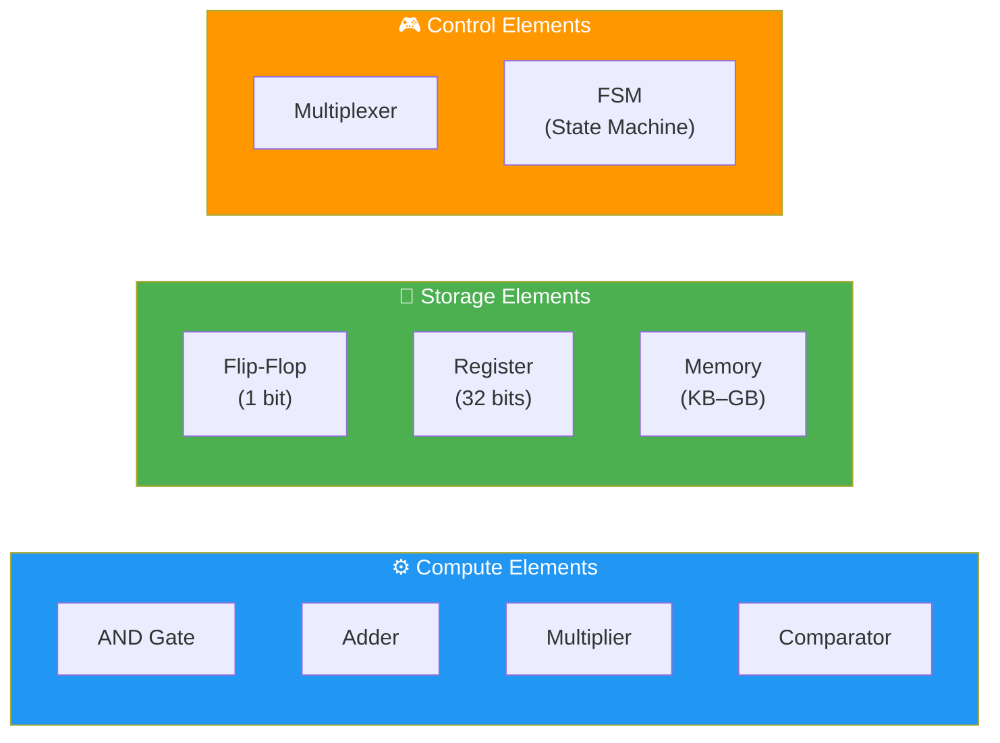
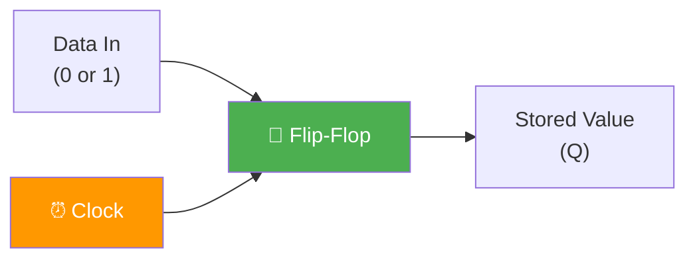
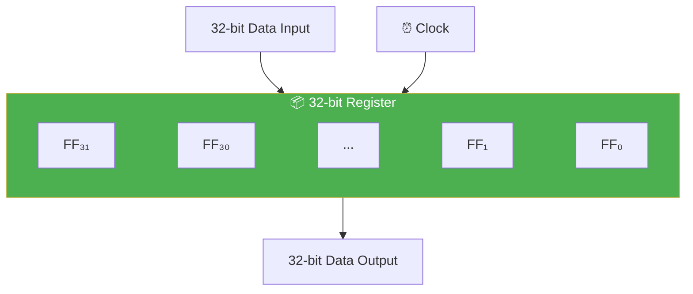
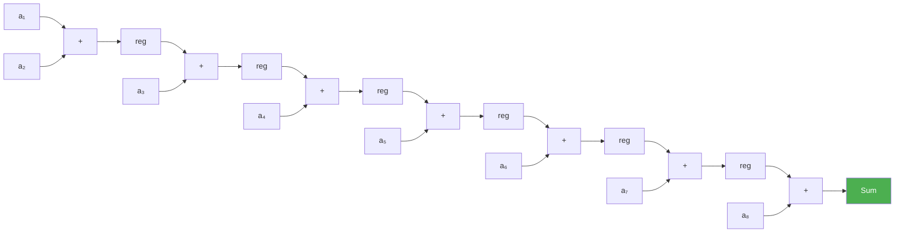
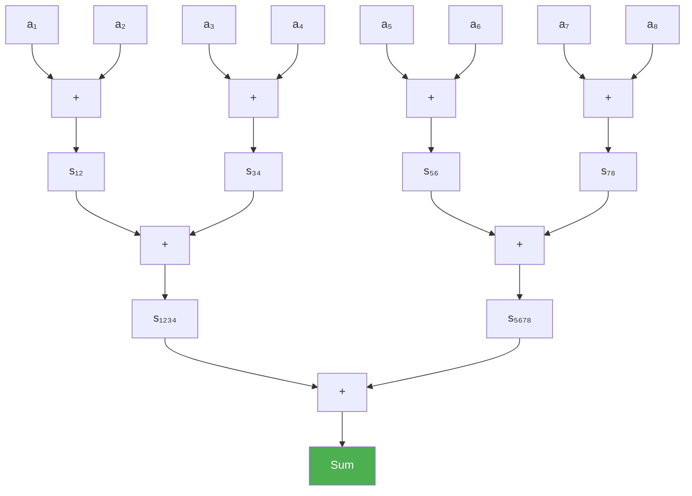
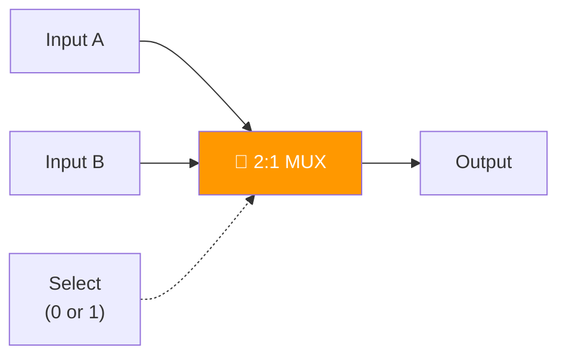

# Hardware Building Blocks: The Atoms of Digital Design

> **Learning Objectives**
> - Identify and explain the six fundamental hardware components: gates, flip-flops, registers, adders, multipliers, and multiplexers
> - Understand why registers are needed (the "variable" of hardware)
> - Compare chain adders vs. tree adders and analyze latency trade-offs
> - Recognize the parallelism–resource trade-off in hardware design
> - Estimate hardware resource requirements for basic computations

---

## 1. Two Kinds of Hardware: Compute + Storage

Every digital circuit, from a simple calculator to a billion-transistor GPU, is built from just two categories of components:

| Category | Purpose | Examples |
|:---|:---|:---|
| **Compute** | Perform calculations | Adders, subtractors, multipliers, comparators, logic gates |
| **Storage** | Hold data between operations | Flip-flops, registers, memory (SRAM, DRAM) |

> **Analogy**: Think of a kitchen. Compute components are like your appliances (oven, blender, mixer) — they transform ingredients. Storage components are like your countertop and refrigerator — they hold intermediate ingredients until the next step.



---

## 2. Logic Gates: The Foundation

Logic gates are the smallest compute elements. They take binary inputs (0 or 1) and produce a binary output.

| Gate | Symbol | Operation | Truth Table (A, B → Output) |
|:---|:---|:---|:---|
| **AND** | A ∧ B | Output 1 only if BOTH inputs are 1 | 0,0→0 · 0,1→0 · 1,0→0 · 1,1→1 |
| **OR** | A ∨ B | Output 1 if ANY input is 1 | 0,0→0 · 0,1→1 · 1,0→1 · 1,1→1 |
| **NOT** | ¬A | Flip the input | 0→1 · 1→0 |
| **NAND** | ¬(A ∧ B) | Opposite of AND | 0,0→1 · 0,1→1 · 1,0→1 · 1,1→0 |
| **XOR** | A ⊕ B | Output 1 if inputs DIFFER | 0,0→0 · 0,1→1 · 1,0→1 · 1,1→0 |

**Key fact**: Every digital circuit — adders, multipliers, even entire CPUs — can be built from combinations of these five basic gates.

**Hardware cost**: A single logic gate requires approximately **4 transistors**. At modern process nodes (3nm, 5nm), billions of gates fit on a single chip.

```python
def simulate_gates(a: int, b: int):
    """Simulate basic logic gate operations."""
    print(f"Inputs: A={a}, B={b}")
    print(f"  AND:  {a & b}")
    print(f"  OR:   {a | b}")
    print(f"  NOT A: {int(not a)}")
    print(f"  NAND: {int(not (a and b))}")
    print(f"  XOR:  {a ^ b}")

simulate_gates(1, 0)
# Inputs: A=1, B=0
#   AND:  0
#   OR:   1
#   NOT A: 0
#   NAND: 1
#   XOR:  1
```

---

## 3. Flip-Flops: The 1-Bit Memory

A **flip-flop** is the most basic storage element — it stores exactly **one bit** of information (0 or 1). It captures data on a clock edge and holds it until the next clock edge.



**How it works**:
- On each **rising edge** of the clock signal, the flip-flop captures whatever value is at its data input
- Between clock edges, the output **Q** remains stable, regardless of input changes
- This is how hardware "remembers" values — unlike a wire, which immediately reflects whatever is driving it

> **Why it matters**: Without flip-flops, computed results would vanish instantly. Every intermediate value in a hardware pipeline needs to be captured and held in a flip-flop until the next stage is ready to use it.

---

## 4. Registers: Multi-Bit Storage

A **register** is simply a group of flip-flops working together to store a multi-bit value. A 32-bit register contains 32 flip-flops, one for each bit.



**Registers are the hardware equivalent of variables in software.**

| Software Concept | Hardware Equivalent |
|:---|:---|
| `int x = 42;` | 32-bit register loaded with value 42 |
| `x = x + 1;` | Adder output fed back into the same register |
| `temp = a;` | Copy value from register A to register TEMP |

**Key difference from memory**: Registers are extremely fast (accessible in a single clock cycle) but expensive in area. Memory (SRAM/DRAM) is slower but can store far more data.

| Storage Type | Access Time | Typical Size | Use Case |
|:---|:---|:---|:---|
| Register | 1 clock cycle (~0.5 ns) | 32–64 bits | Individual values, counters |
| SRAM (on-chip) | 1–3 cycles (~1–2 ns) | KB to MB | Caches, buffers |
| DRAM (off-chip) | 50–100 cycles (~50 ns) | GB | Main memory, large datasets |

---

## 5. Adders: The Workhorse of Arithmetic

The adder computes the sum of two numbers. Despite its simplicity, how you **arrange** adders has enormous impact on performance.

### 5.1 Chain Adder (Sequential)

The simplest approach: add the first two values, then add the result to the third, and so on.



**Latency**: For N values, the chain requires **N – 1 sequential additions**. With 8 values: **7 clock cycles**.

### 5.2 Tree Adder (Parallel)

Pair up inputs and add them simultaneously at each level:



**Latency**: For N values, the tree requires only **⌈log₂(N)⌉ levels**. With 8 values: **3 clock cycles** (vs. 7 for the chain).

### 5.3 The Trade-off

| Metric | Chain Adder | Tree Adder |
|:---|:---|:---|
| **Latency** | O(N) — linear | O(log₂ N) — logarithmic |
| **Number of adders** | N − 1 | N − 1 |
| **Area (wiring)** | Less (simple chain) | More (fan-out at each level) |
| **Registers needed** | N − 1 | ~2N − 1 (more intermediate) |

> **The universal trade-off in hardware design**: You can reduce latency by adding more parallel hardware (spatial parallelism) or by cleverly reorganizing data flow — but there is always a cost in area, power, or complexity.

```python
import math

def compare_adder_architectures(n_values):
    """Compare chain vs tree adder latency."""
    chain_cycles = n_values - 1
    tree_cycles = math.ceil(math.log2(n_values))
    speedup = chain_cycles / tree_cycles
    
    print(f"Summing {n_values} values:")
    print(f"  Chain adder: {chain_cycles} cycles")
    print(f"  Tree adder:  {tree_cycles} cycles")
    print(f"  Speedup:     {speedup:.1f}×")

compare_adder_architectures(8)
# Summing 8 values:
#   Chain adder: 7 cycles
#   Tree adder:  3 cycles
#   Speedup:     2.3×

compare_adder_architectures(1024)
# Summing 1024 values:
#   Chain adder: 1023 cycles
#   Tree adder:  10 cycles
#   Speedup:     102.3×
```

---

## 6. Multipliers: Expensive but Essential

Multipliers are significantly more complex than adders:

| Component | Approximate Gate Count | Transistors (4 per gate) |
|:---|:---|:---|
| 32-bit Adder | ~10 gates | ~40 transistors |
| 32-bit Multiplier | ~200+ gates | ~800+ transistors |
| FP32 Multiplier | ~500+ gates | ~2,000+ transistors |

This is why **multiply-accumulate (MAC)** units — the core operation in neural networks — dominate the area of AI accelerators.

> **Neural Network Connection**: A single neuron computes `output = Σ(wᵢ × xᵢ) + bias`. This requires N multiplications and N additions. Scaling to millions of neurons means millions of multipliers and adders — driving the need for custom silicon.

---

## 7. Multiplexers: The Hardware Switch

A **multiplexer (MUX)** selects one input from several options based on a control signal. Think of it as a hardware `if-else` or `switch` statement.



**Behavior**:
- If Select = 0 → Output = Input A
- If Select = 1 → Output = Input B

**Why multiplexers are critical**: In hardware, you can't "just" reassign a variable like in software. When a register needs to receive data from multiple sources (e.g., initial input vs. intermediate computation), a multiplexer chooses which source to connect.

```python
def hardware_mux(input_a, input_b, select):
    """Simulate a 2:1 multiplexer."""
    return input_b if select else input_a

# Example: Register receives either external input or feedback
external_input = 42
feedback_value = 37

# First cycle: load from external input (select=0)
reg_value = hardware_mux(external_input, feedback_value, select=0)
print(f"Cycle 1 (load): Register = {reg_value}")  # 42

# Later cycle: update from internal computation (select=1)
reg_value = hardware_mux(external_input, feedback_value, select=1)
print(f"Cycle 2 (update): Register = {reg_value}")  # 37
```

---

## 8. Comparators: Decision Makers

A **comparator** takes two values and determines their relationship: equal, greater than, or less than.

| Comparator Type | Output | Use Case |
|:---|:---|:---|
| **Equality** (A == B?) | 1 bit (yes/no) | Decision tree node checks |
| **Magnitude** (A > B?) | 1 bit | Branching, sorting, min/max finding |
| **Three-way** (A ≷ B) | 2 bits (>, <, =) | FSM control decisions |

Comparators are simpler than adders (they can use XOR gates for equality checks) and appear extensively in:
- Decision tree hardware (every node is a comparator)
- K-Means hardware (finding minimum distance)
- Sorting networks (ordering elements)
- Control paths (state transition decisions)

---

## 9. Putting It Together: Resource Estimation

A critical skill in hardware design is estimating how many components you need.

**Example**: Computing the mean of N values requires:
1. **N − 1 adders** (to sum all values) — or ⌈log₂ N⌉ levels with a tree
2. **1 divider** (or 1 reciprocal lookup + 1 multiplier)
3. **Several registers** (to hold intermediate sums and the final result)

For N = 1024 values in FP32:
- Tree adder: 1023 adders across 10 levels
- 1 FP32 divider (or multiplier with precomputed 1/N)
- ~2047 registers for the tree pipeline

At modern FPGA densities, this fits comfortably — but it illustrates why custom designs are needed. A CPU would compute this mean sequentially with 1 adder, taking 1024 cycles instead of 10.

---

## Key Takeaways

- **Gates** (AND, OR, NOT, XOR) are the atoms; everything is built from them
- **Flip-flops** store 1 bit; **registers** group flip-flops for multi-bit storage (the hardware "variable")
- **Chain adders** have O(N) latency; **tree adders** reduce it to O(log N) by parallelizing — at the cost of more wiring
- **Multipliers** are ~20× more expensive than adders — driving the design of specialized MAC units for neural networks
- **Multiplexers** act as hardware switches, routing data between paths
- The **parallelism–resource trade-off** is the central tension in all hardware design: more parallelism = faster, but requires more area and power

---

## Practice Problems

### Problem 1: Vector Sum Accelerator

> **Context**: *SensorFusion Labs* needs a hardware unit to sum 256 sensor readings (each 32-bit FP32) every microsecond. The FPGA clock runs at 200 MHz.
>
> **Tasks**:
> - (a) Calculate the latency of a chain adder design. Will it meet the 1 μs deadline? [2]
> - (b) Calculate the latency of a tree adder design. Will it meet the deadline? [2]
> - (c) Both designs use 255 adders. Why is the tree design faster despite using the same number of adders? [1]

<details>
<summary><b>Solution</b></summary>

**(a)** Chain adder:
- Latency = N − 1 = 256 − 1 = **255 clock cycles**
- Clock period at 200 MHz = 1/200M = 5 ns
- Total time = 255 × 5 ns = **1,275 ns = 1.275 μs**
- **❌ Does NOT meet the 1 μs deadline**

**(b)** Tree adder:
- Latency = ⌈log₂(256)⌉ = **8 clock cycles**
- Total time = 8 × 5 ns = **40 ns = 0.04 μs**
- **✅ Easily meets the deadline** (25× faster than required)

**(c)** Both designs use exactly 255 adders. The difference is **arrangement, not quantity**:
- Chain: 255 adders connected in series — each must wait for the previous result
- Tree: 255 adders arranged in 8 levels, with 128 adders working in parallel at level 1, 64 at level 2, etc.
- The tree exploits **spatial parallelism** — many independent additions happen simultaneously

This is the core insight of hardware design: **performance comes from parallelism, not just raw component count.**

</details>

### Problem 2: Register Budget for a Neural Network Layer

> **Context**: *NeuroChip Inc.* is designing an accelerator for a single fully-connected layer with 512 input neurons and 256 output neurons. All values are FP32 (32 bits).
>
> **Tasks**:
> - (a) How many weight values must be stored? How many bytes of register storage? [1]
> - (b) If each flip-flop occupies 10 μm² of silicon area, what is the total area for weight storage alone? [2]
> - (c) Given a 10mm × 10mm chip (100 mm²), what percentage is consumed by weight registers? Is this feasible? [2]

<details>
<summary><b>Solution</b></summary>

**(a)** Weight storage:
- Number of weights = 512 × 256 = **131,072 weights**
- Each weight = 32 bits = 4 bytes
- Total storage = 131,072 × 4 = **524,288 bytes = 512 KB**

**(b)** Silicon area:
- Total flip-flops = 131,072 × 32 = **4,194,304 flip-flops**
- Area per flip-flop = 10 μm²
- Total area = 4,194,304 × 10 μm² = 41,943,040 μm²
- Convert: 41,943,040 μm² = **41.94 mm²**

**(c)** Chip utilization:
- Chip area = 100 mm²
- Weight register area = 41.94 mm²
- Utilization = 41.94 / 100 = **41.9%**
- **This is NOT feasible** — the weights alone consume nearly half the chip, leaving insufficient room for compute units, control logic, I/O, and bias/activation storage.
- **Solution**: Store weights in SRAM (much denser) or off-chip DRAM, loading them into registers as needed. This is exactly why **memory hierarchy** is critical in accelerator design.

</details>

### Problem 3: Multiplexer Design for Register Reuse

> **Context**: In a hardware design, a 32-bit register `R` needs to receive data from three possible sources:
> 1. External input (initial load)
> 2. Adder output (accumulation)
> 3. Multiplier output (scaling)
>
> **Tasks**:
> - (a) How many select bits does the multiplexer need? [1]
> - (b) Draw (describe) how a 4:1 MUX would be used here, noting what the fourth input could be. [2]
> - (c) If the adder takes 1 cycle, the multiplier takes 3 cycles, and external load takes 1 cycle, what is the role of the FSM in this system? [2]

<details>
<summary><b>Solution</b></summary>

**(a)** Select bits:
- 3 sources → need at least ⌈log₂(3)⌉ = **2 select bits**
- A 2-bit select can address 4 inputs (00, 01, 10, 11), so we use a 4:1 MUX

**(b)** 4:1 MUX configuration:

| Select (S₁S₀) | Source | Operation |
|:---|:---|:---|
| 00 | External input | Initial data load |
| 01 | Adder output | Accumulate (R = R + X) |
| 10 | Multiplier output | Scale (R = R × Y) |
| 11 | Register R itself | Hold current value (no-op) |

The fourth input (11) feeds the register's own output back to its input — this implements a **hold** operation where the register maintains its value when no update is needed.

**(c)** FSM role:
- The FSM (Finite State Machine) acts as the **controller** that generates the correct select signal at each clock cycle
- It tracks which operation phase the hardware is in:
  - **State LOAD**: Set select = 00 to load external data
  - **State ACCUMULATE**: Set select = 01 for each addition cycle (1 cycle per add)
  - **State SCALE**: Set select = 10, then WAIT 3 cycles for the multiplier to complete before enabling the register
  - **State HOLD**: Set select = 11 when waiting for external events
- The FSM ensures **timing correctness** — the register is only updated when the selected compute unit has a valid result

</details>
