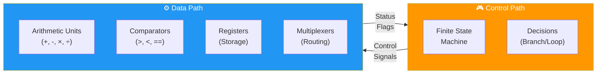
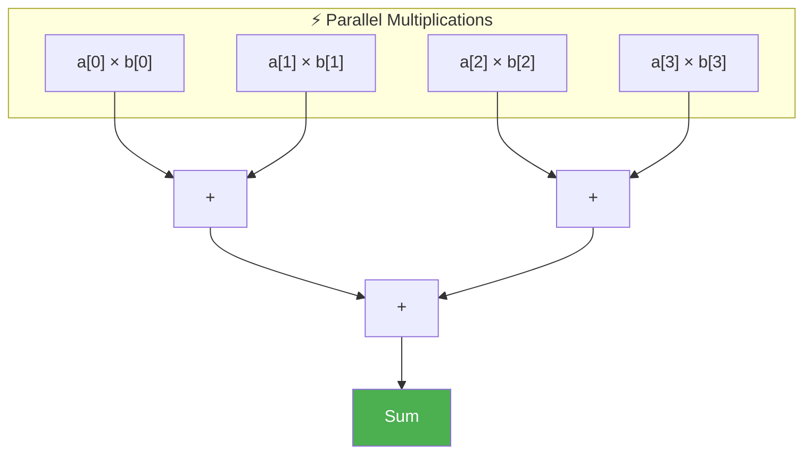
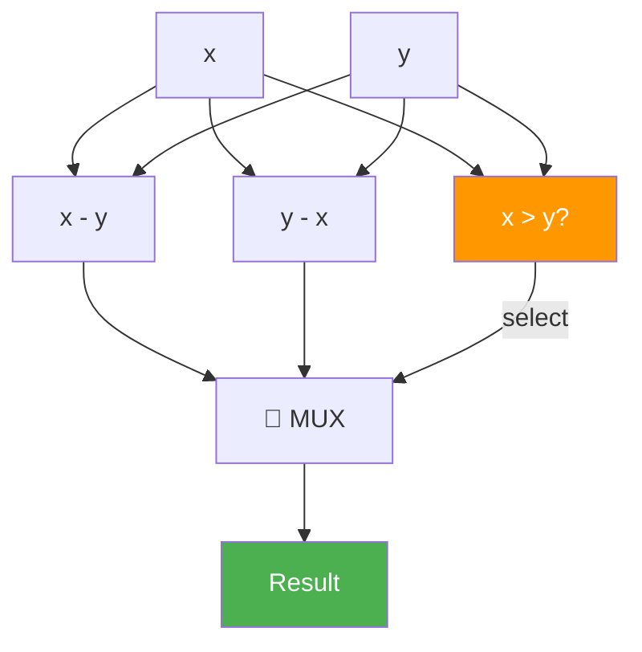
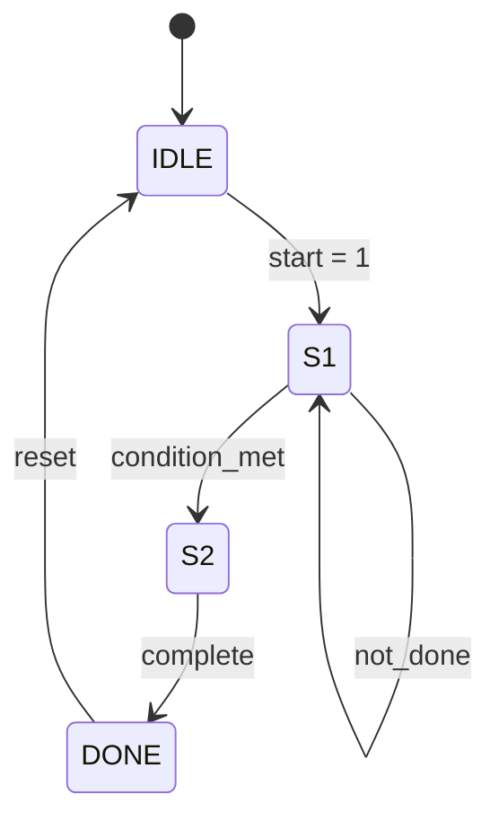
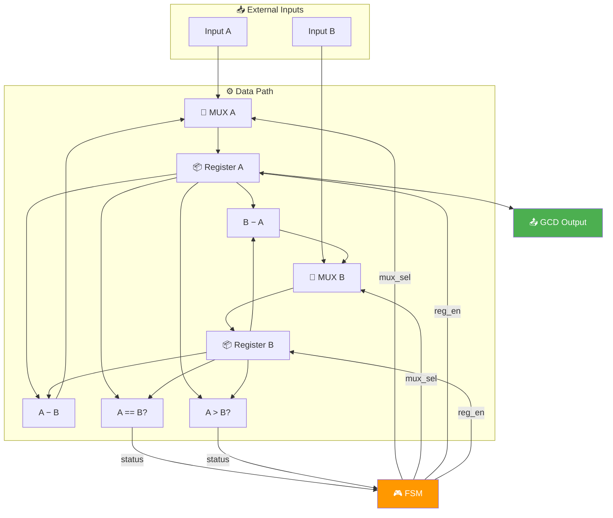
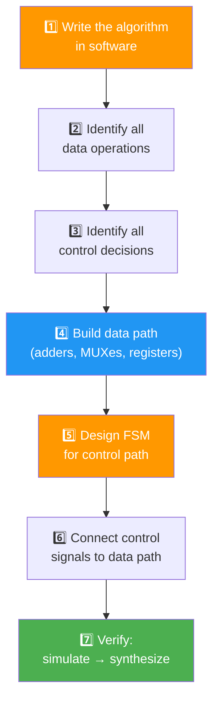

# Control Path and Data Path: The Two Halves of Every Circuit

> **Learning Objectives**
> - Decompose any algorithm into its control path (decisions) and data path (computations)
> - Design a Finite State Machine (FSM) to sequence hardware operations
> - Understand synthesizability constraints: why `while` loops cannot be synthesized
> - Build a complete hardware system for the GCD algorithm as a worked example
> - Apply the control/data path pattern to any algorithm-to-hardware conversion

---

## 1. The Big Idea: Every Hardware System Has Two Halves

When converting any algorithm to hardware, the circuit naturally splits into two distinct parts:



| Aspect | Control Path | Data Path |
|:---|:---|:---|
| **What it does** | Makes decisions, sequences operations | Performs computations on data |
| **Software analogy** | `if`, `else`, `for`, state transitions | `x = a + b`, `y = x * c` |
| **Hardware components** | FSM, decoders, select signals | Adders, multipliers, registers, MUXes |
| **Drives** | Select lines on MUXes, enable signals on registers | Actual data values |

> **Analogy**: Think of an orchestra. The **conductor** (control path) decides when each section plays and how fast. The **musicians** (data path) actually produce the music. Neither can function without the other.

---

## 2. Synthesizability: What Can Become Hardware?

Before designing any circuit, you must understand a fundamental constraint: **only deterministic code can be synthesized into hardware**.

### 2.1 The Synthesizability Rule

Hardware synthesis tools convert high-level code into a fixed circuit. The circuit's structure (number of gates, wires, registers) must be decided **at compile time**, not at runtime.

| Construct | Synthesizable? | Why? |
|:---|:---|:---|
| `for(i=0; i<10; i++)` | ✅ Yes | Compiler knows: exactly 10 iterations → unroll into 10 copies |
| `for(i=0; i<N; i++)` where N is a constant | ✅ Yes | N is known at compile time |
| `while(a != b)` | ❌ No | Can't predict how many iterations → can't determine circuit size |
| `for(i=0; i<a; i++)` where `a` is variable | ❌ No | Same problem — loop count depends on runtime data |
| `if(x > y)` | ✅ Yes | Both branches exist simultaneously in hardware |

### 2.2 Why `while` Loops Are the "Villain"

Consider the GCD algorithm:

```c
// This code is NOT synthesizable!
int gcd(int a, int b) {
    while (a != b) {        // How many times? Unknown!
        if (a > b)
            a = a - b;
        else
            b = b - a;
    }
    return a;
}
```

**The problem**: For `gcd(15, 6)`, the loop runs 4 times. For `gcd(1000, 3)`, it might run hundreds of times. The hardware compiler cannot determine the circuit size because the loop count is **data-dependent**.

### 2.3 How `for` Loops Are Synthesized

When a `for` loop has a known iteration count, the compiler **unrolls** it into parallel hardware:

```c
// This IS synthesizable!
int dot_product(int a[4], int b[4]) {
    int sum = 0;
    for (int i = 0; i < 4; i++) {  // Exactly 4 iterations
        sum += a[i] * b[i];
    }
    return sum;
}
```

The compiler generates four multipliers and an adder tree — all operating simultaneously:



> **Key Insight**: In software, `for` and `while` loops do the same thing — repeat code. In hardware, they are fundamentally different. A deterministic `for` loop becomes parallel hardware. A data-dependent `while` loop requires a state machine to handle the unknown iteration count.

### 2.4 How `if-else` Becomes Hardware

Unlike loops, `if-else` statements are always synthesizable because **both branches are built in hardware simultaneously**. A multiplexer selects which result to use:



Both `x - y` and `y - x` are computed every cycle. The comparator result controls the MUX to select the correct output. This is why **branching is "free" in hardware** — both paths exist physically; the MUX just picks one.

---

## 3. The FSM: Hardware's Decision Maker

A **Finite State Machine (FSM)** is a controller that moves through a fixed set of states, making decisions at each state based on input conditions. It is the standard way to handle data-dependent control flow in hardware — including our problematic `while` loop.

### 3.1 FSM Structure

Every FSM has:
- A finite set of **states** (S₀, S₁, S₂, ...)
- **Transitions** between states (driven by conditions)
- **Outputs** at each state (control signals to the data path)



### 3.2 FSM for the GCD Algorithm

The `while(a != b)` loop becomes an FSM that loops through states until the condition is met:

```mermaid
stateDiagram-v2
    [*] --> S0_READ
    S0_READ --> S1_COMPARE: inputs loaded
    S1_COMPARE --> S2_SUBTRACT: a ≠ b
    S1_COMPARE --> S3_DONE: a == b
    S2_SUBTRACT --> S1_COMPARE: subtraction complete
    S3_DONE --> S0_READ: new inputs
    
    note right of S0_READ: Load a, b into registers
    note right of S1_COMPARE: Compare a and b
    note right of S2_SUBTRACT: if a>b: a=a-b; else: b=b-a
    note right of S3_DONE: Output result (a or b)
```

**State actions and control signals**:

| State | Action | MUX Select | Register Enable | Output |
|:---|:---|:---|:---|:---|
| **S0: READ** | Load external inputs into registers | Select = 0 (external) | Enable both | — |
| **S1: COMPARE** | Compare register values | — | — | Status flags to FSM |
| **S2: SUBTRACT** | Compute a−b or b−a, update register | Select = 1 (feedback) | Enable one | — |
| **S3: DONE** | Output the GCD result | — | — | Valid output signal |

The FSM transitions from S1→S2→S1→S2→... until the comparator reports `a == b`, at which point it moves to S3.

---

## 4. Worked Example: Complete GCD Hardware Design

Let us build the complete GCD hardware, step by step.

### 4.1 The Algorithm

```python
def gcd_algorithm(a: int, b: int) -> int:
    """Euclid's GCD algorithm — what we want to implement in hardware."""
    steps = 0
    print(f"Computing GCD({a}, {b})")
    while a != b:
        if a > b:
            a = a - b
        else:
            b = b - a
        steps += 1
        print(f"  Step {steps}: a={a}, b={b}")
    print(f"  Result: GCD = {a} (took {steps} iterations)")
    return a

gcd_algorithm(15, 6)
# Computing GCD(15, 6)
#   Step 1: a=9, b=6
#   Step 2: a=3, b=6
#   Step 3: a=3, b=3
#   Result: GCD = 3 (took 3 iterations)
```

### 4.2 Identifying Control vs. Data Operations

| Line of Code | Control or Data? | Hardware Block |
|:---|:---|:---|
| `while a != b` | Control (loop decision) | Comparator + FSM |
| `if a > b` | Control (branch decision) | Comparator + FSM |
| `a = a - b` | Data (computation) | Subtractor + Register |
| `b = b - a` | Data (computation) | Subtractor + Register |
| `return a` | Control (output enable) | FSM + valid signal |

### 4.3 The Complete Data Path



**Key design decisions**:
- **Two multiplexers** (MUX A, MUX B): Each allows the register to load either the external input (first cycle) or the subtractor output (subsequent cycles)
- **Two subtractors** (A−B and B−A): Both compute simultaneously; the FSM decides which result to use by controlling which register gets updated
- **Two comparators**: One for equality (`a == b` → done signal), one for magnitude (`a > b` → determines which subtraction to apply)
- **Register reuse**: Registers A and B hold both the initial inputs and intermediate results — the MUX switches between sources

### 4.4 Cycle-by-Cycle Execution

For GCD(15, 6):

| Cycle | State | Reg A | Reg B | A−B | B−A | A>B? | A==B? | Action |
|:---|:---|:---|:---|:---|:---|:---|:---|:---|
| 0 | READ | **15** | **6** | — | — | — | — | Load inputs |
| 1 | COMPARE | 15 | 6 | 9 | — | Yes | No | Check: not equal |
| 2 | SUBTRACT | **9** | 6 | — | — | — | — | A = A − B |
| 3 | COMPARE | 9 | 6 | 3 | — | Yes | No | Check: not equal |
| 4 | SUBTRACT | **3** | 6 | — | — | — | — | A = A − B |
| 5 | COMPARE | 3 | 6 | — | 3 | No | No | Check: not equal |
| 6 | SUBTRACT | 3 | **3** | — | — | — | — | B = B − A |
| 7 | COMPARE | 3 | 3 | — | — | — | **Yes** | Equal! → DONE |
| 8 | DONE | 3 | 3 | — | — | — | — | Output: GCD = 3 |

**Total latency**: 8 clock cycles for this particular input. Different inputs will take different numbers of cycles — this is inherent in the data-dependent `while` loop, and the FSM handles it gracefully.

---

## 5. The Simulation vs. Synthesis Trap

A critical point that catches many engineers:

```c
// This code will SIMULATE correctly in a testbench
// But it CANNOT be converted to a physical circuit!
while (a != b) {
    if (a > b) a = a - b;
    else b = b - a;
}
```

- **Simulation** (running the code in a software simulator) works fine — the simulator simply executes the loop until the condition is met, just like any programming language
- **Synthesis** (converting the code to physical gates and wires) fails — the synthesis tool cannot determine how many hardware copies of the loop body to create

This distinction is one of the most common sources of confusion in hardware design:

| Aspect | Simulation | Synthesis |
|:---|:---|:---|
| **Environment** | Software tool | Hardware compiler |
| **Execution model** | Sequential, like software | Parallel, physical gates |
| **Dynamic loops** | Work perfectly | Cannot be synthesized |
| **Purpose** | Verify correctness | Generate physical circuit |
| **Analogy** | Test-driving a car design in a video game | Actually building the car |

> **Rule of thumb**: If your code works in simulation but fails synthesis, look for data-dependent loops or dynamic memory allocation — these are the usual suspects.

---

## 6. Generalizing the Pattern

The control path / data path decomposition applies to **every** algorithm-to-hardware conversion:



This same pattern works for:
- Decision tree classifiers (Chapter 3 of Module 1)
- K-Means distance computation
- Linear regression inference
- CNN convolution layers
- Transformer attention blocks

---

## Key Takeaways

- Every hardware circuit splits into a **control path** (decisions, sequencing) and a **data path** (computation, storage)
- **FSMs** are the standard way to implement control paths — they handle data-dependent flow that can't be "unrolled"
- `while` loops are **not synthesizable** because the loop count is unknown at compile time; `for` loops with fixed bounds **are synthesizable** and get unrolled into parallel hardware
- `if-else` in hardware means **both branches exist physically** — a MUX selects which result to use
- **Simulation ≠ Synthesis**: code can simulate correctly but fail to synthesize if it contains non-deterministic constructs
- The control/data path pattern is **universal** — it applies to every algorithm you'll ever convert to hardware

---

## Practice Problems

### Problem 1: Identifying Control vs. Data Path

> **Context**: *CryptoChip Labs* wants to implement the following modular exponentiation algorithm in hardware for RSA encryption:
>
> ```
> function mod_exp(base, exp, mod):
>     result = 1
>     for i = 0 to 31:          // 32-bit exponent
>         result = (result * result) % mod
>         if exp[i] == 1:
>             result = (result * base) % mod
>     return result
> ```
>
> **Tasks**:
> - (a) List all data path operations and the hardware blocks needed for each. [3]
> - (b) List all control path decisions and describe the FSM states. [2]
> - (c) Is this algorithm synthesizable as written? Justify your answer. [1]

<details>
<summary><b>Solution</b></summary>

**(a)** Data path operations:

| Operation | Hardware Block | Count |
|:---|:---|:---|
| `result * result` | Multiplier | 1 (reused) or 2 (parallel) |
| `result * base` | Multiplier | 1 (shared with above) |
| `% mod` (modulo) | Divider or modular reduction unit | 1 |
| `result = 1` (init) | Register with load | 1 |
| `exp[i]` (bit extraction) | Shift register or bit selector | 1 |

Minimum data path: 1 multiplier, 1 modular reduction unit, 1 register for `result`, 1 register for `base`, 1 shift register for `exp`, MUXes for routing.

**(b)** Control path FSM:

| State | Action | Transitions |
|:---|:---|:---|
| **INIT** | Load `base`, `exp`, `mod` into registers; set `result = 1` | → SQUARE |
| **SQUARE** | Compute `result = (result × result) % mod` | → CHECK_BIT |
| **CHECK_BIT** | Test if current exponent bit is 1 | → MULTIPLY (if bit=1) or → NEXT_BIT (if bit=0) |
| **MULTIPLY** | Compute `result = (result × base) % mod` | → NEXT_BIT |
| **NEXT_BIT** | Shift exponent, increment counter | → SQUARE (if counter < 32) or → DONE |
| **DONE** | Output result, assert valid | → INIT |

**(c)** **Yes, it is synthesizable.** The `for` loop iterates exactly 32 times (fixed at compile time, since the exponent is always 32 bits). The `if` statement is a simple conditional — both paths (multiply or skip) can exist in hardware with a MUX. There are no data-dependent loop counts.

</details>

### Problem 2: FSM Design for a Sorting Network

> **Context**: *DataSort ASIC* needs to sort two 8-bit numbers (A and B) in hardware. The output should always be `MIN` and `MAX`.
>
> **Tasks**:
> - (a) Design the data path (list all components needed). [2]
> - (b) How many clock cycles does this take? Does it need an FSM? [1]
> - (c) Extend the design to sort three numbers (A, B, C). How many comparator-swap stages are needed? [2]

<details>
<summary><b>Solution</b></summary>

**(a)** Data path for sorting two numbers:
- **1 comparator**: A > B?
- **2 multiplexers (2:1)**: 
  - MUX_MIN: if A > B, output B; else output A
  - MUX_MAX: if A > B, output A; else output B
- **2 registers**: hold the outputs

```
Comparator: A > B? → select signal
MUX_MIN: select = 0 → A, select = 1 → B
MUX_MAX: select = 0 → B, select = 1 → A
```

**(b)** Clock cycles: **1 cycle** (comparison and MUX selection happen combinationally in a single cycle). **No FSM needed** — this is a purely combinational circuit with no sequencing or state.

**(c)** Sorting three numbers requires a **sorting network**:
- **Stage 1**: Compare and swap (A, B) → get intermediate min₁, max₁
- **Stage 2**: Compare and swap (max₁, C) → get intermediate values
- **Stage 3**: Compare and swap (min₁, min from stage 2) → final sorted order

Minimum: **3 comparator-swap stages** (each stage = 1 comparator + 2 MUXes).

This is known as a **3-element sorting network** and takes 3 clock cycles if pipelined, or 1 cycle if fully combinational (all stages in the same cycle).

</details>

### Problem 3: Simulation vs. Synthesis Bug Hunt

> **Context**: A junior engineer at *AccelTech* wrote the following C-like code for a moving average filter and claims it "works perfectly in simulation":
>
> ```c
> float moving_average(float* data, int length) {
>     float sum = 0;
>     int i = 0;
>     while (i < length) {   // Line A
>         sum += data[i];     // Line B
>         i++;
>     }
>     return sum / length;    // Line C
> }
> ```
>
> **Tasks**:
> - (a) Will this code synthesize? Identify all problematic constructs and explain why. [2]
> - (b) Rewrite the code to make it synthesizable (assume max input length is 256). [2]
> - (c) What is the hardware cost of your rewritten version compared to the original intent? [1]

<details>
<summary><b>Solution</b></summary>

**(a)** Problematic constructs:
1. **`while (i < length)`** — `length` is a runtime parameter, so the loop count is unknown at compile time. **Not synthesizable.**
2. **`float* data` (pointer with dynamic length)** — pointers to dynamically-sized arrays cannot be synthesized. Hardware needs a fixed memory interface.
3. **`sum / length`** — division by a variable is expensive and complex in hardware, though technically synthesizable with a divider unit.

Despite simulating correctly (a simulator just runs it as software), the synthesis tool cannot determine the circuit size.

**(b)** Synthesizable version:

```c
#define MAX_LENGTH 256  // Fixed maximum

float moving_average(float data[MAX_LENGTH], int length) {
    float sum = 0;
    for (int i = 0; i < MAX_LENGTH; i++) {  // Fixed bound
        if (i < length) {                    // Conditional add
            sum += data[i];
        }
    }
    // Division by constant reciprocal (precomputed LUT)
    return sum * reciprocal_lut[length];
}
```

Changes made:
- `while` → `for` with fixed upper bound (`MAX_LENGTH`)
- Dynamic check via `if (i < length)` — this is synthesizable (MUX selects between adding and holding)
- Division replaced with multiplication by precomputed reciprocal (stored in a lookup table)

**(c)** Hardware cost:
- The rewritten version always instantiates **256 iterations** of hardware (adders), even if the actual input length is shorter
- For inputs shorter than 256, many adders compute unnecessary zero-additions
- This is the price of synthesizability: **worst-case resource allocation**
- Optimization: use a tree adder structure (log₂ 256 = 8 levels) to keep latency at 8 cycles regardless of length

</details>
