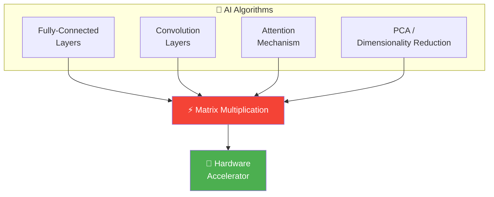
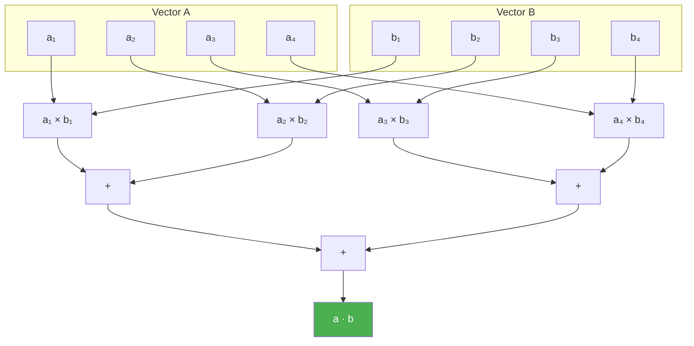
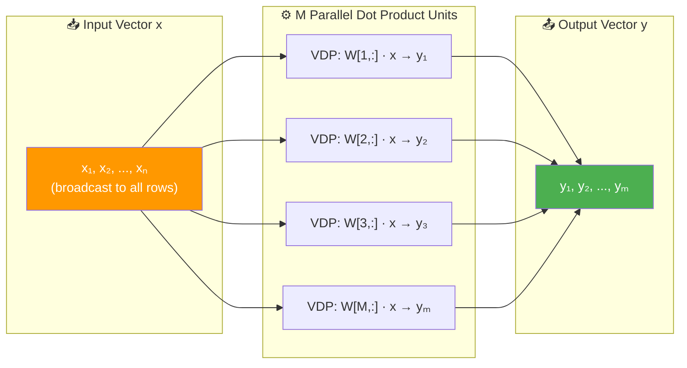
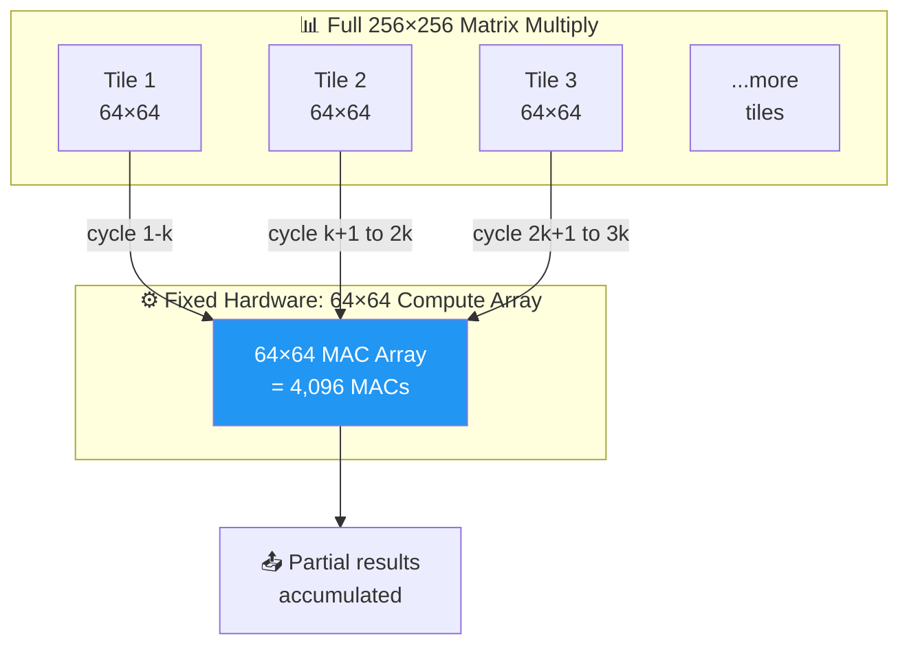
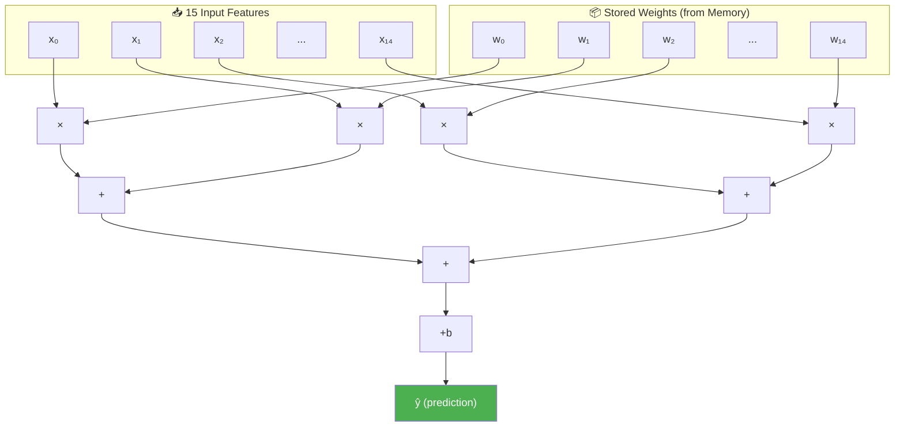
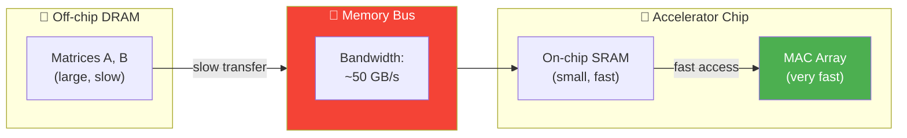

# Matrix Multiplication in Hardware: The Core of Every AI Accelerator

> **Learning Objectives**
> - Understand why matrix multiplication is the computational bottleneck of all AI workloads
> - Design hardware for vector dot products using parallel multiplier-adder trees
> - Scale from 1D (vector) to 2D (matrix) multiplication architectures
> - Analyze the resource requirements: O(N) for vectors, O(N²) for matrix-vector, O(N³) for matrix-matrix
> - Recognize that this is exactly what GPUs, TPUs, and custom accelerators optimize

---

## 1. Why Matrix Multiplication Is Everything

Almost every AI computation reduces to matrix multiplication:

| AI Operation | What It Really Is |
|:---|:---|
| Fully-connected layer inference | Matrix × Vector |
| Convolutional layer (im2col) | Matrix × Matrix |
| Attention mechanism (Transformers) | Matrix × Matrix × Matrix |
| PCA (covariance computation) | Matrix × Matrix^T |
| Linear regression inference | Vector dot product |

> **The bottom line**: If you can do matrix multiplication fast, you can do AI fast. This is why every custom accelerator — from Google's TPU to Nvidia's Tensor Cores — is fundamentally a matrix multiplication engine.



---

## 2. Vector Dot Product: The Atomic Operation

The simplest form of matrix multiplication is the **dot product** of two vectors:

```
a · b = a₁×b₁ + a₂×b₂ + ... + aₙ×bₙ = Σ(aᵢ × bᵢ)
```

This is also called **Multiply-Accumulate (MAC)**: multiply corresponding elements and accumulate (sum) the results.

### 2.1 Software Implementation

```python
def dot_product(a, b):
    """Vector dot product — the fundamental AI operation."""
    assert len(a) == len(b), "Vectors must be same length"
    result = 0
    for i in range(len(a)):
        result += a[i] * b[i]  # One MAC operation
    return result

# Example: Linear regression inference
weights = [0.5, -0.3, 0.8, 0.1, -0.6]
inputs  = [1.2,  3.4, 0.7, 2.1,  0.9]
prediction = dot_product(weights, inputs)
print(f"Prediction: {prediction:.2f}")  # 0.11
```

### 2.2 Hardware: Fully Parallel Dot Product

For an N-dimensional vector, the fully parallel hardware uses:
- **N multipliers** (all operating simultaneously)
- **An adder tree** with ⌈log₂ N⌉ levels



**Resource count for N-dimensional dot product**:

| Component | Count | Latency Contribution |
|:---|:---|:---|
| Multipliers | N | 1 multiply stage |
| Adders | N − 1 | ⌈log₂ N⌉ adder stages |
| Registers | ~2N | Pipeline buffers |
| **Total latency** | — | **1 + ⌈log₂ N⌉ cycles** |

For N = 8: 8 multipliers, 7 adders, latency = 1 + 3 = 4 cycles.

On a CPU with 1 ALU: the same computation takes **2N − 1 = 15 cycles** (8 multiplies + 7 adds, sequential).

```python
import math

def dot_product_hardware_analysis(n):
    """Analyze hardware resources for a parallel dot product unit."""
    multipliers = n
    adders = n - 1
    latency_hw = 1 + math.ceil(math.log2(n))  # parallel
    latency_cpu = 2 * n - 1  # sequential
    speedup = latency_cpu / latency_hw
    
    print(f"Vector dimension: {n}")
    print(f"  Multipliers: {multipliers}")
    print(f"  Adders:      {adders}")
    print(f"  HW Latency:  {latency_hw} cycles")
    print(f"  CPU Latency: {latency_cpu} cycles")
    print(f"  Speedup:     {speedup:.1f}×")

dot_product_hardware_analysis(8)
# Vector dimension: 8
#   Multipliers: 8
#   Adders:      7
#   HW Latency:  4 cycles
#   CPU Latency: 15 cycles
#   Speedup:     3.8×

dot_product_hardware_analysis(512)
# Vector dimension: 512
#   Multipliers: 512
#   Adders:      511
#   HW Latency:  10 cycles
#   CPU Latency: 1023 cycles
#   Speedup:     102.3×
```

---

## 3. Matrix-Vector Multiplication

A matrix-vector multiply computes **M dot products** in parallel:

```
y = W · x

where W is M×N matrix, x is N×1 vector, y is M×1 vector
```

Each output `yᵢ` is a dot product of row `i` of W with vector x:

```
y₁ = W[1,:] · x
y₂ = W[2,:] · x
...
yₘ = W[M,:] · x
```

### 3.1 Hardware Architecture



**Resources** (fully parallel):

| Component | Count | Reasoning |
|:---|:---|:---|
| Multipliers | **M × N** | N per dot product, M dot products |
| Adders | **M × (N−1)** | N−1 adders per dot product |
| Total MAC units | **M × N** | Each MAC = 1 multiplier + 1 adder |
| Latency | **1 + ⌈log₂ N⌉** | Same as single dot product! |

> **Key insight**: The latency doesn't increase with M! All M dot products execute in parallel. We trade **area** (more multipliers) for **time** (constant latency). This is exactly what fully-connected layer inference looks like.

---

## 4. Matrix-Matrix Multiplication

The full matrix multiply: **C = A × B** where A is M×K and B is K×N, producing C of dimension M×N.

Each element `C[i,j]` is a dot product of row `i` of A with column `j` of B:

```
C[i,j] = Σₖ A[i,k] × B[k,j]
```

### 4.1 Resource Explosion

For a fully parallel implementation:

| Component | Count | For 64×64 matrices |
|:---|:---|:---|
| Multipliers | M × N × K | 64³ = 262,144 |
| Adders | M × N × (K−1) | 64² × 63 = 258,048 |
| Total operations | **O(M × N × K)** = **O(N³)** | ~500,000 units |

**This is the fundamental challenge** — matrix multiplication requires O(N³) operations, and fully parallelizing it requires O(N³) hardware. Even at 5nm transistor sizes, this quickly becomes impractical for large matrices.

### 4.2 Practical Solution: Tiling and Reuse

No real accelerator builds O(N³) hardware. Instead, they use a **fixed-size compute array** and process the matrix in **tiles**:



**Example**: Google TPU v1 has a **256×256 systolic array** = 65,536 MAC units. For matrices larger than 256, it tiles the computation.

This tiling strategy is covered in detail in Module 4 (Accelerator Architectures).

---

## 5. Real-World Case: Linear Regression Hardware

Linear regression inference is a single matrix-vector multiply:

```
y = W·x + b
```

For a model with 15 features:



Hardware signals for a real implementation:
- **`enable`**: Tells the hardware to start computation
- **`ready`**: Status signal indicating the output is valid
- **Weight memory**: Small on-chip memory storing W₀ through W₁₄ + bias

On a CPU with 1 ALU: 15 multiplications + 14 additions + 1 bias add = **30 sequential operations**.

On custom hardware: 15 parallel multiplies + ⌈log₂ 15⌉ = 4 adder levels + 1 bias = **6 cycles**.

**Speedup: 5× with a simple, small design.**

---

## 6. The Memory Challenge

As matrix sizes grow, the bottleneck shifts from **compute** to **memory**:



**The problem**: Even if the MAC array can process data in 10 ns, loading the data from DRAM takes 50+ ns. The compute units sit idle waiting for data — a situation called being **memory-bound**.

This memory bottleneck is why:
1. **On-chip SRAM** is maximized in accelerators (to cache frequently accessed data)
2. **Data reuse** strategies are carefully designed (use each loaded element many times before discarding)
3. **Dataflow architectures** (covered in Module 4) organize computation to minimize data movement

> **Rule of thumb**: Modern accelerators spend more transistors on **memory** and **data routing** than on **compute**. The MAC array is often less than 30% of the chip — the rest is memory hierarchy and interconnects.

---

## Key Takeaways

- **Matrix multiplication is the universal bottleneck** — every AI workload reduces to it
- A **vector dot product** (length N) requires N multipliers + an adder tree with ⌈log₂ N⌉ levels
- Scaling to **matrix-vector** multiply multiplies resource count by M (number of rows)
- **Full matrix-matrix** multiply requires O(N³) resources — practically solved by tiling with fixed-size compute arrays
- The **memory bandwidth** often limits performance more than compute — data needs to travel from slow DRAM to fast on-chip units
- Real accelerators balance **compute resources** (MACs) with **memory hierarchy** (SRAM/caches) and **data movement** (buses/interconnects)

---

## Practice Problems

### Problem 1: Dot Product Unit Design

> **Context**: *VoiceAI Systems* needs a hardware dot product unit for processing audio feature vectors of length 64 (in FP32).
>
> **Tasks**:
> - (a) How many multipliers and adders are needed for a fully parallel design? [1]
> - (b) What is the latency in clock cycles? At 500 MHz, what is the wall-clock time? [2]
> - (c) If each FP32 multiplier uses 500 LUTs and each FP32 adder uses 200 LUTs, what is the total LUT count? Will it fit on a 200K-LUT FPGA? [2]

<details>
<summary><b>Solution</b></summary>

**(a)** Components:
- Multipliers: **64**
- Adders: 64 − 1 = **63** (arranged as a tree)

**(b)** Latency:
- 1 multiply stage + ⌈log₂ 64⌉ = 6 adder levels = **7 clock cycles**
- At 500 MHz: 7 × (1/500M) = 7 × 2 ns = **14 ns**

**(c)** LUT count:
- Multiplier LUTs: 64 × 500 = 32,000
- Adder LUTs: 63 × 200 = 12,600
- **Total: 44,600 LUTs**
- With a 200K-LUT FPGA: 44,600 / 200,000 = **22.3% utilization**
- **✅ Yes, it fits comfortably**, with 77.7% remaining for control logic, memory interfaces, and other functions.

</details>

### Problem 2: Fully-Connected Layer Accelerator

> **Context**: *PathsalaAI* is designing a hardware accelerator for a fully-connected neural network layer with 512 input neurons and 128 output neurons. All values are FP32.
>
> **Tasks**:
> - (a) How many total MAC operations are needed per inference? [1]
> - (b) Design Option A: Fully parallel. How many multipliers needed? Is this feasible at 500 LUTs per multiplier on a 1M-LUT FPGA? [2]
> - (c) Design Option B: Use a 64-multiplier dot product unit and time-multiplex. How many clock cycles per output neuron? Total for all 128 outputs? [2]
> - (d) Compare the latency and resource usage of Options A and B. [2]

<details>
<summary><b>Solution</b></summary>

**(a)** MAC operations:
- Each output neuron computes a dot product of length 512 → **512 MACs**
- Total: 128 output neurons × 512 MACs = **65,536 MAC operations**

**(b)** Option A — Fully parallel:
- Multipliers needed: 128 × 512 = **65,536 multipliers**
- LUT cost: 65,536 × 500 = **32,768,000 LUTs (32.8M)**
- Available: 1M LUTs
- **❌ NOT feasible** — requires 32.8× more resources than available

**(c)** Option B — Time-multiplexed:
- Use 64 multipliers to compute each dot product of length 512
- Each dot product requires ⌈512/64⌉ = 8 rounds of multiplication + accumulation
- Latency per neuron: 8 rounds × (1 multiply + 1 accumulate) ≈ **16 cycles**
- Total for 128 neurons (sequential): 128 × 16 = **2,048 cycles**

**(d)** Comparison:

| Metric | Option A (Full Parallel) | Option B (Time-Multiplexed) |
|:---|:---|:---|
| Multipliers | 65,536 | 64 |
| LUTs | 32.8M ❌ | 32,000 ✅ |
| Latency | ~10 cycles | ~2,048 cycles |
| FPGA fit? | No | Yes (3.2% utilization) |
| Throughput | 1 inference / 10 cycles | 1 inference / 2,048 cycles |

**Trade-off**: Option B uses 1024× fewer resources but takes 200× longer. A middle ground (e.g., 4 parallel dot product units = 256 multipliers) would give 512 cycles — a 4× speedup over Option B while using only 12.8% of the FPGA.

</details>

### Problem 3: Memory Bandwidth Bottleneck

> **Context**: *CloudEdge* has a matrix multiplication accelerator with a 128×128 MAC array running at 1 GHz. The chip has 256 KB of on-chip SRAM and connects to off-chip DRAM via a 50 GB/s memory bus.
>
> **Tasks**:
> - (a) How many MACs per second can the array perform? [1]
> - (b) For FP32 data, how many bytes per second must be supplied to keep the array fully utilized? [2]
> - (c) Can the 50 GB/s memory bus support this? If not, what is the maximum utilization of the MAC array? [2]

<details>
<summary><b>Solution</b></summary>

**(a)** MAC throughput:
- Array size: 128 × 128 = 16,384 MACs
- One set of MACs per cycle at 1 GHz
- **16,384 × 10⁹ = 16.384 TMAC/s (Tera-MACs per second)**

**(b)** Data requirements:
- Each MAC needs 2 input operands (1 weight + 1 activation), each 4 bytes (FP32)
- Naive: 16,384 MACs × 2 × 4 bytes × 1 GHz = **131 TB/s** (if every operand loaded fresh)
- With perfect reuse (each weight used 128 times): 16,384 × 2 × 4 / 128 ≈ **1.024 TB/s**
- Realistic reuse brings it to approximately **50–200 GB/s** depending on data reuse strategy

**(c)** Memory bus analysis:
- Available bandwidth: 50 GB/s
- Even with good reuse (100 GB/s needed), we can only supply: 50/100 = **50% of required data**
- **Maximum MAC utilization: ~50%** — the array performs only 8.192 TMAC/s
- This is called **being memory-bound** — the compute capability exceeds what the memory can feed
- Solution: maximize on-chip SRAM usage, implement smart data reuse (tiling), and use high-bandwidth memory (HBM) which can deliver 1+ TB/s

</details>
