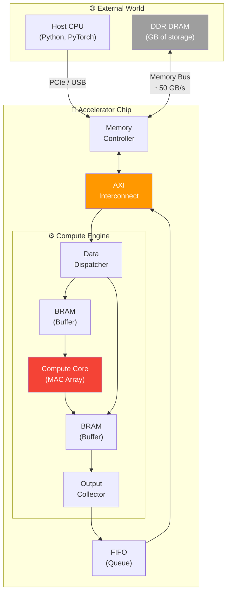
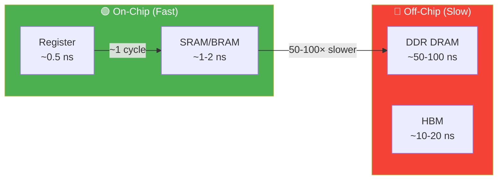
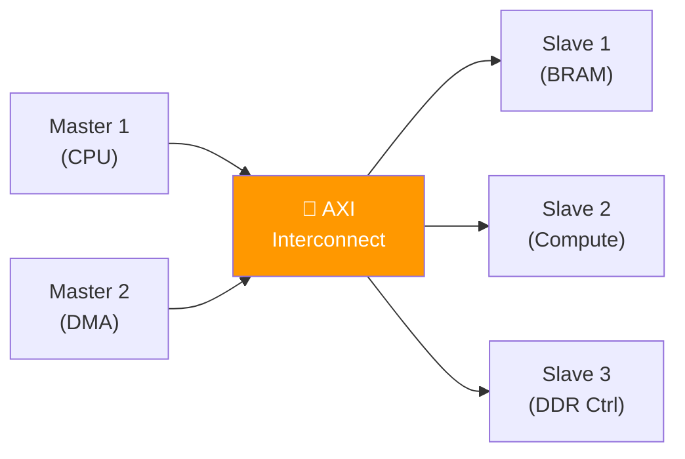
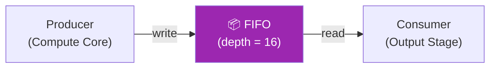
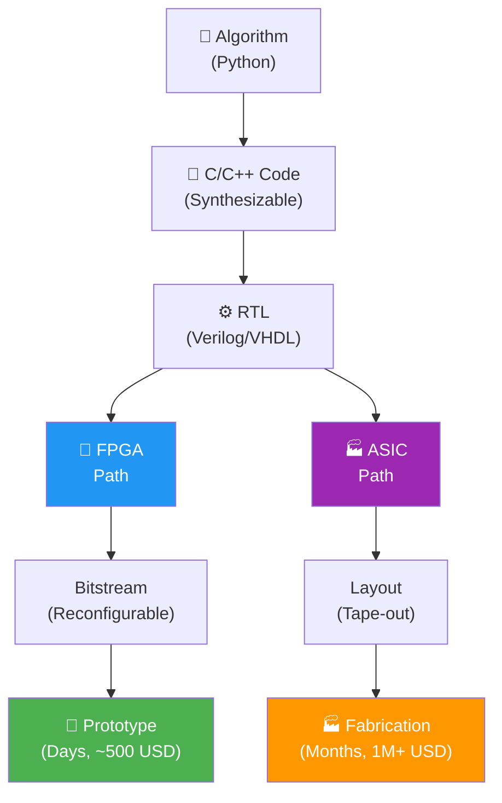
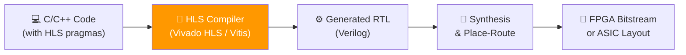
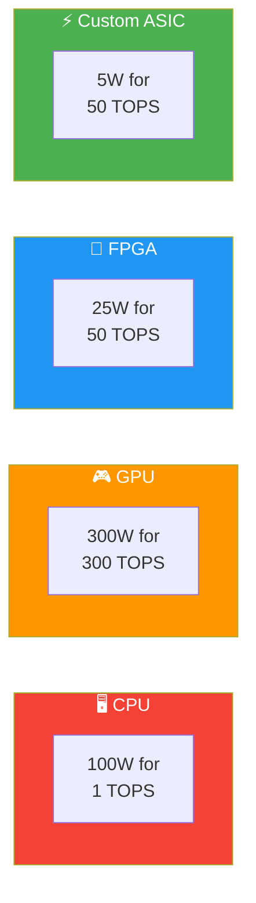

# System Architecture and High-Level Synthesis

> **Learning Objectives**
> - Understand the complete system architecture of an AI accelerator: compute, memory hierarchy, and interconnects
> - Distinguish between on-chip (fast) and off-chip (slow) communication
> - Learn the basics of High-Level Synthesis (HLS): writing C/C++ that becomes hardware
> - Understand FPGA implementation as the prototyping path for custom ASICs
> - Grasp key system-level components: DDR, AXI, BRAM, FIFO

---

## 1. The Complete Picture: Accelerator System Architecture

A real AI accelerator is far more than just arithmetic units. It's a complete **system** with compute, memory, control, and communication working together:



### 1.1 Component Roles

| Component | Function | Software Analogy |
|:---|:---|:---|
| **DDR DRAM** | Stores large datasets, model weights | Hard drive / main RAM |
| **Memory Controller** | Manages read/write requests to DDR | OS memory manager |
| **AXI Interconnect** | Routes data between blocks on-chip | System bus / network switch |
| **Data Dispatcher** | Formats raw data into tiles/packets for the compute core | Data loader / preprocessor |
| **BRAM (Block RAM)** | Fast on-chip buffers (~1 cycle access) | L1/L2 cache |
| **Compute Core** | The MAC array that does the actual math | GPU cores |
| **FIFO (First-In-First-Out)** | Queue for managing data flow between stages | OS pipe / message queue |
| **Output Collector** | Gathers and formats results for return | Post-processor |

### 1.2 The Speed Gap: On-Chip vs. Off-Chip

The most critical insight in accelerator design is the **enormous speed difference** between on-chip and off-chip communication:



| Access | Latency | Bandwidth | Energy per Access |
|:---|:---|:---|:---|
| Register | 0.5 ns | — | ~1 pJ |
| On-chip SRAM | 1–2 ns | ~TB/s | ~5 pJ |
| Off-chip DDR | 50–100 ns | ~50 GB/s | ~640 pJ |
| Off-chip HBM | 10–20 ns | ~1 TB/s | ~100 pJ |

> **DDR access costs 100× more energy than SRAM access.** This is why accelerator architects obsess over minimizing off-chip memory transfers — it's not just about speed, it's about power consumption.

### 1.3 Why This Matters for AI

Consider loading weights for a neural network layer with 512×256 = 131,072 FP32 weights:

- **Total data**: 131,072 × 4 bytes = 512 KB
- **From DDR at 50 GB/s**: 512 KB / 50 GB/s = **~10 μs** to load
- **From on-chip SRAM**: 512 KB / 1 TB/s = **~0.5 μs** to load

The computation itself might take only 1 μs, but loading the data can take 10× longer!

> **Design Principle**: The best accelerator is one where the compute core **never waits for data**. This requires careful orchestration of data movement — preloading the next tile while computing the current one (a technique called **double buffering**).

---

## 2. Key System Components in Detail

### 2.1 AXI: The Universal Interconnect

**AXI (Advanced eXtensible Interface)** is the standard protocol for connecting blocks inside a chip. It's used in nearly every modern SoC (System-on-Chip), including your smartphone.



**Key features**:
- **Read and Write channels** operate independently (full-duplex)
- **Burst transfers**: send multiple data words in one request
- **Handshake protocol**: `valid` and `ready` signals ensure no data is lost
- **Flexible addressing**: any master can access any slave

> **Why you should care**: When designing an accelerator, the AXI interface defines how your compute core communicates with memory and the host CPU. It's the "USB" of the on-chip world.

### 2.2 BRAM: Fast On-Chip Memory

**Block RAM (BRAM)** is a fixed-size, fast memory available on FPGAs. It acts as a local cache for the compute core.

| Property | BRAM | DDR DRAM |
|:---|:---|:---|
| Access time | 1 clock cycle | 50–100+ cycles |
| Location | On-chip | Off-chip |
| Size (typical) | 1–10 MB total | 4–64 GB |
| Power per access | Very low | 100× higher |
| Use case | Buffering tiles/weights | Storing entire models |

**Design pattern**: Load a tile of data from DDR into BRAM, process it with the MAC array, then load the next tile. This hides DDR latency and keeps the compute core busy.

### 2.3 FIFO: The Data Queue

A **FIFO (First-In-First-Out)** buffer is a queue that decouples producers and consumers:



**Why FIFOs are essential**: Different stages of the pipeline may run at different speeds. The producer might generate results in bursts, while the consumer processes them steadily. The FIFO absorbs this mismatch.

---

## 3. Implementation Paths: FPGA vs. ASIC

There are two paths to turn your hardware design into a physical chip:



| Aspect | FPGA | ASIC |
|:---|:---|:---|
| **What it is** | Reconfigurable chip with programmable logic blocks | Custom-manufactured chip |
| **Cost to prototype** | ~$500–$20K (buy a board) | $1M–$100M+ (mask + fabrication) |
| **Time to deploy** | Hours to days | 6–18 months |
| **Performance** | Good (200–500 MHz typical) | Excellent (1–3 GHz) |
| **Power efficiency** | Moderate | Best (custom power optimization) |
| **Reconfigurability** | ✅ Can reprogram for different designs | ❌ Fixed after fabrication |
| **Volume economics** | Better for < 10,000 units | Better for > 100,000 units |
| **Use case** | Prototyping, low-volume, edge devices | Smartphones, data centers, mass market |

> **Typical workflow**: Design the accelerator → Verify on FPGA → If performance and market justify it → Tape-out as ASIC

### Companies and Their Paths

| Company | Product | Path |
|:---|:---|:---|
| Google | TPU | Custom ASIC |
| Nvidia | GPU (A100, H100) | Custom ASIC |
| Intel | Stratix FPGAs | FPGA (sold as product) |
| Xilinx (AMD) | Versal, Alveo | FPGA (sold as product) |
| Groq | LPU | Custom ASIC |
| Startups | Various AI chips | FPGA prototype → ASIC production |

---

## 4. High-Level Synthesis (HLS): From C++ to Hardware

**High-Level Synthesis** is a compiler technology that converts C/C++ code directly into hardware (RTL), bypassing the need to write Verilog or VHDL manually.

### 4.1 The HLS Promise



### 4.2 HLS Constraints (Synthesizable C++)

Not all C++ code is HLS-compatible. The key constraints:

| Allowed ✅ | Not Allowed ❌ |
|:---|:---|
| Fixed-size arrays | Dynamic memory (`malloc`, `new`) |
| `for` loops with fixed bounds | `while` with data-dependent conditions |
| Arithmetic operations (+, -, ×, /) | Standard library functions (`math.h`) |
| `if-else` (becomes MUX) | Recursion |
| Structs and simple classes | Pointers to dynamic memory |
| `#pragma` directives for optimization | System calls (`printf`, file I/O) |

### 4.3 HLS Pragmas: Directing the Hardware

HLS compilers use **pragmas** (compiler directives) to control how C++ maps to hardware:

```cpp
// HLS-compatible dot product
void dot_product(float a[64], float b[64], float *result) {
    #pragma HLS INTERFACE s_axilite port=return
    #pragma HLS INTERFACE m_axi port=a
    #pragma HLS INTERFACE m_axi port=b
    
    float sum = 0;
    
    DOT_LOOP:
    for (int i = 0; i < 64; i++) {
        #pragma HLS UNROLL factor=8    // Unroll 8× → 8 parallel multipliers
        #pragma HLS PIPELINE II=1      // Pipeline: 1 result per cycle
        sum += a[i] * b[i];
    }
    
    *result = sum;
}
```

| Pragma | Effect | Hardware Impact |
|:---|:---|:---|
| `#pragma HLS UNROLL factor=8` | Replicate loop body 8 times | 8 parallel multipliers |
| `#pragma HLS PIPELINE II=1` | Pipeline with initiation interval 1 | New input accepted every cycle |
| `#pragma HLS INTERFACE m_axi` | Connect port via AXI memory interface | AXI master port generated |
| `#pragma HLS ARRAY_PARTITION` | Split array across multiple BRAMs | Parallel memory access |

### 4.4 Example: HLS vs. Manual RTL

For simple designs, HLS can achieve close-to-optimal results:

```python
# Python representation of what HLS generates for the dot product

def hls_dot_product_simulation():
    """Simulating what the HLS-generated hardware does."""
    a = [0.5, -0.3, 0.8, 0.1, -0.6, 0.2, 0.7, -0.4]
    b = [1.2,  3.4, 0.7, 2.1,  0.9, 1.5, 0.3,  2.8]
    
    # HLS with UNROLL factor=4: processes 4 elements per cycle
    cycles = 0
    sum_accum = 0
    
    for start in range(0, 8, 4):  # 4 elements at a time
        # These 4 multiplications happen IN PARALLEL in hardware
        products = [a[start+j] * b[start+j] for j in range(4)]
        partial_sum = sum(products)
        sum_accum += partial_sum
        cycles += 1
        print(f"Cycle {cycles}: process elements [{start}:{start+4}], "
              f"partial_sum = {partial_sum:.2f}, accumulator = {sum_accum:.2f}")
    
    print(f"\nFinal result: {sum_accum:.2f} in {cycles} cycles")
    print(f"Without unrolling: would take 8 cycles")
    print(f"With full unrolling (factor=8): would take 1 cycle")

hls_dot_product_simulation()
```

### 4.5 The HLS Trade-off

| Approach | Development Time | Performance | Control |
|:---|:---|:---|:---|
| Manual RTL (Verilog) | Weeks–Months | Best (100%) | Full |
| HLS (C/C++) | Days–Weeks | Good (70–90%) | Moderate |
| Pre-built IP cores | Hours | Varies | Limited |

> **When to use HLS**: When rapid prototyping matters more than squeezing out the last 10% of performance. Most research labs and startups use HLS; large companies (Nvidia, Google) writing production ASICs use manual RTL.

---

## 5. The Power Advantage of Custom Silicon

Why go through all this effort instead of just using a GPU?

### Energy Comparison



| Platform | Performance | Power | Efficiency (TOPS/W) |
|:---|:---|:---|:---|
| CPU | 1 TOPS | 100W | 0.01 |
| GPU (A100) | 312 TOPS | 300W | ~1 |
| FPGA | 50 TOPS | 25W | 2 |
| Custom ASIC | 50 TOPS | 5W | **10** |

**Why custom ASICs are more efficient**:
1. **No wasted logic**: Every transistor serves the specific algorithm
2. **No instruction fetch/decode**: Data flows directly through the pipeline
3. **Optimized memory**: Data paths are designed for the exact access pattern
4. **Power gating**: Unused blocks can be completely shut off

> **Where this matters most**: Edge devices (smartwatches, IoT sensors, drones) where power budgets are measured in milliwatts. A 5W ASIC can do what a 300W GPU does — enabling AI inference on battery power.

---

## Key Takeaways

- An accelerator system has **compute** (MAC arrays), **memory hierarchy** (registers → SRAM → DRAM), and **interconnects** (AXI buses)
- **Off-chip DDR access is 100× slower and 100× more energy-expensive** than on-chip SRAM — minimizing data transfers is critical
- **FPGAs** enable rapid prototyping (days, ~$500); **ASICs** deliver maximum performance (months, $1M+) for mass production
- **HLS** converts C/C++ to hardware using pragmas — trading some performance for dramatically faster development
- Custom ASICs achieve **10–100× better energy efficiency** than GPUs for specific AI workloads

---

## Practice Problems

### Problem 1: System Architecture Design

> **Context**: *EdgeVision Corp* is designing a system to run a CNN on an FPGA for real-time object detection at 30 frames per second.
>
> **Given**:
> - CNN model: 10M FP32 parameters (40 MB total)
> - FPGA on-chip BRAM: 2 MB
> - DDR bandwidth: 25 GB/s
> - Each frame requires processing all 10M parameters
>
> **Tasks**:
> - (a) Can all parameters fit in BRAM? If not, how many DDR loads per frame? [2]
> - (b) How long does each DDR load take? Can the system meet 30 FPS? [2]
> - (c) Propose a double-buffering strategy. What additional BRAM is needed? [2]

<details>
<summary><b>Solution</b></summary>

**(a)** BRAM capacity check:
- Model size: 40 MB
- BRAM: 2 MB
- **No**, parameters do not fit in BRAM.
- DDR loads per frame: ⌈40 MB / 2 MB⌉ = **20 loads per frame**

**(b)** DDR load timing:
- Each load: 2 MB / 25 GB/s = 0.08 ms = **80 μs per load**
- Total DDR time: 20 × 80 μs = **1.6 ms per frame**
- Frame budget at 30 FPS: 1000/30 = **33.3 ms per frame**
- DDR loading consumes: 1.6/33.3 = **4.8% of the frame budget**
- **✅ Yes**, plenty of time for computation within the remaining 31.7 ms

**(c)** Double buffering:
- Allocate BRAM into two 1 MB buffers (Buffer A and Buffer B)
- While the compute core processes tile N from Buffer A, DDR loads tile N+1 into Buffer B
- Next cycle: compute from Buffer B, load into Buffer A
- **No additional BRAM needed** — just split the existing 2 MB into two halves
- Benefit: DDR load latency is completely hidden; compute core never stalls for data

</details>

### Problem 2: HLS Design Space Exploration

> **Context**: You are using HLS to implement a vector dot product of length 256 on an FPGA.
>
> **Given**:
> - FPGA has 100,000 LUTs and 200 BRAM blocks
> - FP32 multiplier: 500 LUTs
> - FP32 adder: 200 LUTs
>
> **Tasks**:
> - (a) With `#pragma HLS UNROLL factor=1` (no unrolling): how many multipliers? Latency? [1]
> - (b) With `#pragma HLS UNROLL factor=16`: how many multipliers? Latency? LUT usage? [2]
> - (c) What is the maximum unroll factor that fits within the 100K LUT budget? [2]

<details>
<summary><b>Solution</b></summary>

**(a)** No unrolling (factor=1):
- Multipliers: **1**
- Latency: 256 multiply cycles + 255 accumulate cycles = **511 cycles**
- (In practice, with pipelining, closer to 256 cycles)

**(b)** Unroll factor=16:
- Multipliers: **16** (16 multiplications per cycle)
- Adders: 16 per tree level, ~15 total for partial sum + 1 accumulator = ~16 adders
- Latency: ⌈256/16⌉ = 16 rounds × (1 multiply + ⌈log₂ 16⌉ = 4 adder levels) ≈ **16 × 5 = 80 cycles**
- LUT usage: 16 × 500 (muls) + 16 × 200 (adders) = 8,000 + 3,200 = **11,200 LUTs (11.2%)**

**(c)** Maximum unroll factor:
- Budget: 100,000 LUTs (leave 20% for control/routing ≈ 80,000 usable)
- Per unroll unit: 500 (mul) + 200 (adder) = 700 LUTs
- Max factor: ⌊80,000 / 700⌋ = **114**
- Practical limit: round to nearest power of 2 = **64**
- With factor=64: 64 × 700 = 44,800 LUTs (44.8%)
- Latency: ⌈256/64⌉ × (1 + 6) = 4 × 7 = **28 cycles**

</details>

### Problem 3: ASIC vs. FPGA Decision

> **Context**: *SmartWatch AI* is deciding between FPGA and ASIC for their next-generation wearable health monitor that runs a small neural network for heart rhythm classification.
>
> **Given**:
> - Expected production volume: 500,000 units/year
> - FPGA cost: $15/unit, 200 mW idle power, 50 GOPS peak
> - ASIC NRE (non-recurring engineering): $3,000,000
> - ASIC per-unit cost: $2/unit, 20 mW idle power, 100 GOPS peak
> - Battery: 300 mAh at 3.7V
>
> **Tasks**:
> - (a) At what production volume does ASIC become cheaper than FPGA? [2]
> - (b) Calculate battery life for both options (assuming continuous operation at idle power). [2]
> - (c) Which option should SmartWatch AI choose? Justify with both cost and technical arguments. [2]

<details>
<summary><b>Solution</b></summary>

**(a)** Break-even calculation:
- FPGA total cost = $15 × N
- ASIC total cost = $3,000,000 + $2 × N
- Break-even: 15N = 3,000,000 + 2N → 13N = 3,000,000 → N = **230,769 units**
- **At 500,000 units/year, ASIC is already well past break-even**
- FPGA cost for 500K units: $7.5M vs. ASIC: $3M + $1M = $4M

**(b)** Battery life:
- Battery energy: 300 mAh × 3.7V = 1,110 mWh
- **FPGA**: 1,110 mWh / 200 mW = **5.55 hours**
- **ASIC**: 1,110 mWh / 20 mW = **55.5 hours** ≈ 2.3 days
- **ASIC lasts 10× longer on the same battery**

**(c)** Recommendation: **ASIC**

| Factor | FPGA | ASIC | Winner |
|:---|:---|:---|:---|
| Unit cost at 500K | $7.5M | $4M | ASIC |
| Battery life | 5.5 hrs | 55.5 hrs | ASIC |
| Performance | 50 GOPS | 100 GOPS | ASIC |
| Time to market | Faster | Slower (12–18 months) | FPGA |
| Flexibility | Can update | Fixed | FPGA |

For a wearable device with 500K unit volumes, the ASIC is the clear winner:
- **10× better battery life** (critical for wearables)
- **$3.5M cheaper** at production volume
- **2× better performance** enables more complex models

The only risk is the 12–18 month development time. A smart strategy: **prototype on FPGA first**, validate the design, then tape-out as ASIC for production.

</details>
