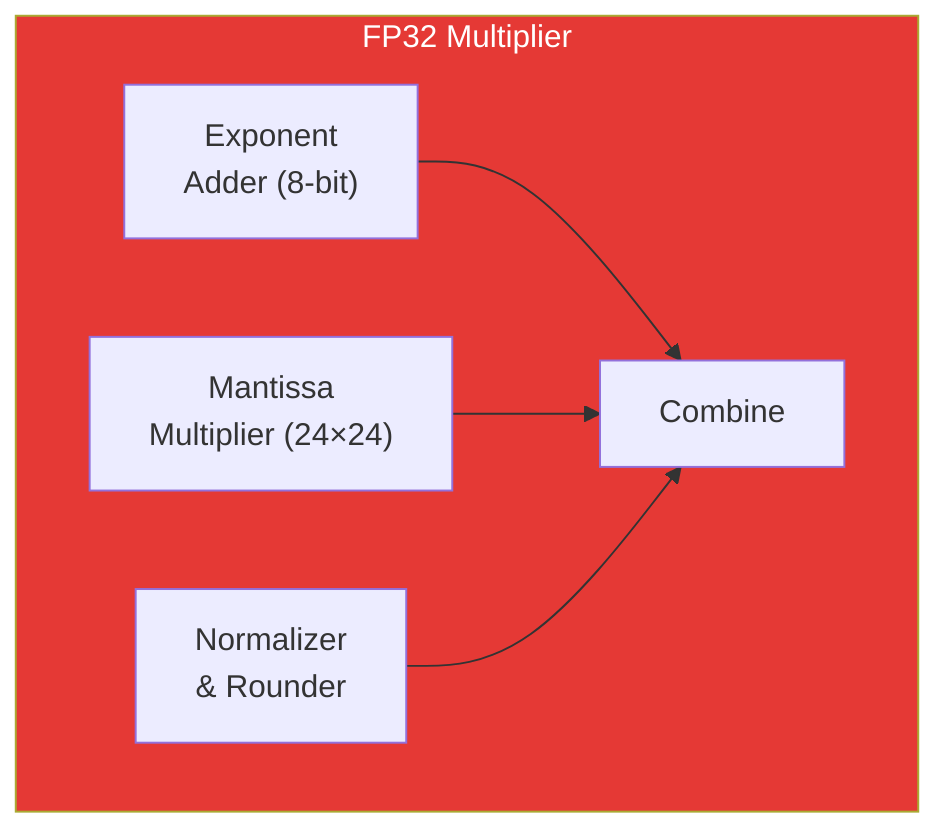
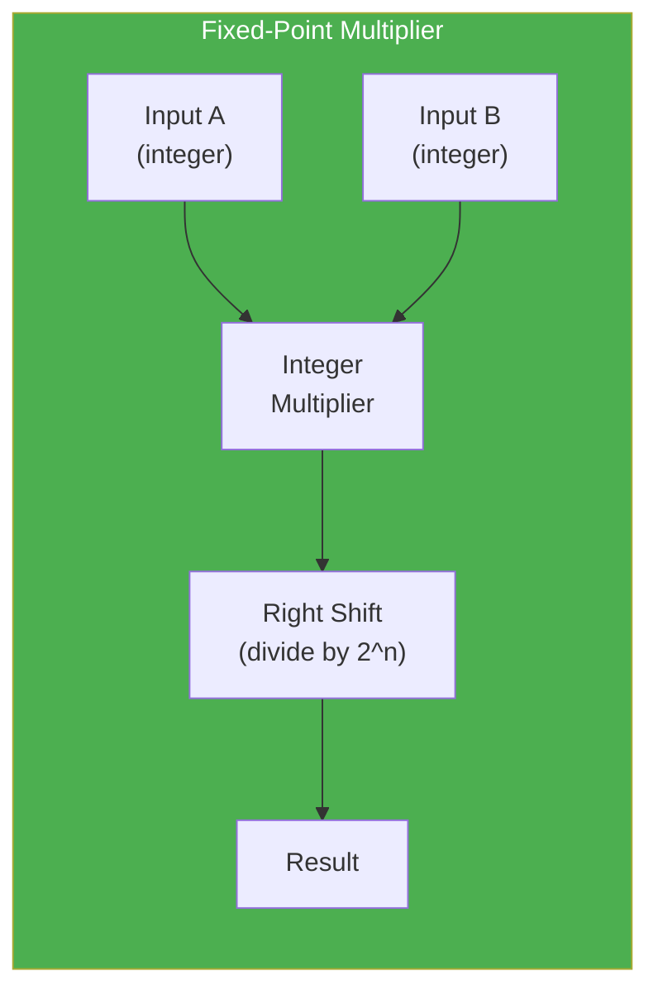
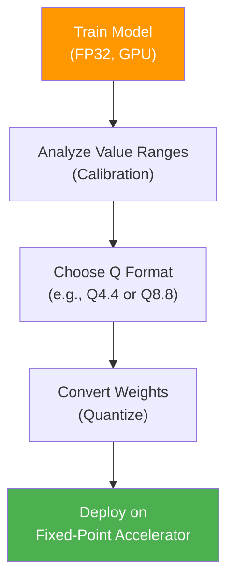
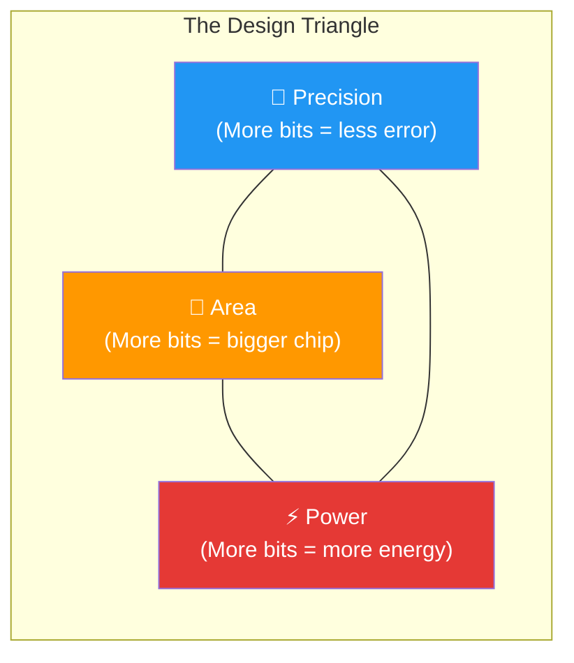

# Number Representations for Hardware

> **Learning Objectives**
> - Understand how real numbers are stored in digital hardware using IEEE 754 and fixed-point formats
> - Compare the area, power, and precision trade-offs between floating-point and fixed-point
> - Justify why inference accelerators overwhelmingly prefer fixed-point arithmetic
> - Preview quantization as a bridge between model accuracy and hardware efficiency

---

## 1. The Fundamental Problem

Every weight, bias, and activation in a neural network is a **real number** — values like `0.025`, `-3.14`, or `127.5`. But hardware only understands **bits** — zeros and ones.

The question is deceptively simple: *How do you represent `0.025` using only 0s and 1s?*

The answer determines everything about your accelerator:
- **How much silicon area** each multiplier consumes
- **How much energy** each operation costs
- **How fast** your chip can compute
- **How accurate** your results will be

> **Analogy**: Think of number representation like choosing a measuring tool. A laser rangefinder (floating-point) can measure anything from millimeters to kilometers with high precision, but it's expensive and power-hungry. A simple ruler with millimeter markings (fixed-point) is cheap and fast, but it can only measure within its range and resolution. For most AI inference tasks, the ruler is more than sufficient.

---

## 2. IEEE 754 Floating-Point

### How It Works

IEEE 754 is the universal standard for representing real numbers in computers. A 32-bit floating-point number (FP32) has three fields:

```
┌──────┬──────────────┬─────────────────────────────┐
│ Sign │   Exponent   │         Mantissa            │
│ 1bit │   8 bits     │         23 bits             │
└──────┴──────────────┴─────────────────────────────┘
```

The value is computed as:

```
value = (-1)^sign × 2^(exponent - 127) × (1 + mantissa)
```

### Worked Example: Representing 0.025

Let's convert `0.025` to IEEE 754 FP32:

1. **Sign**: Positive → `0`
2. **Convert to binary**: 0.025 = 0.00000110011... (repeating)
3. **Normalize**: 1.10011... × 2⁻⁶
4. **Exponent**: -6 + 127 = 121 → `01111001`
5. **Mantissa**: `10011001100110011001100` (23 bits, truncated)

```
Result: 0 01111001 10011001100110011001100
```

### The Hardware Cost

Here is where it matters for accelerators:



An FP32 multiplier requires:
- A **24×24 integer multiplier** for the mantissa (the largest component)
- An **8-bit adder** for exponents
- A **normalizer** to adjust the result back into standard form
- A **rounding unit** to handle truncation

> **Key Insight**: That 24×24 multiplier alone needs ~576 single-bit full adders arranged in a tree. This is the dominant cost in both area and power for floating-point arithmetic.

### Floating-Point Formats at a Glance

| Format | Total Bits | Exponent | Mantissa | Dynamic Range | Hardware Cost |
|:-------|:-----------|:---------|:---------|:--------------|:-------------|
| FP32   | 32         | 8        | 23       | ±3.4 × 10³⁸  | Very High    |
| FP16   | 16         | 5        | 10       | ±6.5 × 10⁴   | High         |
| BF16   | 16         | 8        | 7        | ±3.4 × 10³⁸  | Medium-High  |

**BFloat16 (BF16)** is noteworthy — it keeps the same exponent range as FP32 but slashes the mantissa from 23 to 7 bits. This means the same dynamic range with much cheaper multipliers, making it popular for training.

---

## 3. Fixed-Point Representation

### The Core Idea

Fixed-point representation takes a different approach: instead of a floating exponent, you **fix the position of the decimal point** at design time. This eliminates the need for exponent logic, normalizers, and rounders.

A fixed-point number is simply an integer with an implied scaling factor.

### Q-Format Notation

The most common notation is **Qm.n**, where:
- `m` = number of integer bits (including sign)
- `n` = number of fractional bits

For example, **Q8.8** uses 16 bits total:

```
┌──────────────────┬──────────────────┐
│   Integer Part   │  Fractional Part │
│     8 bits       │     8 bits       │
└──────────────────┴──────────────────┘
         ↑
    Implied decimal point
```

### Converting to Fixed-Point

To represent `0.025` in Q8.8:

1. Multiply by 2⁸ (256): `0.025 × 256 = 6.4`
2. Round: `6`
3. Store as integer: `00000110`

To read back: `6 / 256 = 0.0234375` — close to 0.025, but not exact.

The **quantization error** is: `|0.025 - 0.0234375| = 0.0015625`

### Q-Format Properties

| Format | Total Bits | Range | Resolution | Multiplier Cost |
|:-------|:-----------|:------|:-----------|:----------------|
| Q8.8   | 16         | ±127  | 1/256 ≈ 0.004 | 16×16 = Low |
| Q4.4   | 8          | ±7    | 1/16 = 0.0625 | 8×8 = Very Low |
| Q16.16 | 32         | ±32767 | 1/65536 ≈ 0.00002 | 32×32 = High |
| Q1.7   | 8          | ±1    | 1/128 ≈ 0.008 | 8×8 = Very Low |

### The Hardware Advantage



A fixed-point multiplier is just an **integer multiplier** followed by a **right shift** (to account for the fractional scaling). No exponent logic, no normalizer, no rounder.

**The savings are dramatic:**

| Component | FP32 | Fixed-Point (Q8.8) | Savings |
|:----------|:-----|:--------------------|:--------|
| Multiplier size | 24×24 bits | 16×16 bits | ~2× area |
| Adder for exponent | Yes | No | Eliminated |
| Normalizer | Yes | No | Eliminated |
| Rounder | Yes | No | Eliminated |
| Energy per multiply | ~5 pJ | ~0.5 pJ | ~10× |

---

## 4. Why Inference Prefers Fixed-Point

Training neural networks requires floating-point because:
- Gradients can be extremely small (10⁻⁸) or large
- Weight updates need high precision to converge
- The dynamic range of FP32 prevents underflow/overflow

But inference is different:
- The weights are **already trained** — their range is known
- Activations fall within predictable bounds
- Small precision losses (±0.5%) rarely affect classification accuracy

This creates a remarkable opportunity: if we **know the range of every value in advance**, we can choose a fixed-point format that covers that range with just enough resolution.



> **Key Insight**: A well-quantized INT8 model running on a fixed-point accelerator can deliver **4× the throughput** and **10× the energy efficiency** of the same model in FP32, often with less than 1% accuracy loss.

---

## 5. Code Example: Precision Impact Simulator

```python
import numpy as np

def simulate_fixed_point(values, integer_bits, frac_bits):
    """
    Simulate fixed-point quantization and measure error.
    
    Args:
        values: numpy array of floating-point values
        integer_bits: bits for integer part (including sign)
        frac_bits: bits for fractional part
    
    Returns:
        quantized values, mean absolute error, max absolute error
    """
    total_bits = integer_bits + frac_bits
    scale = 2 ** frac_bits
    
    # Compute representable range
    max_val = (2 ** (total_bits - 1) - 1) / scale
    min_val = -(2 ** (total_bits - 1)) / scale
    
    # Quantize: scale → round → clip → unscale
    scaled = np.round(values * scale)
    clipped = np.clip(scaled, -2**(total_bits-1), 2**(total_bits-1) - 1)
    quantized = clipped / scale
    
    # Compute errors
    errors = np.abs(values - quantized)
    mae = np.mean(errors)
    max_err = np.max(errors)
    
    print(f"Q{integer_bits}.{frac_bits} ({total_bits}-bit):")
    print(f"  Range: [{min_val:.4f}, {max_val:.4f}]")
    print(f"  Resolution: {1/scale:.6f}")
    print(f"  Mean Absolute Error: {mae:.6f}")
    print(f"  Max Absolute Error:  {max_err:.6f}")
    print(f"  Multiplier size:     {total_bits}×{total_bits} bits")
    print()
    
    return quantized, mae, max_err

# Simulate typical neural network weight distribution
np.random.seed(42)
weights = np.random.randn(1000) * 0.5  # mean=0, std=0.5

print("=== Weight Quantization Analysis ===\n")
print(f"Original weights: mean={weights.mean():.4f}, "
      f"std={weights.std():.4f}, "
      f"range=[{weights.min():.4f}, {weights.max():.4f}]\n")

# Compare different fixed-point formats
for int_bits, frac_bits in [(4, 4), (8, 8), (1, 7), (1, 15)]:
    simulate_fixed_point(weights, int_bits, frac_bits)
```

**Expected Output:**
```
=== Weight Quantization Analysis ===

Original weights: mean=0.0146, std=0.4872, range=[-1.7388, 1.7359]

Q4.4 (8-bit):
  Range: [-8.0000, 7.9375]
  Resolution: 0.062500
  Mean Absolute Error: 0.015924
  Max Absolute Error:  0.031250
  Multiplier size:     8×8 bits

Q8.8 (16-bit):
  Range: [-128.0000, 127.9961]
  Resolution: 0.003906
  Mean Absolute Error: 0.001001
  Max Absolute Error:  0.001953
  Multiplier size:     16×16 bits

Q1.7 (8-bit):
  Range: [-1.0000, 0.9922]
  Resolution: 0.007812
  Mean Absolute Error: 0.002697
  Max Absolute Error:  0.742188    ← Overflow! Weights > 1.0 get clipped
  Multiplier size:     8×8 bits

Q1.15 (16-bit):
  Range: [-1.0000, 0.9999]
  Resolution: 0.000031
  Mean Absolute Error: 0.000011
  Max Absolute Error:  0.738831    ← Still overflow, but fractional precision is excellent
  Multiplier size:     16×16 bits
```

> **Takeaway**: Q8.8 gives a good balance — the range covers typical weight values, and the resolution (0.004) introduces negligible error. But notice Q1.7: if your weights exceed the range, overflow causes catastrophic error. **Choosing the right format requires knowing your data's range.**

---

## 6. The Precision–Hardware Trade-off

Every bit you add to your number representation has a real cost in silicon:



| Precision | Multiplier Area | Energy/Op | Typical Use |
|:----------|:---------------|:----------|:------------|
| FP32 (32-bit float) | ~15,000 µm² | ~5 pJ | Training |
| FP16 (16-bit float) | ~4,000 µm² | ~1.5 pJ | Mixed-precision training |
| INT16 (16-bit fixed) | ~2,000 µm² | ~0.5 pJ | High-precision inference |
| INT8 (8-bit fixed) | ~500 µm² | ~0.1 pJ | Standard inference |
| INT4 (4-bit fixed) | ~130 µm² | ~0.03 pJ | Aggressive quantization |

> **Power Law**: Multiplier area scales roughly as **O(n²)** where n is the bit-width. Halving the bit-width gives you approximately **4× area savings** — and you can pack 4× more multipliers in the same chip area.

---

## Key Takeaways

- **IEEE 754 floating-point** provides enormous dynamic range but requires expensive hardware (exponent logic, normalizer, rounder)
- **Fixed-point** eliminates this overhead by fixing the decimal position at design time — just an integer multiplier plus a shift
- **Inference accelerators prefer fixed-point** because trained weights have known ranges, making the dynamic range of floating-point unnecessary
- The choice of **Q format** (e.g., Q8.8, Q4.4) is a critical design decision: too few bits → accuracy loss; too many bits → wasted silicon
- **Quantization** — converting FP32 weights to lower-precision fixed-point — is the first optimization step in any deployment pipeline
- Multiplier area scales as **O(n²)**: an 8-bit multiplier is ~30× smaller than a 32-bit one

---

## Practice Problems

### Problem 1: Choosing the Right Precision

> **Context**: You are the lead hardware engineer at *EdgeVision AI*, designing a wearable camera that classifies hand gestures in real time. The CNN model has 2 million weights, and profiling shows all weights fall in the range [-2.0, +2.0].
>
> **Constraints**:
> - Chip area budget: 4 mm²
> - Each Q8.8 multiplier occupies 2,000 µm²
> - Each Q4.4 multiplier occupies 500 µm²  
> - You need at least 128 parallel multipliers for real-time performance
> - Remaining area is for memory and control logic
>
> **Tasks**:
> - (a) Calculate the area consumed by 128 multipliers in Q8.8 vs. Q4.4. [2]
> - (b) Which format's range covers [-2.0, +2.0]? Verify mathematically. [2]
> - (c) Your model achieves 95% accuracy in FP32. After Q4.4 quantization, accuracy drops to 89%. After Q8.8, it's 94.5%. The product requires ≥ 93% accuracy. What format do you recommend, and how much chip area remains for memory? [2]

<details>
<summary><b>Solution</b></summary>

**(a)** Multiplier area:
- Q8.8 (128 units): 128 × 2,000 µm² = 256,000 µm² = **0.256 mm²**
- Q4.4 (128 units): 128 × 500 µm² = 64,000 µm² = **0.064 mm²**

**(b)** Range check:
- Q8.8: Range = [-128.0, +127.996] → ✅ Covers [-2.0, +2.0] with massive headroom
- Q4.4: Range = [-8.0, +7.9375] → ✅ Covers [-2.0, +2.0]
- Both formats cover the required range.

**(c)** Recommendation:
- Q4.4: 89% accuracy ❌ (below 93% requirement)
- Q8.8: 94.5% accuracy ✅ (meets requirement)
- **Recommend Q8.8**
- Area remaining: 4.0 mm² - 0.256 mm² = **3.744 mm²** for memory and control
- This is generous — 3.744 mm² of SRAM (at ~0.5 Mbit/mm²) ≈ 1.87 Mbit ≈ 234 KB, enough to store a significant portion of the model weights on-chip.

</details>

### Problem 2: Energy Budget Analysis

> **Context**: *BioSense Labs* is building a neural implant for seizure detection. The model has 500K parameters and runs inference 200 times per second. The implant's battery provides 10 mW continuous power.
>
> **Given**:
> - FP32 MAC energy: 5 pJ/op
> - INT8 MAC energy: 0.1 pJ/op
> - Each inference requires 2M MAC operations
> - Memory access energy: 50 pJ per 32-bit read from SRAM
> - Each MAC needs 2 memory reads (1 weight + 1 activation)
>
> **Tasks**:
> - (a) Calculate total energy per inference for FP32 and INT8 (compute only). [2]
> - (b) For INT8, each memory read is 8 bits instead of 32. How does this affect memory energy? [1.5]
> - (c) Can the INT8 design meet the 10 mW power budget at 200 inferences/sec? Show your calculation including memory energy. [2.5]

<details>
<summary><b>Solution</b></summary>

**(a)** Compute energy per inference:
- FP32: 2M ops × 5 pJ = **10 µJ per inference**
- INT8: 2M ops × 0.1 pJ = **0.2 µJ per inference**
- INT8 is **50× more energy efficient** in compute alone.

**(b)** Memory energy impact:
- FP32: Each read is 32 bits → 50 pJ per read
- INT8: Each read is 8 bits = 32/4 → 50 pJ ÷ 4 = **12.5 pJ per read** (assuming energy scales linearly with bit-width)
- INT8 memory reads: 2M MACs × 2 reads × 12.5 pJ = **50 µJ** per inference
- (Note: memory energy still dominates over compute — a critical insight!)

**(c)** Total power for INT8:
- Compute: 0.2 µJ × 200 Hz = 40 µW
- Memory: 50 µJ × 200 Hz = 10,000 µW = **10 mW**
- Total: 40 µW + 10 mW ≈ **10.04 mW**
- **Barely exceeds budget** ❌ — This reveals the fundamental insight: even with INT8 compute, **memory access dominates the energy budget**. The solution is to maximize data reuse (covered in subsequent chapters) to reduce memory accesses.

</details>

### Problem 3: Format Selection Under Constraints

> **Context**: *AudioNet Inc.* is deploying a keyword detection model on a microcontroller. The model's activation values range from [-1.0, +1.0], while weights range from [-0.5, +0.5]. The MCU has an 8-bit fixed-point multiplier.
>
> **Tasks**:
> - (a) Choose a Q format for weights that maximizes precision within 8 bits. What is the resolution? [2]
> - (b) Does Q1.7 (1 sign bit, 7 fractional bits) cover the weight range? What is the maximum representable positive value? [1]
> - (c) An engineer proposes using Q3.5 instead, arguing "more integer bits for safety." Calculate the resolution of Q3.5. Is this proposal sound? Why or why not? [2]

<details>
<summary><b>Solution</b></summary>

**(a)** For weights in [-0.5, +0.5], we want:
- Minimum integer bits to cover the range
- Maximum fractional bits for precision
- Since |max value| = 0.5, we need at least 1 integer bit (sign)
- **Best format: Q1.7** → 1 sign/integer bit + 7 fractional bits = 8 bits
- Resolution: 1/2⁷ = **1/128 ≈ 0.0078**

**(b)** Q1.7:
- Max positive value: (2⁷ - 1) / 2⁷ = 127/128 = **0.992**
- Range: [-1.0, +0.992]
- ✅ Covers [-0.5, +0.5] with headroom

**(c)** Q3.5:
- Resolution: 1/2⁵ = 1/32 = **0.03125**
- Range: [-4.0, +3.96875]
- The range [-4.0, +3.97] massively exceeds the weight range of [-0.5, +0.5]
- **The proposal is poor**: it wastes 2 bits on unnecessary integer range, reducing resolution from 0.008 to 0.031 — a **4× precision loss**. Since the weights never exceed 0.5, those extra integer bits are completely wasted.

</details>

---

[← Back to Module 3](README.md) | [Next: The MAC Unit →](02_mac_operations.md)
