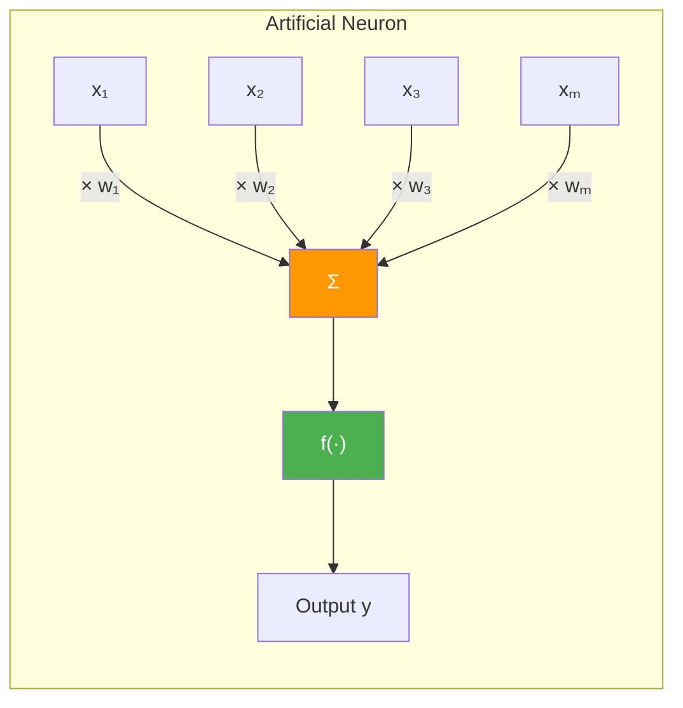
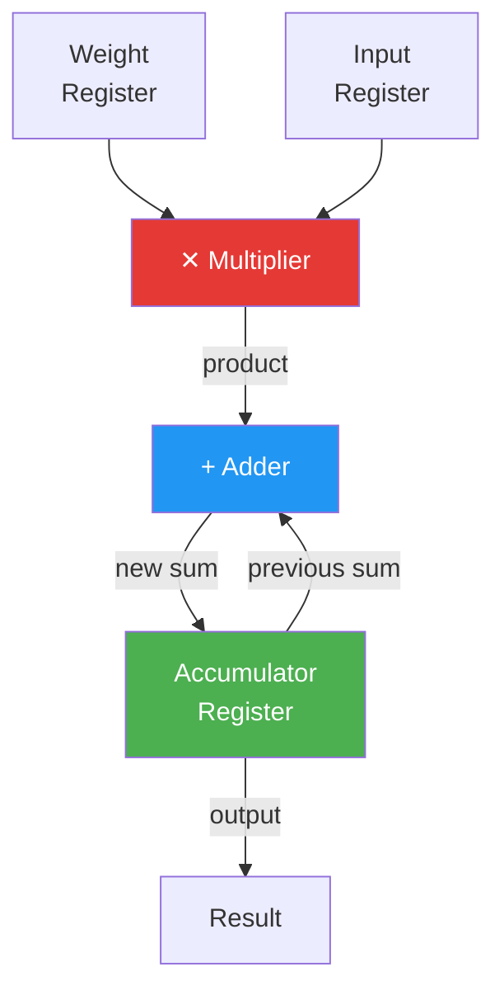
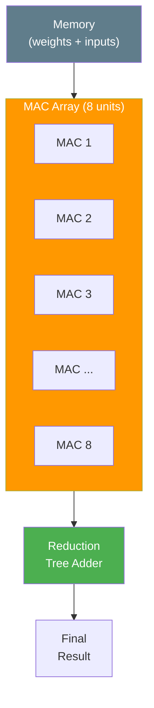
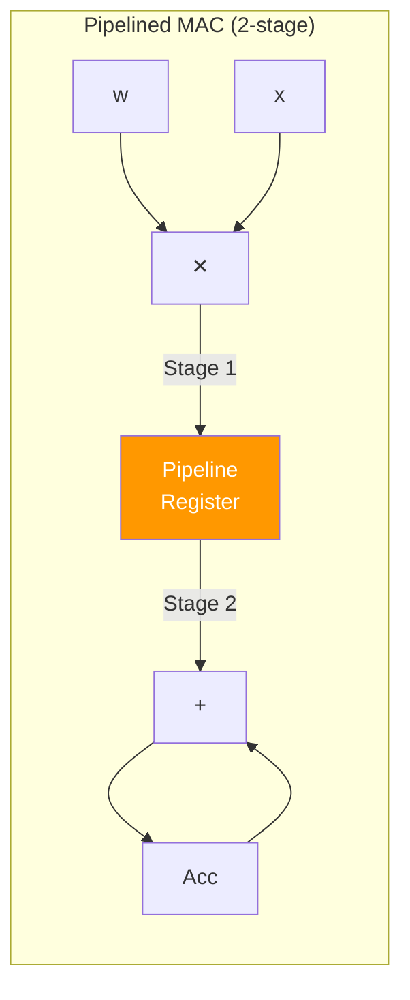
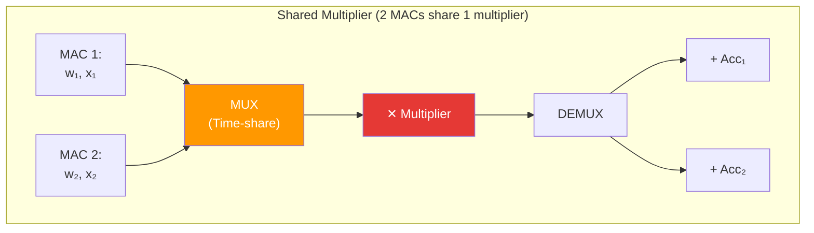
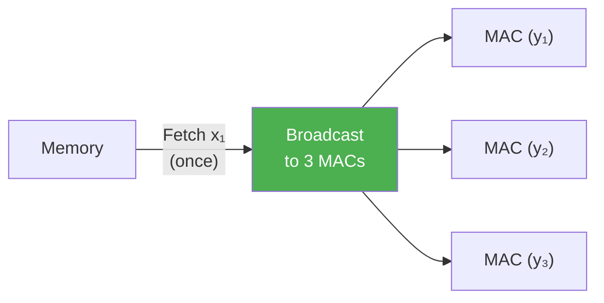

# The MAC Unit — Heart of Every Accelerator

> **Learning Objectives**
> - Understand the Multiply-Accumulate (MAC) operation and why it dominates AI workloads
> - Design a MAC unit from basic hardware components (multiplier, adder, register)
> - Analyze resource costs: how many gates, how much area, how much power
> - Explore MAC unit variations: shared multipliers, pipelining, and multi-precision support

---

## 1. What Is a MAC Operation?

The Multiply-Accumulate (MAC) is the single most important operation in all of neural network computation. Every neuron, every convolution filter, every attention head ultimately boils down to this:

```
accumulator = accumulator + (input × weight)
```

Or mathematically, the output of a single neuron with `M` inputs is:

```
y = Σ(x_i × w_i) + b    for i = 0, 1, ..., M-1
```

This is nothing but **M consecutive MAC operations**: multiply each input by its weight, and keep a running sum.

> **Analogy**: A MAC unit is like a cashier scanning items at a grocery store. Each item has a price (weight) and quantity (input). The cashier multiplies price × quantity for each item and keeps a running total on the register (accumulator). The final total is the neuron's output.



### Scale of the Problem

To appreciate why MAC efficiency matters, consider the numbers:

| Network | MACs per Inference | Weights |
|:--------|:------------------|:--------|
| LeNet-5 (digit recognition) | ~60K | ~60K |
| AlexNet (image classification) | ~720M | ~60M |
| VGG-16 | ~15.5B | ~138M |
| ResNet-50 | ~4.1B | ~25M |
| GPT-2 (text generation) | ~35B per token | ~1.5B |

A VGG-16 inference requires **15.5 billion** multiply-accumulate operations. If each MAC takes 1 nanosecond, a single inference takes 15.5 seconds — far too slow for real-time video. This is why we need **thousands of MAC units working in parallel**.

---

## 2. Anatomy of a MAC Unit

### Block Diagram

A MAC unit consists of three core components connected in a feedback loop:



**Step-by-step operation (one clock cycle):**

1. **Read**: Weight `w` is loaded from the weight register; input `x` is loaded from the input register
2. **Multiply**: The multiplier computes `product = w × x`
3. **Accumulate**: The adder computes `new_sum = old_sum + product`
4. **Store**: The result is written back to the accumulator register
5. **Repeat**: Next clock cycle loads the next `(w, x)` pair

After `M` cycles, the accumulator holds the final dot product: `Σ(x_i × w_i)`.

### Hardware Components in Detail

For an **8-bit fixed-point** MAC unit:

| Component | Function | Size | Area Estimate |
|:----------|:---------|:-----|:-------------|
| Weight Register | Stores current weight | 8 flip-flops | ~80 µm² |
| Input Register | Stores current input | 8 flip-flops | ~80 µm² |
| Multiplier | 8×8 → 16-bit product | ~64 full adders | ~500 µm² |
| Adder | 24-bit accumulation | ~24 full adders | ~200 µm² |
| Accumulator Register | Stores running sum | 24 flip-flops | ~240 µm² |
| **Total** | | | **~1,100 µm²** |

> **Why 24-bit accumulator?** An 8×8 multiply produces a 16-bit product. When we sum many 16-bit products, the total grows. To prevent overflow when accumulating up to 256 products: 16 + log₂(256) = 16 + 8 = 24 bits.

---

## 3. Building Up: From One MAC to Many

### Single MAC: Sequential Processing

With one MAC unit clocked at 1 GHz, we can perform **1 billion MAC operations per second** (1 GMAC/s). For a LeNet-5 inference (60K MACs), this takes:

```
60,000 / 1,000,000,000 = 0.00006 seconds = 60 µs ✓
```

But for VGG-16 (15.5 billion MACs):

```
15,500,000,000 / 1,000,000,000 = 15.5 seconds ✗ (far too slow)
```

### Parallel MACs: The Array Approach

The solution is to replicate the MAC unit:



With 8 parallel MACs, a dot product of length 8 completes in **1 cycle** instead of 8.

**Scaling example:**

| # of Parallel MACs | VGG-16 Inference Time | Chip Area (8-bit) |
|:------------|:-------------------|:-----------|
| 1 | 15.5 seconds | ~1,100 µm² |
| 1,000 | 15.5 ms | ~1.1 mm² |
| 64,000 (like TPU v1) | ~0.24 ms | ~70 mm² |

---

## 4. MAC Unit Variations

### 4.1 Pipelined MAC

In a simple MAC, the multiplier and adder work **sequentially** within one clock cycle. This limits the clock speed because the critical path is long (multiply + add in one cycle).

A **pipelined MAC** inserts a register between the multiplier and adder:



**Trade-off**: 
- ✅ Higher clock frequency (each stage is shorter)
- ❌ 1 extra cycle of **latency** (pipeline fill time)
- ✅ **Throughput** remains 1 MAC/cycle after the pipeline fills

For thousands of consecutive MACs (typical in neural networks), the 1-cycle latency is negligible. The higher clock speed is pure gain.

### 4.2 Shared-Multiplier Design

When chip area is severely constrained (e.g., TinyML on microcontrollers), you might use fewer multipliers shared across multiple MAC pipelines:



**Trade-off**: Half the throughput, but significant area savings when the multiplier dominates cost (as it does for 16+ bit precision).

### 4.3 Multi-Precision MAC

Modern accelerators support **multiple precisions** in the same hardware:

```
One 16×16 multiplier can also work as:
  → Four 8×8 multipliers (process 4 INT8 MACs simultaneously)
  → Sixteen 4×4 multipliers (process 16 INT4 MACs simultaneously)
```

This is how NVIDIA's Tensor Cores achieve different TOPS numbers for different precisions:

| Mode | Multiplier Use | Effective MACs/cycle |
|:-----|:--------------|:-------------------|
| FP16 | Full 16×16 | 1× |
| INT8 | 4 × 8×8 | 4× |
| INT4 | 16 × 4×4 | 16× |

---

## 5. The Reuse Factor

One of the most important metrics for MAC efficiency is the **Reuse Factor** — how many times each fetched datum is used before being discarded.

Consider a fully connected layer with 4 inputs and 3 outputs:

```
y₁ = w₁₁·x₁ + w₁₂·x₂ + w₁₃·x₃ + w₁₄·x₄
y₂ = w₂₁·x₁ + w₂₂·x₂ + w₂₃·x₃ + w₂₄·x₄
y₃ = w₃₁·x₁ + w₃₂·x₂ + w₃₃·x₃ + w₃₄·x₄
```

Notice: each input `x_i` is used in **3 different MAC operations** (once per output neuron). If we fetch `x₁` from memory once and reuse it 3 times, we save 2 memory accesses per input.



**Reuse factor for inputs** = number of output neurons = 3
**Reuse factor for weights** = batch size (if processing multiple inputs)

> **Key Insight**: The reuse factor determines whether your design is **compute-bound** (good — multipliers are busy) or **memory-bound** (bad — multipliers are idle waiting for data). Maximizing reuse is the #1 optimization goal in accelerator design.

---

## 6. Code Example: MAC Unit Simulator

```python
def mac_unit_sim(weights, inputs, precision_bits=8):
    """
    Simulate a MAC unit processing a dot product,
    tracking operations and potential overflow.
    """
    assert len(weights) == len(inputs), "Dimension mismatch"
    
    # Fixed-point simulation
    scale = 2 ** (precision_bits // 2)  # Q4.4 for 8-bit
    max_val = 2 ** (precision_bits - 1) - 1
    min_val = -(2 ** (precision_bits - 1))
    
    # Quantize inputs
    w_quant = [max(min_val, min(max_val, round(w * scale))) for w in weights]
    x_quant = [max(min_val, min(max_val, round(x * scale))) for x in inputs]
    
    # MAC operation (accumulator has 2× precision to prevent overflow)
    acc_bits = precision_bits * 2 + 8  # Extra bits for accumulation
    accumulator = 0
    mac_count = 0
    
    print(f"{'Step':>4} | {'Weight':>8} | {'Input':>8} | {'Product':>10} | {'Accumulator':>12}")
    print("-" * 60)
    
    for i, (w, x) in enumerate(zip(w_quant, x_quant)):
        product = w * x
        accumulator += product
        mac_count += 1
        
        # Display scaled values
        w_real = w / scale
        x_real = x / scale
        prod_real = product / (scale * scale)
        acc_real = accumulator / (scale * scale)
        
        print(f"{i:4d} | {w_real:8.4f} | {x_real:8.4f} | {prod_real:10.4f} | {acc_real:12.4f}")
    
    final = accumulator / (scale * scale)
    exact = sum(w * x for w, x in zip(weights, inputs))
    
    print(f"\n{'Results':=^60}")
    print(f"  Fixed-point result: {final:.6f}")
    print(f"  Exact FP result:    {exact:.6f}")
    print(f"  Quantization error: {abs(final - exact):.6f}")
    print(f"  MAC operations:     {mac_count}")
    print(f"  Accumulator bits:   {acc_bits}")
    
    return final, mac_count

# Example: 8-input neuron
import random
random.seed(42)
weights = [random.gauss(0, 0.5) for _ in range(8)]
inputs = [random.gauss(0, 1.0) for _ in range(8)]

print("=== MAC Unit Simulation (Q4.4, 8-bit) ===\n")
result, ops = mac_unit_sim(weights, inputs, precision_bits=8)
```

---

## 7. Worked Example: Resource Budgeting

> **Scenario**: You are architecting a chip for *NanoVision* that must process a fully connected layer with 512 inputs and 256 outputs. The clock runs at 500 MHz. The target is to complete one inference of this layer in under 100 µs.

**Step 1: Count total MACs**
```
Total MACs = inputs × outputs = 512 × 256 = 131,072 MACs
```

**Step 2: Determine required throughput**
```
Required MACs/sec = 131,072 / 100 µs = 131,072 / 0.0001 = 1.31 GMAC/s
```

**Step 3: Calculate MACs per clock cycle**
```
MACs/cycle = 1.31 GMAC/s ÷ 500 MHz = 2.62 → round up to 3 MACs/cycle minimum
```

**Step 4: Resource estimate (INT8)**
```
3 MAC units × 1,100 µm² each ≈ 3,300 µm² for compute
```

But wait — with 3 MAC units, we process 3 MACs/cycle × 500 MHz = 1.5 GMAC/s, giving:
```
Inference time = 131,072 / 1,500,000,000 ≈ 87 µs ✓ (under 100 µs target)
```

**Step 5: Consider data reuse**
- Each input `x_i` is reused across all 256 outputs → reuse factor = 256
- Each weight is used once per inference → reuse factor = 1 (or batch_size if batching)
- Strategy: Broadcast inputs, stream weights

---

## Key Takeaways

- **MAC** (multiply-accumulate) is the atomic operation of neural network hardware — everything reduces to massive numbers of MACs
- A MAC unit consists of a **multiplier**, **adder**, and **accumulator register** connected in a feedback loop
- For 8-bit fixed-point, one MAC unit occupies ~1,100 µm² — small enough to pack thousands on a chip
- **Pipelining** increases clock frequency; **parallelism** (MAC arrays) increases throughput
- The **reuse factor** determines if your design is compute-bound or memory-bound
- Real accelerators like the TPU contain **65,536 MAC units** to achieve the throughput needed for modern neural networks

---

## Practice Problems

### Problem 1: MAC Array Sizing

> **Context**: *SpeechCore Inc.* is designing an always-on keyword spotting chip. The model computes a 256-element dot product (256 weights × 256 inputs) every 10 ms. Each MAC takes 1 clock cycle on a 100 MHz clock.
>
> **Tasks**:
> - (a) How many clock cycles are available per inference? [1]
> - (b) What is the minimum number of parallel MAC units needed? [1.5]
> - (c) If each INT8 MAC unit occupies 1,100 µm² and the total chip area for compute is limited to 0.5 mm², how many MAC units can you fit? Is this sufficient? [2]
> - (d) The boss asks for FP32 MAC units instead (15,000 µm² each). How many fit in 0.5 mm²? Can you still meet the timing constraint? [1.5]

<details>
<summary><b>Solution</b></summary>

**(a)** Available cycles:
- 100 MHz = 100 million cycles/second
- 10 ms = 0.01 seconds
- Available: 100M × 0.01 = **1,000,000 cycles**

**(b)** Minimum MACs:
- 256 MACs needed, 1,000,000 cycles available
- Minimum parallel units: 256 / 1,000,000 = 0.000256 → **1 MAC unit** suffices!
- (With 1 MAC at 100 MHz, 256 MACs take only 256 cycles = 2.56 µs — well within 10 ms)

**(c)** INT8 capacity:
- 0.5 mm² = 500,000 µm²
- 500,000 / 1,100 = **454 MAC units**
- Far more than needed (only 1 required). The excess capacity could enable:
  - Processing multiple layers concurrently
  - Reducing latency to sub-microsecond
  - Supporting larger models in the future

**(d)** FP32 capacity:
- 500,000 / 15,000 = **33 MAC units**
- Still sufficient (only 1 needed), but we get **13× fewer** MAC units
- The timing constraint is easily met, but future model growth has much less headroom

</details>

### Problem 2: Pipelining Trade-offs

> **Context**: *ChipLogic* has designed a non-pipelined MAC with:
> - Multiplier delay: 3 ns
> - Adder delay: 2 ns
> - Register setup time: 0.5 ns
> 
> They are considering a 2-stage pipeline (multiply in Stage 1, add in Stage 2).
>
> **Tasks**:
> - (a) What is the maximum clock frequency of the non-pipelined design? [1.5]
> - (b) What is the maximum clock frequency of the pipelined design? [1.5]
> - (c) For a 1024-element dot product, calculate the total latency for each design. [2]
> - (d) Which design achieves higher throughput (MAC/sec)? By what factor? [1]

<details>
<summary><b>Solution</b></summary>

**(a)** Non-pipelined clock period:
- Critical path: multiply + add + register = 3 + 2 + 0.5 = 5.5 ns
- Max frequency: 1 / 5.5 ns = **181.8 MHz**

**(b)** Pipelined clock period:
- Stage 1 (multiply + register): 3 + 0.5 = 3.5 ns
- Stage 2 (add + register): 2 + 0.5 = 2.5 ns  
- Clock period = max(3.5, 2.5) = **3.5 ns**
- Max frequency: 1 / 3.5 ns = **285.7 MHz**

**(c)** Latency for 1024 MACs:
- Non-pipelined: 1024 cycles × 5.5 ns = **5,632 ns = 5.63 µs**
- Pipelined: (1024 + 1) cycles × 3.5 ns = **3,587.5 ns = 3.59 µs**
  - (+1 cycle for pipeline fill latency)

**(d)** Throughput comparison:
- Non-pipelined: 181.8 MMAC/s
- Pipelined: 285.7 MMAC/s
- Factor: 285.7 / 181.8 = **1.57× higher throughput**

</details>

### Problem 3: Reuse Factor Analysis

> **Context**: *TensorLab* is processing a fully connected layer: 1024 inputs → 512 outputs, with a batch size of 8 (processing 8 images simultaneously).
>
> **Tasks**:
> - (a) Calculate the total number of MAC operations for the entire batch. [1]
> - (b) What is the reuse factor for each input value? For each weight? [2]
> - (c) If memory access costs 50× more energy than a MAC operation, what fraction of total energy is spent on memory access assuming NO reuse (every operand fetched fresh each time)? [2]
> - (d) With perfect reuse (each value fetched exactly once), what is the new memory energy fraction? [1]

<details>
<summary><b>Solution</b></summary>

**(a)** Total MACs:
- Per image: 1024 × 512 = 524,288 MACs
- Batch of 8: 524,288 × 8 = **4,194,304 MACs**

**(b)** Reuse factors:
- Each **input** `x_i` is used across all 512 outputs → reuse factor = **512**
- Each **weight** `w_ij` is used across all 8 batch images → reuse factor = **8**

**(c)** No reuse (worst case):
- Each MAC needs 2 operands (1 weight + 1 input) fetched from memory
- Total memory accesses: 4,194,304 × 2 = 8,388,608
- MAC energy: 4,194,304 × 1 = 4,194,304 units
- Memory energy: 8,388,608 × 50 = 419,430,400 units
- Total: 4,194,304 + 419,430,400 = 423,624,704
- **Memory fraction: 419,430,400 / 423,624,704 = 99.0%**
- Without reuse, 99% of energy is wasted on memory access!

**(d)** Perfect reuse:
- Unique inputs: 1024 × 8 = 8,192 (fetch once)
- Unique weights: 1024 × 512 = 524,288 (fetch once)
- Total memory accesses: 8,192 + 524,288 = 532,480
- Memory energy: 532,480 × 50 = 26,624,000
- Total: 4,194,304 + 26,624,000 = 30,818,304
- **Memory fraction: 26,624,000 / 30,818,304 = 86.4%**
- Even with perfect reuse, memory still dominates — but total energy dropped by **13.7×**

</details>

---

[← Number Representations](01_number_representations.md) | [Next: Convolution Arithmetic →](03_convolution_arithmetic.md)
