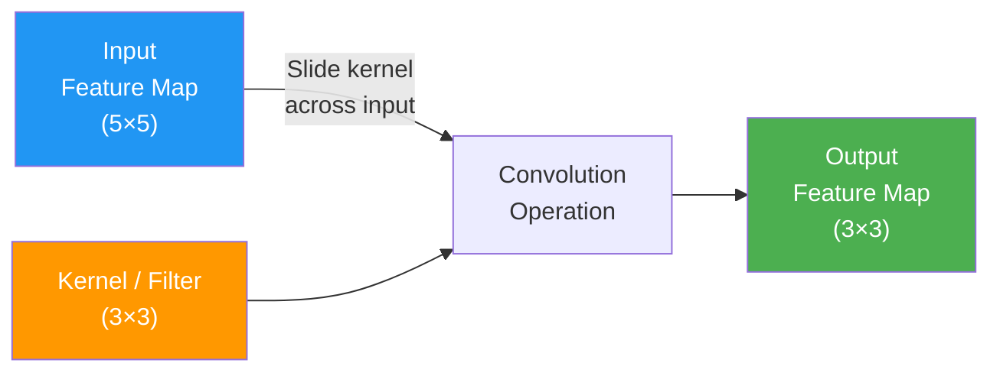
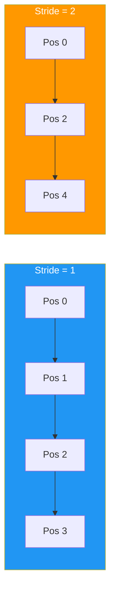
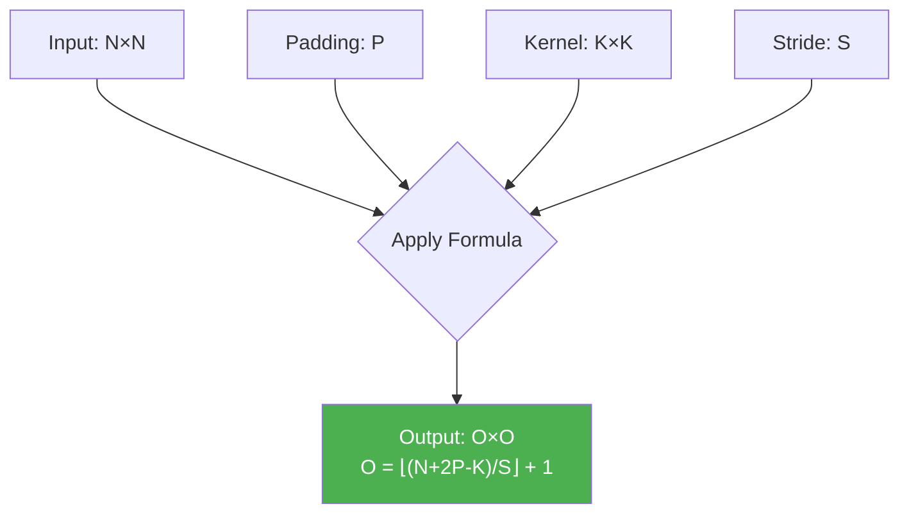
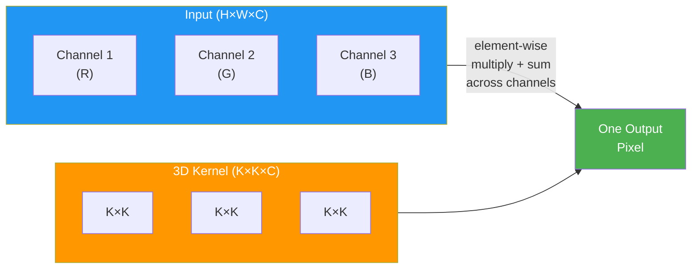
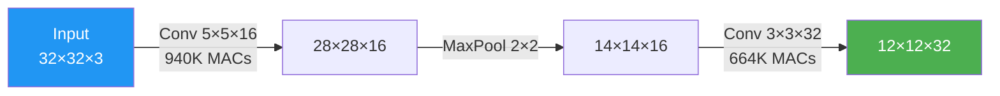

# Convolution Arithmetic

> **Learning Objectives**
> - Master the convolution operation: kernel, stride, padding, and their effect on output dimensions
> - Derive and apply the output dimension formula for any convolution layer
> - Count the exact number of MAC operations, multiplications, and additions in a convolution
> - Understand multi-channel and multi-filter convolution for real CNN layers

---

## 1. What Is Convolution?

In neural networks, **convolution** is a sliding-window operation that extracts features from input data. It is the fundamental operation in Convolutional Neural Networks (CNNs) — the architecture that dominates image classification, object detection, and video analysis.

> **Analogy**: Imagine you're a detective examining a large photograph with a magnifying glass. You systematically move the glass across the photo, section by section, looking for specific patterns (edges, textures, shapes). The magnifying glass is the **kernel** (or filter), the photograph is the **input feature map**, and your notes about what you found at each position form the **output feature map**.



### The Element-Wise Operation

At each position, the kernel overlaps a patch of the input. We perform **element-wise multiplication** and then **sum** all the products:

```
Position (0,0):
┌─────────────┐     ┌─────────────┐
│ 1  2  3  .  . │     │ a  b  c │
│ 6  7  8  .  . │  ×  │ d  e  f │  =  1·a + 2·b + 3·c + 
│ 11 12 13 .  . │     │ g  h  i │     6·d + 7·e + 8·f +
│ .  .  .  .  . │                      11·g + 12·h + 13·i
│ .  .  .  .  . │
└─────────────┘
```

This sum becomes **one element** of the output. Then the kernel slides to the next position and repeats.

---

## 2. The Three Control Knobs

### 2.1 Kernel Size (K)

The kernel (also called a filter) is a small matrix of learned weights. Common sizes:

| Kernel Size | Parameters | Use Case |
|:------------|:-----------|:---------|
| 1×1 | 1 | Channel mixing (pointwise convolution) |
| 3×3 | 9 | Most common — good balance of receptive field and cost |
| 5×5 | 25 | Larger receptive field — used in early architectures |
| 7×7 | 49 | Used in first layers of deep networks (e.g., ResNet) |

### 2.2 Stride (S)

Stride controls **how many positions the kernel moves** at each step:



- **Stride 1**: The kernel moves one position at a time → maximum overlap → largest output
- **Stride 2**: The kernel skips every other position → output is roughly half the size
- **Stride S**: Output dimension reduces by a factor of ~S

### 2.3 Padding (P)

Padding adds **zeros** around the border of the input before convolution:

```
Without padding (P=0):        With padding (P=1):
┌─────────────┐               ┌───────────────────┐
│ 1  2  3  4  5 │               │ 0  0  0  0  0  0  0 │
│ 6  7  8  9 10 │               │ 0  1  2  3  4  5  0 │
│11 12 13 14 15 │               │ 0  6  7  8  9 10  0 │
│16 17 18 19 20 │               │ 0 11 12 13 14 15  0 │
│21 22 23 24 25 │               │ 0 16 17 18 19 20  0 │
└─────────────┘               │ 0 21 22 23 24 25  0 │
   (5×5)                       │ 0  0  0  0  0  0  0 │
                               └───────────────────┘
                                  (7×7 after padding)
```

**Why pad?**
- Without padding, output dimensions shrink rapidly through layers
- "Same" padding (P = K//2) preserves the spatial dimensions
- Ensures border pixels get equal treatment as interior pixels

---

## 3. The Output Dimension Formula

For an input of size **N×N**, kernel **K×K**, stride **S**, and padding **P**:

```
Output dimension = ⌊(N + 2P - K) / S⌋ + 1
```

This is one of the most important formulas in CNN hardware design. Let's verify it with examples:

### Example 1: No Padding, Stride 1
- Input: 5×5, Kernel: 3×3, Stride: 1, Padding: 0
- Output: ⌊(5 + 0 - 3) / 1⌋ + 1 = 2 + 1 = **3×3** ✓

### Example 2: Same Padding, Stride 1
- Input: 5×5, Kernel: 3×3, Stride: 1, Padding: 1
- Output: ⌊(5 + 2 - 3) / 1⌋ + 1 = 4 + 1 = **5×5** ✓ (same as input!)

### Example 3: Stride 2
- Input: 28×28, Kernel: 5×5, Stride: 2, Padding: 0
- Output: ⌊(28 + 0 - 5) / 2⌋ + 1 = ⌊11.5⌋ + 1 = 11 + 1 = **12×12**

### Example 4: LeNet-5 First Layer
- Input: 28×28, Kernel: 5×5, Stride: 1, Padding: 0
- Output: ⌊(28 + 0 - 5) / 1⌋ + 1 = 23 + 1 = **24×24** ✓



---

## 4. Counting Operations

### 4.1 Single-Channel, Single-Filter

For one output pixel, the kernel performs:
- **K² multiplications** (element-wise multiply)
- **K² - 1 additions** (summing all products)

The full output has O² pixels, so:

```
Total MACs per convolution = O² × K²
Total multiplications = O² × K²
Total additions = O² × (K² - 1)
```

**Example**: Input 5×5, Kernel 3×3, Stride 1, Padding 0 → Output 3×3

```
MACs = 3² × 3² = 9 × 9 = 81
```

### 4.2 Multi-Channel Convolution

Real images have multiple channels (e.g., RGB → 3 channels). The kernel must be 3D to match:



For **C input channels**:

```
MACs per output pixel = K² × C
Total MACs = O² × K² × C
```

### 4.3 Multi-Filter Convolution (Full Layer)

A convolution layer applies **M different filters** to produce M output channels:

```
Total MACs = O² × K² × C × M
```

Where:
- O = output spatial dimension
- K = kernel size
- C = input channels
- M = output channels (number of filters)

### The Complete Seven-Loop Representation

The full convolution computation can be expressed as 7 nested loops:

```python
for n in range(batch_size):      # N: batch dimension
  for m in range(num_filters):    # M: output channels
    for p in range(out_height):   # P: output rows
      for q in range(out_width):  # Q: output columns
        for c in range(in_channels):  # C: input channels
          for r in range(K):      # R: kernel rows
            for s in range(K):    # S: kernel columns
              output[n][m][p][q] += weight[m][c][r][s] * input[n][c][p*S+r][q*S+s]
```

> **Key Insight for Hardware**: These 7 loops give hardware designers enormous flexibility. You can choose **which loops to parallelize** (spatial dimensions? channels? filters?) and **which loops to keep sequential** (based on available hardware resources). This choice is the foundation of **dataflow design** covered in Module 4.

---

## 5. Worked Example: Layer-by-Layer Operation Count

Let's analyze the first two convolution layers of a simple CNN:

**Layer 1**: Input 32×32×3, Kernel 5×5, 16 filters, Stride 1, Padding 0
```
Output size = ⌊(32 - 5)/1⌋ + 1 = 28×28×16
MACs = 28 × 28 × 5 × 5 × 3 × 16 = 28² × 25 × 3 × 16
     = 784 × 25 × 48 = 940,800 MACs
```

**Layer 2**: Input 14×14×16 (after 2×2 pooling), Kernel 3×3, 32 filters, Stride 1, Padding 0
```
Output size = ⌊(14 - 3)/1⌋ + 1 = 12×12×32
MACs = 12 × 12 × 3 × 3 × 16 × 32 = 144 × 9 × 512
     = 663,552 MACs
```

**Total for both layers**: 940,800 + 663,552 = **1,604,352 MACs**



---

## 6. Code Example: Convolution Calculator

```python
def conv_layer_analysis(name, input_h, input_w, input_c, 
                        kernel_size, num_filters, stride=1, padding=0):
    """
    Analyze a convolution layer: output dimensions, MACs, 
    parameters, and memory requirements.
    """
    # Output dimensions
    out_h = (input_h + 2 * padding - kernel_size) // stride + 1
    out_w = (input_w + 2 * padding - kernel_size) // stride + 1
    out_c = num_filters
    
    # Operation counts
    macs_per_output = kernel_size * kernel_size * input_c
    total_output_pixels = out_h * out_w * out_c
    total_macs = total_output_pixels * macs_per_output // out_c * out_c
    # Correction: MACs = out_h × out_w × K² × C_in × num_filters
    total_macs = out_h * out_w * kernel_size**2 * input_c * num_filters
    total_multiplications = total_macs
    total_additions = out_h * out_w * (kernel_size**2 * input_c - 1) * num_filters
    
    # Parameters (weights + biases)
    num_weights = kernel_size * kernel_size * input_c * num_filters
    num_biases = num_filters
    total_params = num_weights + num_biases
    
    # Memory (assuming INT8 = 1 byte per value)
    input_memory = input_h * input_w * input_c  # bytes
    output_memory = out_h * out_w * out_c  # bytes
    weight_memory = num_weights  # bytes
    
    print(f"\n{'=' * 50}")
    print(f"Layer: {name}")
    print(f"{'=' * 50}")
    print(f"  Input:  {input_h}×{input_w}×{input_c}")
    print(f"  Kernel: {kernel_size}×{kernel_size}, Filters: {num_filters}, "
          f"Stride: {stride}, Padding: {padding}")
    print(f"  Output: {out_h}×{out_w}×{out_c}")
    print(f"{'─' * 50}")
    print(f"  Total MACs:         {total_macs:>12,}")
    print(f"  Multiplications:    {total_multiplications:>12,}")
    print(f"  Additions:          {total_additions:>12,}")
    print(f"  Parameters:         {total_params:>12,}")
    print(f"{'─' * 50}")
    print(f"  Input memory:       {input_memory:>12,} bytes")
    print(f"  Weight memory:      {weight_memory:>12,} bytes")
    print(f"  Output memory:      {output_memory:>12,} bytes")
    
    return {
        'out_h': out_h, 'out_w': out_w, 'out_c': out_c,
        'macs': total_macs, 'params': total_params,
        'input_mem': input_memory, 'weight_mem': weight_memory,
        'output_mem': output_memory
    }

# Analyze a simple CNN pipeline
print("╔══════════════════════════════════════════════════╗")
print("║       CNN Layer-by-Layer Analysis                ║")
print("╚══════════════════════════════════════════════════╝")

# Layer 1: First convolution
l1 = conv_layer_analysis("Conv1", 32, 32, 3, 
                         kernel_size=5, num_filters=16, stride=1, padding=0)

# After 2×2 max pooling (halves spatial dimensions)
l2 = conv_layer_analysis("Conv2", l1['out_h']//2, l1['out_w']//2, l1['out_c'],
                         kernel_size=3, num_filters=32, stride=1, padding=0)

# Summary
total_macs = l1['macs'] + l2['macs']
total_params = l1['params'] + l2['params']
print(f"\n{'═' * 50}")
print(f"TOTAL across all layers:")
print(f"  MACs:       {total_macs:>12,}")
print(f"  Parameters: {total_params:>12,}")
print(f"  At 1 GMAC/s: {total_macs / 1e9 * 1000:.2f} ms per inference")
```

---

## Key Takeaways

- **Convolution** = sliding a small kernel across an input, performing element-wise multiply-and-sum at each position
- Three control knobs: **Kernel size** (receptive field), **Stride** (step size), **Padding** (border handling)
- The **output dimension formula** `⌊(N + 2P - K) / S⌋ + 1` is essential for hardware sizing
- Total MACs for a conv layer: **O_h × O_w × K² × C_in × C_out**
- Multi-channel convolution is the dominant compute cost in CNNs
- The **7-loop nest** representation of convolution gives hardware designers freedom to choose parallelism and data ordering strategies

---

## Practice Problems

### Problem 1: Dimension Detective

> **Context**: *PixelAI Corp* is building an image classification pipeline. The input image is 224×224×3 (standard ImageNet size). The first convolution layer uses 64 filters of size 7×7 with stride 2 and padding 3.
>
> **Tasks**:
> - (a) Calculate the output dimensions of this layer. [1.5]
> - (b) How many MAC operations does this single layer require? [2]
> - (c) How many total parameters (weights + biases) does this layer have? [1]
> - (d) If the chip processes 100 GMAC/s, how long does this single layer take? [1.5]

<details>
<summary><b>Solution</b></summary>

**(a)** Output dimensions:
- O = ⌊(224 + 2×3 - 7) / 2⌋ + 1 = ⌊(224 + 6 - 7) / 2⌋ + 1 = ⌊223 / 2⌋ + 1 = 111 + 1 = **112**
- Output: **112 × 112 × 64**

**(b)** MAC operations:
- MACs = 112 × 112 × 7 × 7 × 3 × 64
- = 12,544 × 49 × 192
- = 12,544 × 9,408
- = **117,973,632 MACs ≈ 118 million MACs**

**(c)** Parameters:
- Weights: 7 × 7 × 3 × 64 = **9,408**
- Biases: 64
- Total: **9,472 parameters**

**(d)** Latency:
- 117,973,632 / 100,000,000,000 = **0.00118 seconds ≈ 1.18 ms**

</details>

### Problem 2: Multi-Layer Analysis

> **Context**: *DroneVision* uses a 3-layer CNN for obstacle detection:
> - Layer 1: Input 64×64×3, Kernel 3×3, 16 filters, stride 1, padding 1
> - MaxPool: 2×2 (halves dimensions)
> - Layer 2: Kernel 3×3, 32 filters, stride 1, padding 1
> - MaxPool: 2×2
> - Layer 3: Kernel 3×3, 64 filters, stride 1, padding 0
>
> **Tasks**:
> - (a) Compute the output dimensions after each layer and each pooling step. [3]
> - (b) Which layer has the most MAC operations? Which has the most parameters? [2]
> - (c) The drone's accelerator has 256 INT8 MAC units at 200 MHz. Can it process 30 frames per second? Show your computation. [2]

<details>
<summary><b>Solution</b></summary>

**(a)** Dimension tracking:

| Stage | Output Dimensions |
|:------|:-----------------|
| Input | 64×64×3 |
| Conv1 (3×3, 16F, P=1) | ⌊(64+2-3)/1⌋+1 = 64 → **64×64×16** |
| MaxPool 2×2 | **32×32×16** |
| Conv2 (3×3, 32F, P=1) | ⌊(32+2-3)/1⌋+1 = 32 → **32×32×32** |
| MaxPool 2×2 | **16×16×32** |
| Conv3 (3×3, 64F, P=0) | ⌊(16+0-3)/1⌋+1 = 14 → **14×14×64** |

**(b)** Operation and parameter counts:

| Layer | MACs | Parameters |
|:------|:-----|:-----------|
| Conv1 | 64×64×9×3×16 = **1,769,472** | 3×3×3×16+16 = **448** |
| Conv2 | 32×32×9×16×32 = **4,718,592** | 3×3×16×32+32 = **4,640** |
| Conv3 | 14×14×9×32×64 = **3,612,672** | 3×3×32×64+64 = **18,496** |

- **Most MACs**: Layer 2 (4.72M)
- **Most parameters**: Layer 3 (18,496)

**(c)** Frame rate achievability:

- Total MACs per frame: 1.77M + 4.72M + 3.61M = **10.1M MACs**
- Throughput: 256 MACs/cycle × 200 MHz = **51.2 GMAC/s**
- Time per frame: 10.1M / 51.2G = **0.197 ms** per frame
- Maximum FPS: 1000 / 0.197 ≈ **5,076 FPS**
- ✅ **Easily exceeds 30 FPS** — by a factor of ~169×. The accelerator is massively overprovisioned for this small model. In practice, larger models or power constraints would be the limiting factor.

</details>

### Problem 3: Memory Bandwidth Bottleneck

> **Context**: A convolution layer has: Input 56×56×128, Kernel 3×3, 256 filters, Stride 1, Padding 1. All values are INT8 (1 byte each). The accelerator has 4,096 MAC units at 1 GHz and 50 GB/s off-chip memory bandwidth.
>
> **Tasks**:
> - (a) Calculate total MACs for this layer. [1]
> - (b) How long does the computation take (compute-only)? [1]
> - (c) How many bytes of data must be loaded from memory (inputs + weights)? Assume the output stays on-chip. [2]
> - (d) How long does the memory transfer take? Is this layer compute-bound or memory-bound? [2]

<details>
<summary><b>Solution</b></summary>

**(a)** Total MACs:
- Output: ⌊(56+2-3)/1⌋+1 = 56 → 56×56×256
- MACs = 56 × 56 × 3 × 3 × 128 × 256 = 3,136 × 9 × 32,768
- = **924,844,032 MACs ≈ 925 million**

**(b)** Compute time:
- Throughput: 4,096 MACs/cycle × 1 GHz = 4.096 TMAC/s
- Time: 925M / 4,096G = **0.226 ms**

**(c)** Memory bytes:
- Input: 56 × 56 × 128 = **401,408 bytes** (392 KB)
- Weights: 3 × 3 × 128 × 256 = **294,912 bytes** (288 KB)
- Total: **696,320 bytes ≈ 680 KB**

**(d)** Memory transfer time:
- 696,320 bytes / 50 GB/s = 696,320 / 50×10⁹ = **0.0139 ms**
- Compute time (0.226 ms) >> Memory time (0.014 ms)
- **This layer is compute-bound** — good news! The multipliers are the bottleneck, not memory.
- However, this assumes perfect data reuse. Without reuse (re-fetching inputs for each filter), memory time would increase by 256× to 3.56 ms, making it severely memory-bound.

</details>

---

[← MAC Operations](02_mac_operations.md) | [Next: CNN Architectures and Data Reuse →](04_cnn_architectures.md)
