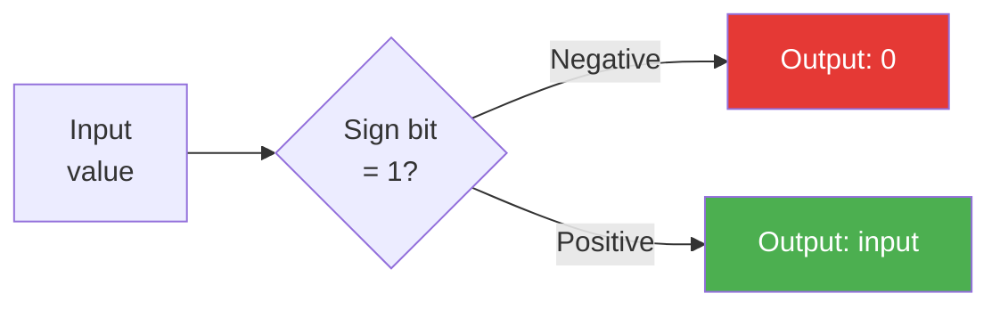
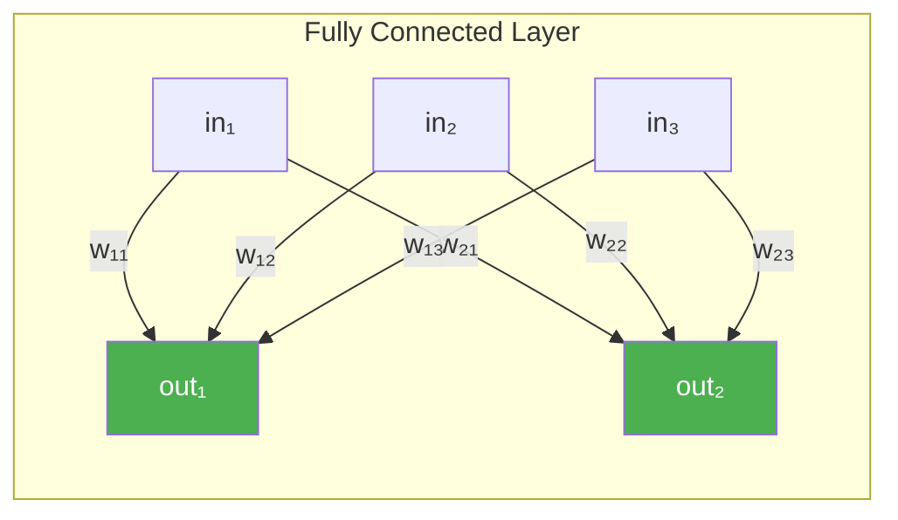
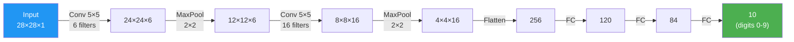
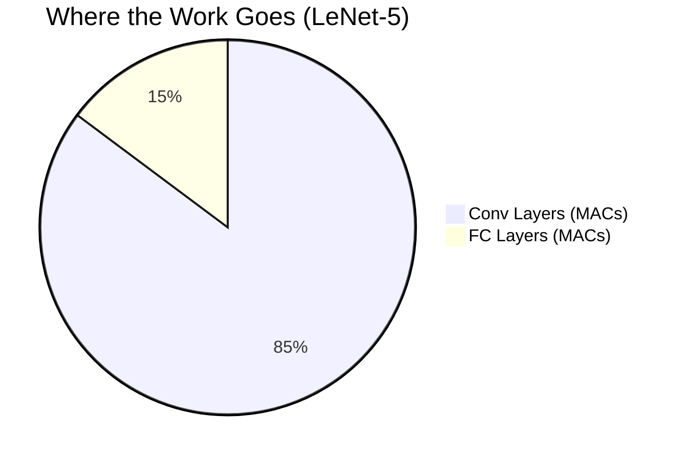
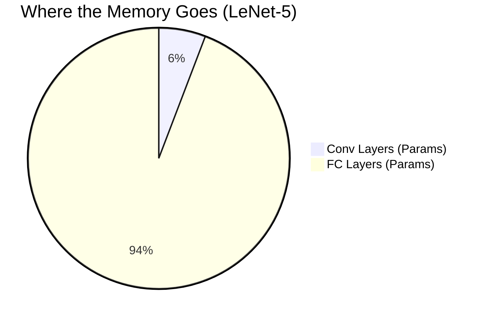
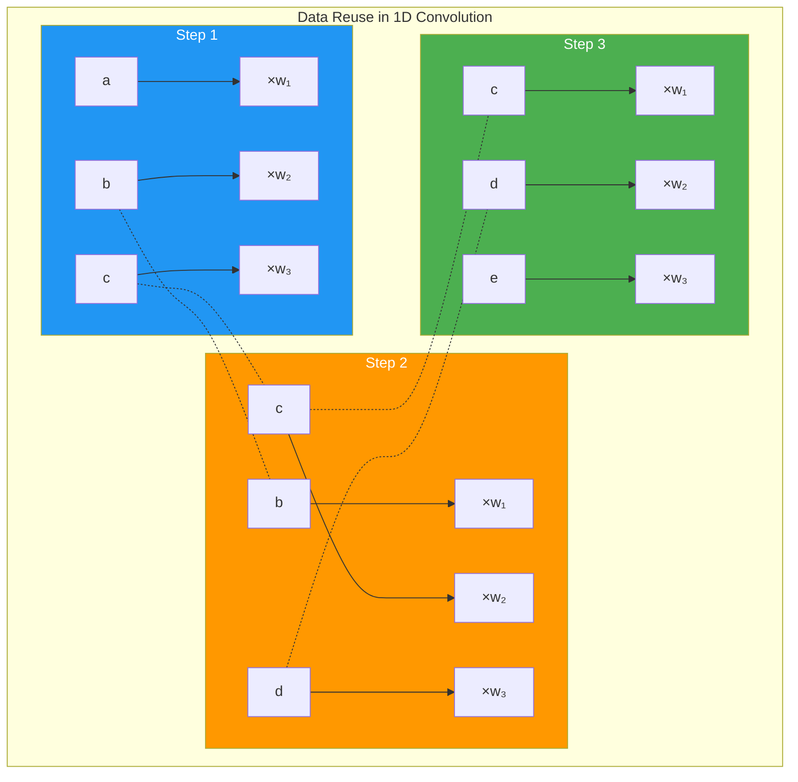
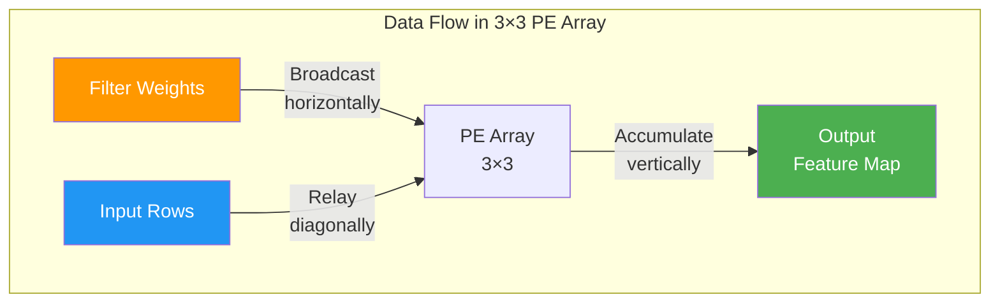
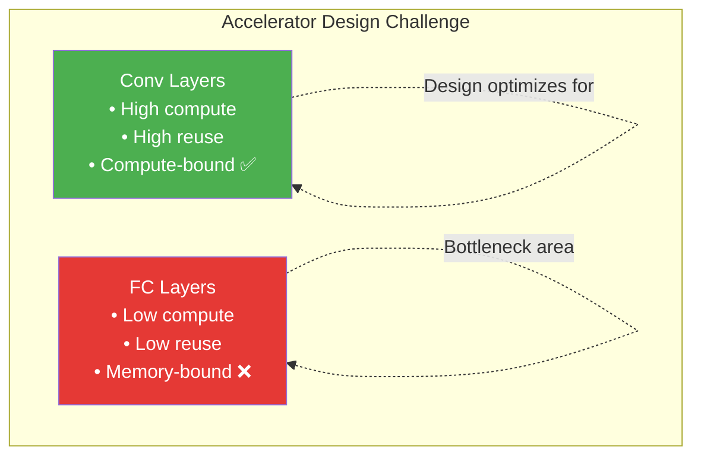

# CNN Architectures and Data Reuse

> **Learning Objectives**
> - Walk through a complete CNN (LeNet-5) end to end, calculating dimensions and operations at every layer
> - Understand pooling (max and average), flattening, and fully connected layers
> - Grasp the data reuse principle — why it matters more than raw compute speed
> - Identify which data elements can be reused in convolution and how this guides hardware design

---

## 1. Building a Complete CNN

So far, you've learned the individual operations: convolution, MAC computation, and number representation. Now let's assemble them into a complete **Convolutional Neural Network** and watch how data flows from input to classification result.

> **Analogy**: Building a CNN is like an assembly line in a factory. Raw material (the image) enters at one end and passes through a series of stations (layers). Each station refines the material — first extracting rough features (edges), then finer features (textures), then high-level features (shapes). At the end, a quality inspector (classifier) announces what the product is.


---

## 2. Layer Types in a CNN

### 2.1 Convolution + Activation

We've covered convolution in detail. After each convolution, we apply an **activation function** — most commonly **ReLU** (Rectified Linear Unit):

```
ReLU(x) = max(0, x)
```

ReLU simply sets all negative values to zero. In hardware, this is trivially implemented — it's just checking the sign bit:



**Hardware cost**: Essentially zero — a single MUX controlled by the sign bit. No multipliers, no adders.

### 2.2 Pooling

Pooling **reduces spatial dimensions** while preserving important features. It serves two purposes:
1. Reduces the number of computations in subsequent layers
2. Provides a degree of translation invariance

**Max Pooling** (most common):
```
Input patch:    Output:
┌─────────┐
│ 3  7 │
│ 2  8 │   →   8  (maximum value)
└─────────┘
```

**Average Pooling**:
```
Input patch:    Output:
┌─────────┐
│ 3  7 │
│ 2  8 │   →   5  (average: (3+7+2+8)/4)
└─────────┘
```

With a 2×2 pooling window and stride 2:
- Input: H × W → Output: H/2 × W/2
- Each dimension is halved
- Number of channels remains the same

**Hardware cost**: Max pooling requires only **comparators** (no multipliers). Average pooling needs an adder and a divider (which can be a shift if pool size is a power of 2).

### 2.3 Flattening

Flattening converts a 3D feature map into a 1D vector:

```
Feature map: 4×4×64 (1,024 total values)
    ↓
Flattened vector: [v₁, v₂, v₃, ..., v₁₀₂₄]
```

**Hardware cost**: Zero computation — it's purely a reinterpretation of how memory is addressed.

### 2.4 Fully Connected (FC) Layer

A fully connected layer connects every input to every output through a weight matrix:

```
output = weights × input + bias
```

This is a standard matrix-vector multiplication — exactly the MAC-heavy operation we studied earlier.



**Hardware cost**: Very MAC-intensive. An FC layer with N inputs and M outputs requires **N × M MAC operations**.

---

## 3. LeNet-5: A Complete Walkthrough

LeNet-5 is historically significant — it was one of the first CNNs successfully deployed for handwritten digit recognition. It's small enough to analyze completely, yet representative of all CNN architectures.



### Layer-by-Layer Analysis

| Layer | Input | Operation | Output | MACs | Parameters |
|:------|:------|:----------|:-------|:-----|:-----------|
| Conv1 | 28×28×1 | 5×5, 6 filters, S=1 | 24×24×6 | 24²×25×1×6 = **86,400** | 5×5×1×6+6 = **156** |
| Pool1 | 24×24×6 | MaxPool 2×2 | 12×12×6 | 0 (comparisons only) | 0 |
| Conv2 | 12×12×6 | 5×5, 16 filters, S=1 | 8×8×16 | 8²×25×6×16 = **153,600** | 5×5×6×16+16 = **2,416** |
| Pool2 | 8×8×16 | MaxPool 2×2 | 4×4×16 | 0 | 0 |
| Flatten | 4×4×16 | Reshape | 256 | 0 | 0 |
| FC1 | 256 | Dense → 120 | 120 | 256×120 = **30,720** | 256×120+120 = **30,840** |
| FC2 | 120 | Dense → 84 | 84 | 120×84 = **10,080** | 120×84+84 = **10,164** |
| FC3 | 84 | Dense → 10 | 10 | 84×10 = **840** | 84×10+10 = **850** |

### Summary

```
Total MACs:       281,640
Total Parameters: 44,426
```

**Key Observation**: The convolution layers dominate the **computation** (86% of MACs), but the fully connected layers dominate the **parameters** (94% of weights). This is a fundamental tension in CNN hardware design:





---

## 4. The Data Reuse Principle

### Why It Matters

In the previous chapter's Practice Problem 3, we discovered a striking fact: **even with INT8 precision, memory access consumes 86–99% of total energy**. The multipliers sit idle, waiting for data.

This is the central challenge of all accelerator design, and the solution is **data reuse** — using each fetched datum as many times as possible before discarding it.

> **Analogy**: Imagine you're cooking a large meal. You need salt for 10 different dishes. The salt is stored in the pantry (off-chip memory). You could walk to the pantry 10 times (one trip per dish), or you could fetch the salt once, place it on the counter (local buffer), and use it for all 10 dishes. Smart cooks reuse; smart hardware designers do the same.

### Reuse in Convolution

Consider a 1D convolution: filter [w₁, w₂, w₃] sliding across input [a, b, c, d, e]:

```
Step 1: output₁ = w₁·a + w₂·b + w₃·c
Step 2: output₂ = w₁·b + w₂·c + w₃·d
Step 3: output₃ = w₁·c + w₂·d + w₃·e
```

Notice the reuse patterns:

**Filter weights** are reused across ALL positions:
- w₁ is used in Steps 1, 2, and 3 → **reuse factor = 3** (= number of output positions)

**Input values** are reused across overlapping windows:
- `b` is used in Steps 1 and 2
- `c` is used in Steps 1, 2, and 3
- `d` is used in Steps 2 and 3



### Extending to 2D: The PE Array

For 2D convolution with a 3×3 filter on a 5×5 input, we can arrange 9 Processing Elements (PEs) in a 3×3 grid:

```
PE Array (3×3):

  ┌────────┬────────┬────────┐
  │  PE₁₁  │  PE₁₂  │  PE₁₃  │  ← Handles rows 1,2,3 of input
  ├────────┼────────┼────────┤
  │  PE₂₁  │  PE₂₂  │  PE₂₃  │  ← Handles rows 2,3,4 of input
  ├────────┼────────┼────────┤
  │  PE₃₁  │  PE₃₂  │  PE₃₃  │  ← Handles rows 3,4,5 of input
  └────────┴────────┴────────┘
```

**Reuse opportunities in this arrangement:**

1. **Filter reuse (horizontal)**: Each row of PEs shares the same filter row weights. PE₁₁, PE₁₂, PE₁₃ all use filter row 1 → broadcast horizontally.

2. **Input reuse (diagonal)**: Input rows overlap between PE groups:
   - Rows 2,3 are used by both the first and second PE rows
   - Rows 3,4 are used by both the second and third PE rows
   - → Relay data diagonally between PE rows

3. **Partial sum accumulation (vertical)**: Results flow upward to be summed across kernel rows.



### Quantifying the Benefit

Without data reuse (naive approach):
```
Every MAC fetches 2 operands from memory.
Total memory accesses = 2 × Total MACs
```

With data reuse (smart hardware):
```
Each weight fetched once, reused across all output positions.
Each input fetched once, reused across overlapping windows.
Memory accesses ≈ (unique weights) + (unique inputs) << 2 × MACs
```

For a 5×5 input, 3×3 filter → 9 output positions, each needing 9 MACs = 81 total MACs:

| Approach | Memory Accesses | MACs | Access/MAC Ratio |
|:---------|:----------------|:-----|:-----------------|
| No reuse | 162 (2 per MAC) | 81 | 2.0 |
| Weight reuse only | 9 + 81 = 90 | 81 | 1.11 |
| Full reuse | 9 + 25 = 34 | 81 | **0.42** |

Full reuse reduces memory traffic by **4.8×** compared to the naive approach.

---

## 5. Preview: Dataflow Strategies

The way you organize data movement through a PE array defines the **dataflow** of your accelerator. There are three fundamental strategies, which Module 4 will explore in depth:

| Dataflow | What Stays in PEs | What Moves | Used By |
|:---------|:-------------------|:-----------|:--------|
| **Weight Stationary** | Weights loaded once, reused | Inputs + partial sums flow through | Google TPU, NVDLA |
| **Output Stationary** | Partial sums stay, accumulated in place | Weights + inputs stream in | ShiDianNao |
| **Row Stationary** | All three types get local reuse | Optimized relay patterns | Eyeriss |

> **Key Insight**: There is no single "best" dataflow. The optimal choice depends on the layer dimensions, available on-chip memory, and the specific CNN architecture. This is why many modern accelerators support **configurable dataflows**.

---

## 6. Code Example: CNN Inference Simulator

```python
import numpy as np

def relu(x):
    """ReLU activation: max(0, x)"""
    return np.maximum(0, x)

def max_pool_2d(feature_map, pool_size=2):
    """2×2 max pooling with stride 2."""
    h, w, c = feature_map.shape
    out_h, out_w = h // pool_size, w // pool_size
    output = np.zeros((out_h, out_w, c))
    
    for i in range(out_h):
        for j in range(out_w):
            patch = feature_map[i*pool_size:(i+1)*pool_size,
                               j*pool_size:(j+1)*pool_size, :]
            output[i, j, :] = patch.max(axis=(0, 1))
    
    return output

def conv2d_manual(input_map, kernels, bias, stride=1, padding=0):
    """Manual 2D convolution (no framework dependency)."""
    if padding > 0:
        input_map = np.pad(input_map, 
                          ((padding, padding), (padding, padding), (0, 0)),
                          mode='constant')
    
    h, w, c_in = input_map.shape
    k, _, _, c_out = kernels.shape  # (K, K, C_in, C_out)
    
    out_h = (h - k) // stride + 1
    out_w = (w - k) // stride + 1
    output = np.zeros((out_h, out_w, c_out))
    
    mac_count = 0
    for m in range(c_out):          # Each output filter
        for i in range(out_h):      # Output rows
            for j in range(out_w):  # Output columns
                patch = input_map[i*stride:i*stride+k,
                                 j*stride:j*stride+k, :]
                output[i, j, m] = np.sum(patch * kernels[:, :, :, m]) + bias[m]
                mac_count += k * k * c_in
    
    return output, mac_count

# === LeNet-5 Inference Pipeline ===
np.random.seed(42)

# Create a random "digit" image (28×28, grayscale)
image = np.random.randn(28, 28, 1).astype(np.float32)

print("=== LeNet-5 Forward Pass ===\n")
total_macs = 0

# Layer 1: Conv 5×5, 6 filters
w1 = np.random.randn(5, 5, 1, 6).astype(np.float32) * 0.1
b1 = np.zeros(6)
out, macs = conv2d_manual(image, w1, b1)
out = relu(out)
total_macs += macs
print(f"Conv1:    {image.shape} → {out.shape}  |  {macs:>10,} MACs")

# Pool 1
out = max_pool_2d(out)
print(f"Pool1:    → {out.shape}  |  0 MACs (comparisons only)")

# Layer 2: Conv 5×5, 16 filters
w2 = np.random.randn(5, 5, 6, 16).astype(np.float32) * 0.1
b2 = np.zeros(16)
out, macs = conv2d_manual(out, w2, b2)
out = relu(out)
total_macs += macs
print(f"Conv2:    → {out.shape}  |  {macs:>10,} MACs")

# Pool 2
out = max_pool_2d(out)
print(f"Pool2:    → {out.shape}  |  0 MACs")

# Flatten
flat = out.reshape(-1)
print(f"Flatten:  → ({flat.shape[0]},)  |  0 MACs")

# FC1: 256 → 120
w3 = np.random.randn(flat.shape[0], 120).astype(np.float32) * 0.1
b3 = np.zeros(120)
fc1 = relu(flat @ w3 + b3)
fc1_macs = flat.shape[0] * 120
total_macs += fc1_macs
print(f"FC1:      → (120,)  |  {fc1_macs:>10,} MACs")

# FC2: 120 → 84
w4 = np.random.randn(120, 84).astype(np.float32) * 0.1
b4 = np.zeros(84)
fc2 = relu(fc1 @ w4 + b4)
fc2_macs = 120 * 84
total_macs += fc2_macs
print(f"FC2:      → (84,)  |  {fc2_macs:>10,} MACs")

# FC3: 84 → 10
w5 = np.random.randn(84, 10).astype(np.float32) * 0.1
b5 = np.zeros(10)
fc3 = fc2 @ w5 + b5
fc3_macs = 84 * 10
total_macs += fc3_macs
print(f"FC3:      → (10,)  |  {fc3_macs:>10,} MACs")

# Softmax for classification
exp_scores = np.exp(fc3 - fc3.max())
probs = exp_scores / exp_scores.sum()
predicted_digit = np.argmax(probs)

print(f"\n{'='*50}")
print(f"Total MACs: {total_macs:,}")
print(f"Predicted digit: {predicted_digit}")
print(f"Confidence: {probs[predicted_digit]*100:.1f}%")
print(f"\nAt 1 GMAC/s: {total_macs/1e9*1e6:.1f} µs per inference")
print(f"At 100 GMAC/s: {total_macs/1e11*1e6:.2f} µs per inference")
```

---

## 7. Computation vs. Memory: The Real Bottleneck

Let's compute the **arithmetic intensity** (operations per byte of data) for each layer type:

| Layer Type | Compute | Data Loaded | Arithmetic Intensity |
|:-----------|:--------|:------------|:-------------------|
| Conv (3×3, C=64, M=64) | O²×9×64×64 MACs | Weights: 9×64×64 = 37K bytes | **O² ops/byte** (high) |
| FC (1024→512) | 1024×512 MACs | Weights: 1024×512 = 524K bytes | **1 op/byte** (low) |

**Convolution layers** have high arithmetic intensity — lots of computation per byte fetched. This makes them amenable to acceleration.

**FC layers** have low arithmetic intensity — each weight is used only once (per input). They are inherently memory-bound.



> **Design Implication**: Modern CNN architectures (ResNet, EfficientNet) deliberately minimize FC layers and maximize convolution layers — partly because convolutions are more hardware-friendly due to their inherent data reuse.

---

## Key Takeaways

- A CNN consists of **convolution + activation + pooling** layers for feature extraction, followed by **FC layers** for classification
- **ReLU** costs essentially nothing in hardware (single MUX); **Max pooling** needs only comparators; the real cost is in convolutions and FC layers
- **LeNet-5** requires ~280K MACs and ~44K parameters — tiny by modern standards, but it illustrates all the key concepts
- Convolution layers dominate **compute**; FC layers dominate **parameters** — this dichotomy shapes accelerator design
- **Data reuse** is the #1 optimization principle: reusing fetched data reduces memory traffic by 5–100× and cuts energy consumption dramatically
- The **PE array** arrangement (explored in Module 4) is designed specifically to maximize data reuse through relay and broadcast patterns
- **Arithmetic intensity** determines if a layer is compute-bound (good) or memory-bound (bad)

---

## Practice Problems

### Problem 1: Complete CNN Analysis

> **Context**: *SmartCam AI* is deploying an image classifier on a security camera. The CNN architecture is:
> 
> | Layer | Type | Details |
> |:------|:-----|:--------|
> | 1 | Conv | Input: 32×32×3, Kernel: 3×3, 8 filters, Stride 1, Padding 1 |
> | 2 | MaxPool | 2×2 |
> | 3 | Conv | Kernel: 3×3, 16 filters, Stride 1, Padding 0 |
> | 4 | MaxPool | 2×2 |
> | 5 | FC | → 64 |
> | 6 | FC | → 5 (classes: person, car, bicycle, dog, none) |
>
> **Tasks**:
> - (a) Track the dimensions through every layer. What is the input size to layer 5 (FC)? [3]
> - (b) Calculate total MACs for the entire network. [2]
> - (c) The chip runs at 100 MHz with 16 INT8 MAC units. What is the maximum FPS? [1]

<details>
<summary><b>Solution</b></summary>

**(a)** Dimension tracking:

| Layer | Output |
|:------|:-------|
| Input | 32×32×3 |
| Conv1 (3×3, 8F, P=1) | ⌊(32+2-3)/1⌋+1 = 32 → 32×32×8 |
| MaxPool 2×2 | 16×16×8 |
| Conv2 (3×3, 16F, P=0) | ⌊(16+0-3)/1⌋+1 = 14 → 14×14×16 |
| MaxPool 2×2 | 7×7×16 |
| Flatten | 7×7×16 = **784** |
| FC1 | 64 |
| FC2 | 5 |

Input to FC1: **784 neurons**

**(b)** Total MACs:

| Layer | MACs |
|:------|:-----|
| Conv1 | 32×32×9×3×8 = **221,184** |
| Conv2 | 14×14×9×8×16 = **225,792** |
| FC1 | 784×64 = **50,176** |
| FC2 | 64×5 = **320** |
| **Total** | **497,472 MACs** |

**(c)** Maximum FPS:
- Throughput: 16 MACs/cycle × 100 MHz = 1.6 GMAC/s
- Time per frame: 497,472 / 1.6×10⁹ = 0.000311 s = 0.311 ms
- Max FPS: 1000 / 0.311 = **3,215 FPS** ✅ (easily exceeds any real-time requirement)

</details>

### Problem 2: Data Reuse Impact

> **Context**: *EcoChip* is designing a battery-powered wildlife camera. The energy budget is 50 µJ per inference. A convolution layer has: Input 16×16×32, Kernel 3×3, 64 filters.
>
> **Given**:
> - MAC energy: 0.1 pJ
> - On-chip SRAM read: 5 pJ per byte
> - Off-chip DRAM read: 200 pJ per byte
> - All values are INT8 (1 byte)
>
> **Tasks**:
> - (a) Calculate total MACs for this layer. [1]
> - (b) If ALL data (inputs + weights) comes from DRAM with NO reuse, calculate the total energy. Can the camera afford this layer? [2]
> - (c) If weights are stored on-chip (SRAM) and inputs are fetched once from DRAM and reused from a local buffer, calculate the new energy. [2]
> - (d) What is the energy savings factor from (b) to (c)? [1]

<details>
<summary><b>Solution</b></summary>

**(a)** MACs:
- Output: ⌊(16-3)/1⌋+1 = 14 → 14×14×64
- MACs = 14×14×9×32×64 = **3,612,672 MACs**

**(b)** No reuse (all from DRAM):
- Each MAC needs 2 bytes (1 weight + 1 input)
- Memory accesses from DRAM: 3,612,672 × 2 = 7,225,344 bytes
- Compute energy: 3,612,672 × 0.1 pJ = 361,267 pJ = **0.36 µJ**
- Memory energy: 7,225,344 × 200 pJ = 1,445,068,800 pJ = **1,445 µJ**
- Total: 0.36 + 1,445 = **1,445.4 µJ**
- Budget: 50 µJ → ❌ **Exceeds budget by 29×**

**(c)** Smart data management:
- **Weights** on SRAM: 3×3×32×64 = 18,432 bytes from SRAM
  - Energy: 18,432 × 5 pJ = 92,160 pJ = 0.092 µJ
  - Each weight reused across 14×14 = 196 output positions → fetched once
- **Inputs** from DRAM once: 16×16×32 = 8,192 bytes from DRAM
  - Energy: 8,192 × 200 pJ = 1,638,400 pJ = 1.64 µJ
  - Each input reused across overlapping kernel positions
- Compute energy: 0.36 µJ (unchanged)
- **Total: 0.36 + 0.092 + 1.64 = 2.09 µJ** ✅ (well within 50 µJ budget!)

**(d)** Savings factor:
- 1,445.4 / 2.09 = **691×** energy savings
- This dramatic reduction demonstrates why data reuse is the single most important optimization in accelerator design.

</details>

### Problem 3: Architecture Comparison

> **Context**: Two CNN architectures are being evaluated for deployment on the same chip:
>
> **Architecture A** (traditional):
> - Conv1: 56×56×64, K=3, 64 filters → Conv2: same → FC: 200,704 → 1000
>
> **Architecture B** (modern):
> - Conv1: 56×56×64, K=3, 64 filters → Conv2: same → GlobalAvgPool → FC: 64 → 1000
>
> Both architectures have identical convolution layers. The difference is in how they transition to classification.
>
> **Tasks**:
> - (a) Calculate the FC layer MACs for Architecture A. [1.5]
> - (b) Calculate the FC layer MACs for Architecture B. [1.5]
> - (c) Which architecture is more hardware-friendly? Explain using the concept of arithmetic intensity and memory requirements. [3]

<details>
<summary><b>Solution</b></summary>

**(a)** Architecture A FC MACs:
- Conv2 output: 56×56×64 (same padding, same dimensions)
- After flatten: 56 × 56 × 64 = 200,704 neurons
- FC: 200,704 × 1,000 = **200,704,000 MACs**
- Parameters: 200,704 × 1,000 = **200.7M weights** (~200 MB for INT8!)

**(b)** Architecture B FC MACs:
- Conv2 output: 56×56×64
- GlobalAvgPool: averages each channel to a single value → 64 neurons
- FC: 64 × 1,000 = **64,000 MACs**
- Parameters: 64 × 1,000 = **64,000 weights** (64 KB for INT8)

**(c)** Architecture B is dramatically more hardware-friendly:

| Metric | Arch A | Arch B | Advantage |
|:-------|:-------|:-------|:----------|
| FC MACs | 200.7M | 64K | B is **3,136× fewer** |
| FC Parameters | 200.7M | 64K | B uses **3,136× less memory** |
| Arithmetic Intensity (FC) | 1 op/byte | 1 op/byte | Same (both memory-bound) |
| Total FC memory | ~200 MB | ~64 KB | **B fits on-chip!** |

Architecture A's FC layer alone requires 200 MB of weights — far exceeding any on-chip SRAM. Every weight must be streamed from DRAM, making it severely memory-bound and energy-inefficient.

Architecture B uses GlobalAveragePooling to collapse spatial dimensions before the FC layer, reducing parameters by >3000×. The 64 KB of weights easily fits in on-chip SRAM, enabling full data reuse.

This is why modern architectures (ResNet, EfficientNet, MobileNet) all use global pooling instead of large FC layers — it's a hardware-aware design choice.

</details>

---

[← Convolution Arithmetic](03_convolution_arithmetic.md) | [Next Module: Accelerator Architectures →](../MODULE_4_ACCELERATOR_ARCH/README.md)
