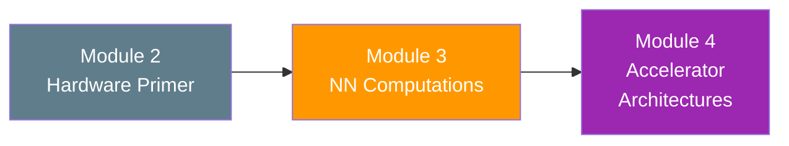

# Module 3: Neural Network Computations

> **From Numbers to Neurons — How Math Becomes Hardware**

---

## Overview

This module bridges the gap between neural network algorithms and the hardware that runs them. You will learn how numbers are represented in silicon, how the fundamental Multiply-Accumulate (MAC) operation drives all neural network inference, and how convolution — the engine of computer vision — translates into billions of hardware operations.

By the end of this module, you will be able to look at any CNN architecture and calculate exactly how many operations, how many memory accesses, and how many clock cycles an accelerator needs to complete the inference.

---

## Learning Objectives

After completing this module, you will be able to:

- ✅ Explain IEEE 754 floating-point and fixed-point number formats, and justify when to use each
- ✅ Design a MAC unit from basic hardware blocks and analyze its resource cost
- ✅ Compute output dimensions, FLOPs, and memory requirements for any convolution layer
- ✅ Walk through a complete CNN (LeNet-5) and count total operations layer by layer
- ✅ Understand the concept of data reuse and why it matters more than raw compute

---

## Chapters

| # | Chapter | Key Topics |
|:--|:--------|:-----------|
| 1 | [Number Representations for Hardware](01_number_representations.md) | IEEE 754, fixed-point Q format, precision vs. area trade-off, quantization preview |
| 2 | [The MAC Unit — Heart of Every Accelerator](02_mac_operations.md) | MAC architecture, pipelining, resource analysis, shared-multiplier design |
| 3 | [Convolution Arithmetic](03_convolution_arithmetic.md) | Kernel, stride, padding, output dimension formula, operation counting |
| 4 | [CNN Architectures and Data Reuse](04_cnn_architectures.md) | LeNet-5 walkthrough, pooling, flattening, FC layers, data reuse principle |

---

## Prerequisites

- Completion of **Module 2** (hardware building blocks, control/data paths)
- Basic understanding of neural networks (what neurons, weights, and layers are)
- Comfort with simple arithmetic (multiplication, addition, counting)

---

## How This Module Connects

Module 2 gave you the hardware vocabulary (gates, registers, adders, multipliers). This module shows you *what* those hardware blocks need to compute for neural networks. Module 4 will show you *how* to arrange thousands of these blocks into a complete accelerator.

---

*Estimated study time: 3–4 hours*
