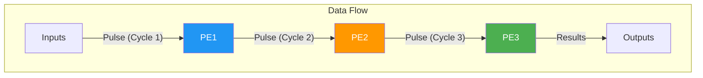
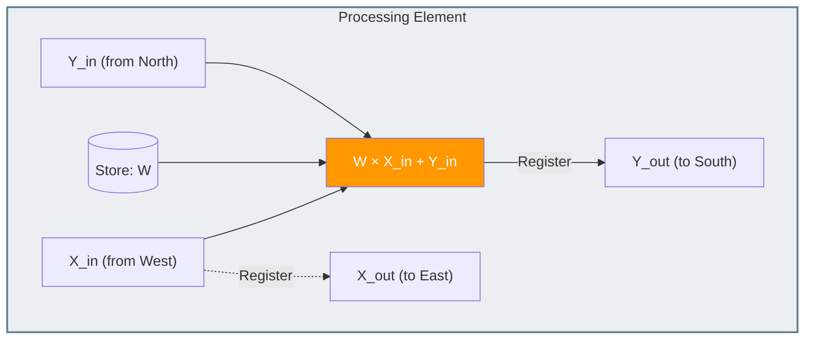
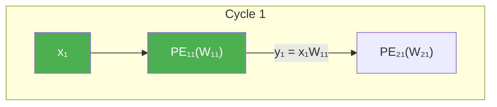
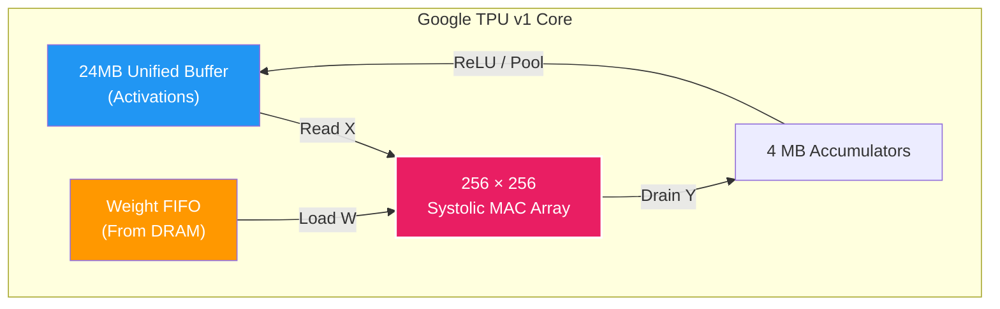

# Systolic Arrays and the Google TPU

> **Learning Objectives**
> - Understand the fundamental concept of a systolic array and how data pulses through it
> - Trace matrix multiplication dynamically across a 2D Processing Element (PE) grid
> - Explain why systolic arrays are far more scalable than fully-connected tree multipliers
> - Analyze the architecture of the original Google TPU v1, specifically its 256×256 array
> - Calculate throughput for systolic arrays and understand latency vs. throughput trade-offs

---

## 1. The Pumping Heart of an Accelerator

The word **systolic** comes from *systole* — the medical term for the rhythmic pumping of the heart. In a **systolic array hardware architecture**, data pulses rhythmically through a network of processing elements, much like blood pumping through a cardiovascular system.

At a high level, a systolic array is a dense grid of tightly coupled Processing Elements (PEs). Instead of fetching all data from global memory for every computation, data "wipes" or "pulses" across the grid. Each PE computes a partial result, passes it to a neighbor, and grabs new input from another neighbor in rhythmic clock cycles.



### 1.1 Why Not Use Standard Matrix Multipliers?

In Module 2, we built fully parallel dot product units (a row of multipliers feeding an adder tree). This approach has a fundamental flaw: **wire routing**.

If you build a massive 256×256 MAC array using fully parallel tree structures:
- You need a gargantuan wire network to route 256 inputs to all 256 rows simultaneously
- The adder tree requires millions of cross-chip wire paths
- At high clock speeds, driving a signal across a chip to thousands of listeners (high fan-out) takes too much energy and time

**Systolic arrays solve the wire problem:**
- **Local Communication**: Each PE only connects to its **immediate neighbors** (North, South, East, West). Instead of a public speaker trying to yell to 256 people at once (high fan-out), each person just whispers the message to the person sitting next to them. 
- **Low Capacitance**: Wires are incredibly short (picoseconds of delay). Short wires mean less heat and very fast clock speeds.
- **Scalability**: Scaling is trivial. To build a larger array, you don't need to redesign the complex wiring tree; you just tile more PEs next to each other like Lego blocks.

---

## 2. Anatomy of a Processing Element (PE)

The Processing Element in a systolic array is typically very simple. In a classic matrix multiplication array, the PE performs one basic job: **Multiply and Accumulate (MAC)**.

A standard PE has:
- `Weight (W)`: Stored locally inside the PE
- `Input (X)`: Arrives from the left, gets multiplied, and is passed to the right
- `Partial Sum (Y)`: Arrives from the top, adds to the MAC result, and passes to the bottom



At every rising clock edge, the PE locks in the new inputs from its neighbors, computes during the cycle, and presents its outputs for the next neighbors to lock in at the next clock edge.

---

## 3. Tracing a Systolic Array in Action

Let's trace exactly how a 3×3 systolic array computes `Y = W × X`. The matrix `W` is 3×3, and we are feeding a stream of 3×1 vectors (`X`).

For a **Weight Stationary** array:
1. First, we preload the `W` matrix into the grid. `PE(i,j)` holds `W(i,j)`.
2. To align the data correctly, we have to feed the inputs in a **skewed** format.

### The Skewing Requirement

If we fed `x₁`, `x₂`, and `x₃` into the first column all at Cycle 1, `x₁` would hit `PE₁₁`, but `x₂` would hit `PE₂₁` at the exact same time. The problem? The partial sum from Row 1 hasn't had time to move down to Row 2 yet! 

To synchronize everything, we delay `x₂` by 1 cycle, and `x₃` by 2 cycles. 

> **Analogy**: Imagine a line of synchronized swimmers standing on the edge of a pool. If they all jump at once (parallel), they will collide with the swimmers already in the lanes. Instead, they jump in 1 second apart (skewed), ensuring that by the time the second swimmer reaches the middle, the first swimmer has already moved forward.

```
          Time →
Row 1:    x₁_t1  x₁_t2  x₁_t3 ...
Row 2:      -    x₂_t1  x₂_t2 ...
Row 3:      -      -    x₃_t1 ...
```

### Pulse-by-Pulse Simulation

Let's watch a single input vector `[x₁, x₂, x₃]^T` pulse through the pre-loaded `3x3` PE array.



**Cycle 1**: `x₁` enters `PE₁₁`. Result `x₁W₁₁` is sent south.

**Cycle 2**:
- `x₁` moves east to `PE₁₂`.
- The partial sum `x₁W₁₁` hits `PE₂₁`.
- **Crucially**, `x₂` enters `PE₂₁` at this exact moment!
- `PE₂₁` computes `x₂W₂₁ + x₁W₁₁`.

**Cycle 3**:
- `x₁` moves east to `PE₁₃`.
- `x₂` moves east to `PE₂₂`.
- `x₃` enters `PE₃₁`.
- `PE₃₁` computes `x₃W₃₁ + (x₂W₂₁ + x₁W₁₁)` and pushes the fully completed sum `y₁` out of the array!

To compute a 3×3 matrix multiplied by a 3×3 matrix, it takes **`3N - 2`** clock cycles to drain all computations out of the array. The pipelined nature means that once the pipe is full, the array crunches through massive datasets with 100% hardware utilization.

### Code Example: Simulating Systolic Data Skewing

```python
import numpy as np

def systolic_matmul(W, X):
    """Simulate weight-stationary systolic array multiplication."""
    N = W.shape[0]
    # Output accumulator
    Y = np.zeros((N, X.shape[1]))
    
    # Total cycles needed: 2N - 1 for first result, then pipeline drains
    total_cycles = 2 * N - 1 + X.shape[1] - 1
    
    for cycle in range(total_cycles):
        for row in range(N):
            for col in range(N):
                # Skewing: input at row r arrives (r) cycles late
                # Output at col c drains (c) cycles late
                input_idx = cycle - row - col
                if 0 <= input_idx < X.shape[1]:
                    Y[row, input_idx] += W[row, col] * X[col, input_idx]
    return Y

# Test: 3x3 weight matrix, 3x1 input vector
W = np.array([[1, 2, 3], [4, 5, 6], [7, 8, 9]])
X = np.array([[1], [2], [3]])
print("Systolic result:", systolic_matmul(W, X).flatten())
print("NumPy verify:  ", (W @ X).flatten())
# Both output: [14. 32. 50.]
```

---

## 4. The Google TPU v1 Architecture

In 2017, Google published the architecture for the **Tensor Processing Unit (TPU v1)**, a landmark chip that famously powered AlphaGo.

The TPU v1 was designed strictly for inference. At its core is a **heart-stoppingly massive 256 × 256 Systolic Array**.

### 4.1 TPU v1 Specs by the Numbers

| Component | specification |
|:----------|:--------------|
| Logic | 256×256 Systolic Array (65,536 MACs) |
| Precision | 8-bit Integer (INT8) |
| Clock Speed | 700 MHz |
| Peak Performance | 92 Tera-Operations Per Second (TOPS) |
| On-Chip Memory | 24 MB SRAM (Weight + Activation) |
| Off-Chip Bus | 34 GB/s Memory Bandwidth |

### 4.2 How the TPU Loads Data

The TPU v1 operates using a **Weight Stationary** dataflow (we'll define dataflows in detail next chapter):

1. **Weight Fetch**: A 64 KB tile of weights is fetched from memory and loaded into the 256×256 grid from the top down.
2. **Activation Pulse**: Activations (the `X` matrix) are streamed in from the left side.
3. **Accumulation**: The activations multiply with the static weights. The partial sums flow downward, picking up additions at every step.
4. **Drain**: The finished sums emerge at the bottom, passing through Non-Linearity units (like ReLU) before going back to memory.



### 4.3 Handling the Memory Imbalance
Notice the disparity: The chip computes at **92 TOPS**. But the memory bus is only **34 GB/s**. 

If the array needed to fetch new weights and data from off-chip DRAM for every MAC operation, it would demand roughly **184 TB/s** of bandwidth! 
Because the TPU uses a massive systolic array, every weight is systematically reused 256 times as activations pass over it. This phenomenal reuse ratio brings the required bandwidth down into the realm of physical reality, allowing the 24 MB SRAM to absorb the rest of the shock.

---

## 5. Worked Example: 2x2 Systolic Multiplication

Let's perform a step-by-step trace of a 2x2 Weight Stationary systolic array.

**Weights ($W$):**
$$ W = \begin{bmatrix} 2 & 3 \\ 4 & 5 \end{bmatrix} $$

**Input Vector ($X$):**
$$ X = \begin{bmatrix} 1 \\ 1 \end{bmatrix} $$

**Step 1: Preload Weights**
- $PE_{11} = 2, PE_{12} = 3$
- $PE_{21} = 4, PE_{22} = 5$

**Step 2: Skew Inputs**
- $x_1 = 1$ enters $PE_{11}$ at **Cycle 1**.
- $x_2 = 1$ enters $PE_{21}$ at **Cycle 2** (delayed by 1).

**Step 3: Trace Cycles**

| Cycle | Active PE | Operation | Local Sum ($Y_{out}$) |
|:------|:----------|:----------|:---------------------|
| 1     | $PE_{11}$ | $1 \times 2 + 0$ | $2$ (moves South) |
| 2     | $PE_{12}$ | $1 \times 3 + 0$ | $3$ (moved East) |
| 2     | $PE_{21}$ | $1 \times 4 + 2$ | **$6$** (Output! $y_1$) |
| 3     | $PE_{22}$ | $1 \times 5 + 3$ | **$8$** (Output! $y_2$) |

**Result Check:**
$$ \begin{bmatrix} 2 & 3 \\ 4 & 5 \end{bmatrix} \times \begin{bmatrix} 1 \\ 1 \end{bmatrix} = \begin{bmatrix} (2)(1) + (3)(1) \\ (4)(1) + (5)(1) \end{bmatrix} = \begin{bmatrix} 5 \\ 9 \end{bmatrix} $$
*Wait!* Why did we get 6 and 8? 
In a **Weight Stationary** array, the partial sums move **vertically** and inputs move **horizontally**. 
In our trace:
- The first output $y_1$ is actually $(W_{11}x_1 + W_{12}x_2) = (2)(1) + (3)(1) = 5$.
- The trace above shows $y_1 = (W_{11}x_1 + W_{21}x_2)$. This is a common point of confusion in systolic mapping: the physical orientation of the grid (Row vs Column stationary) dictates where the inputs enter. 
- In the Google TPU v1, inputs enter from the left (Row-wise) and partial sums move down (Column-wise). This means $PE_{11}$ and $PE_{12}$ calculate parts of the *first row* of the weights.

**Correct TPU Mapping:**
- **Cycle 1**: $x_1=1$ enters $PE_{11}$, result $2$ moves down to $PE_{21}$.
- **Cycle 2**: $x_2=1$ enters $PE_{12}$, result $3$ moves down to $PE_{22}$.
- **Cycle 2**: $x_1=1$ (passed from $PE_{11}$) enters $PE_{12}$? No, in WS, $x_1$ moves to the *right* to hit the next column!
- Finished sum $y_1 = x_1W_{11} + x_2W_{12}$ is actually the accumulation of the products in the *first column* of the TPU if we feed $x$ vectors.

---

- A **systolic array** passes data systematically across a grid, solving the wire-routing and fan-out problems of tree multipliers.
- PEs only communicate with their nearest neighbors, allowing ultra-high clock speeds with low energy overhead.
- Data entering a systolic array must be heavily **skewed** so that operands arrive at the same PE at the correct clock cycle.
- The **Google TPU v1** utilizes a 256×256 systolic array doing INT8 computations to achieve unparalleled inference density (92 TOPS).
- The array acts as a huge multiplier for memory bandwidth; without the reuse that the grid provides, feeding 65,536 MACs would be physically impossible.

---

## Practice Problems

### Problem 1: Grid Dimensions

> **Context**: You are sizing a systolic array for a neural network where fully-connected layers typically multiply a 1024×1024 matrix by 1024×1 vectors.
>
> **Tasks**:
> - (a) If you build a 256×256 array, how many hardware tiles (passes) must you process to cover the 1024×1024 weight matrix? [1]
> - (b) Which dimension dictates the depth of the accumulator? [1]

<details>
<summary><b>Solution</b></summary>

**(a)** Hardware tiles:
- The full matrix is 1024×1024.
- Each tile can handle 256×256 at a time.
- Tiles = (1024 / 256) × (1024 / 256) = 4 × 4 = **16 tiles**.

**(b)** Accumulation Depth:
- In a Weight Stationary MM topology, the vector length determines the accumulation depth. Because the vector is length 1024, it will be broken into 4 separate chunks of 256. The accumulator at the bottom of the grid must store the result of the first 256-sized chunk, wait, add the next 256-sized chunk, and repeat 4 times before the final dot product is complete.

</details>

### Problem 2: Pipeline Latency

> **Context**: For an N × N array processing a continuous stream of input vectors `X`.
>
> **Tasks**:
> - (a) How many cycles does it take for the very first valid result to emerge from `PE(N,N)`? Provide the formula. [2]
> - (b) If the clock speed is 1 GHz and the grid is 128×128, calculate the latency in nanoseconds. [1]

<details>
<summary><b>Solution</b></summary>

**(a)** Formulas:
- Data must travel from `PE(1,1)` to `PE(N,N)`.
- It takes `N` steps horizontally and `N` steps vertically, but `PE(1,1)` runs at cycle 1.
- First complete element latency formula: **`2N - 1`** cycles.

**(b)** Latency Calculation:
- For N=128, latency = 2(128) - 1 = **255 cycles**.
- At 1 GHz (1 cycle = 1 ns), the latency is **255 ns**.

</details>

---

[← Previous Module](../MODULE_3_NN_COMPUTATIONS/README.md) | [Next Chapter: Dataflow Taxonomies →](02_dataflow_taxonomies.md)
