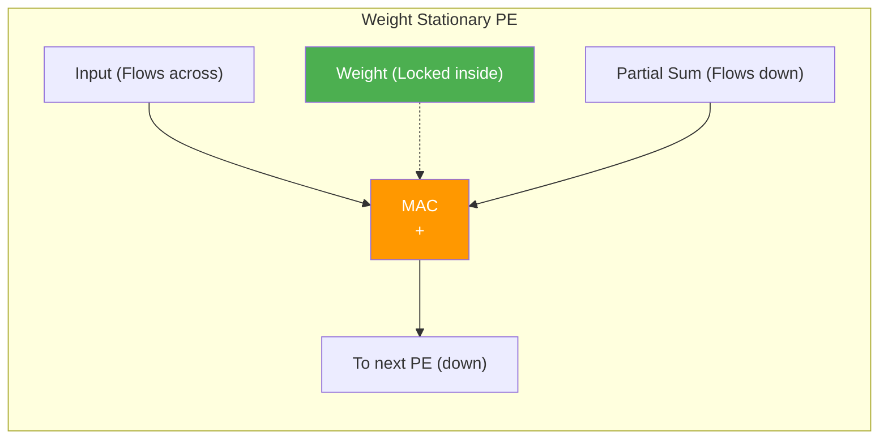
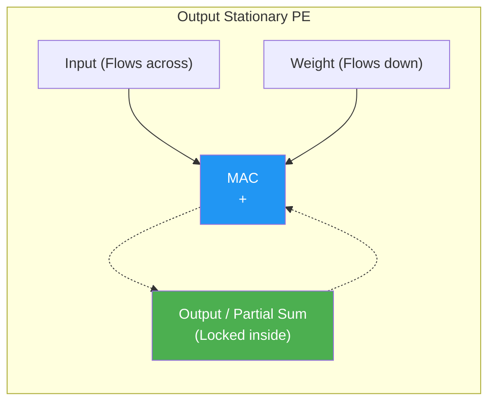

# Dataflow Taxonomies

> **Learning Objectives**
> - Define what "dataflow" means in the context of hardware accelerators
> - Compare and contrast Weight Stationary (WS), Output Stationary (OS), and Row Stationary (RS) architectures
> - Understand the energy hierarchy of different memory levels
> - Determine which data types are best mapped to local registers based on the hardware topology

---

## 1. What is a Dataflow?

In a processor, the **Control Flow** decides what instructions execute next (loops, if-statements). In a hardware accelerator consisting of fixed grid logic, the control flow is trivial. What matters instead is the **Dataflow**.

**Dataflow** describes how data routes through the massive arrays of Processing Elements (PEs) and memory banks. It defines:
1. What stays anchored inside the PE registers?
2. What moves horizontally?
3. What moves vertically?

In every neural network MAC convolution array, there are exactly three types of data involved:
1. **Weights (W)**: The model parameters.
2. **Inputs / Activations (I)**: The incoming pixel data or feature maps.
3. **Partial Sums / Outputs (O)**: The running totals that eventually become the output feature maps.

A "Stationary" dataflow identifies which of these three data types remains locked inside the local register of a given PE for the duration of the tile's computation. By keeping data stationary, you minimize reads and writes to global SRAM, saving immense amounts of energy.

---

## 2. The Energy Cost Hierarchy

To understand why dataflows are critical, look at physical energy costs. Extracting an element from memory costs significantly more energy depending on how far away it is. 

Approximate energy costs for a 45nm CMOS process (relative to a 1x MAC operation):

| Operation | Relative Energy Cost |
|:----------|:---------------------|
| 1x MAC Operation | 1x |
| Register Read (inside PE) | ~1-2x |
| Neighboring PE routing | ~2x |
| On-Chip Global SRAM Buffer | ~50x |
| Off-Chip DRAM Read | **~1000x - 3000x** |

**The Goal of any Dataflow:** Guarantee that as many accesses as possible hit the local PE register (1x cost), and as few accesses as possible originate from Off-Chip DRAM (3000x cost). 

### The Secret Cost: Wires
In modern sub-10nm chips, it's not the transistors that consume the most power—it's the **wires**. Moving data across a long wire ($1 \text{ mm}$) consumes more energy than a hundred MAC operations. 
1. **Multicasting**: Sending the same value to every PE in a row simultaneously. Expensive wires, but high reuse.
2. **Unicasting**: Moving data from neighbor to neighbor. Shorter wires, lower energy, but higher latency.
Your choice of dataflow determines which of these "hidden wire costs" your chip will pay.

---

## 3. Weight Stationary (WS)

In a **Weight Stationary** architecture, the filters/weights are fetched from SRAM and loaded into the local registers of the PEs. Once locked in, they don't move until a new tile of weights is necessary.

- **Stationary**: Weights (W)
- **Moving**: Inputs (I) broadcast across rows; Partial Sums (O) stream down columns.



**Pros:**
- Excellent when weights are heavily reused (like in Convolutions or fully batch-processed FC layers).
- This is the approach used by the **Google TPU v1** and **NVDLA**.

**Cons:**
- Moving massive arrays of partial sums around the chip consumes heavily on wire routing power and requires large external accumulators.

---

## 4. Output Stationary (OS)

In an **Output Stationary** architecture, the partial sums never move. A PE is assigned a specific output coordinate `O(x,y)`. It accumulates the MAC results inside its local register. 

- **Stationary**: Partial Sums / Outputs (O)
- **Moving**: Inputs (I) and Weights (W) stream over the array, often broadcast simultaneously.



**Pros:**
- Partial sums have higher precision (e.g., 32-bit INT instead of 8-bit inputs) and thus require more wires to move. Anchoring them inside the PE minimizes high-bandwidth internal routing.
- This approach natively minimizes the need for giant external accumulators.
- Used by **ShiDianNao** and some Edge computing designs.

**Cons:**
- Requires both weights and inputs to be broadcast continuously, drawing high SRAM read energy.

---

## 5. Row Stationary (RS)

**Row Stationary** is a highly innovative dataflow pioneered by MIT's **Eyeriss** project.
Rather than locking one specific data type perfectly, RS maps a *1D row* of a convolution onto a *1D row* of PEs.

In this layout, the array takes advantage of the distinct sliding window nature of a 2D convolution. PEs are given small specialized local scratchpad registers.
- A row of weights stays in a PE row.
- A row of inputs slides horizontally through that PE row.
- The partial sums accumulate vertically across PE rows.

This maximizes the **local spatial reuse** of ALL three data types simultaneously. Everything stays mostly localized on a single row or column. 

**How it works (The Metaphor):** 
Imagine three jugglers. 
- In **WS**, one juggler holds a ball (weight) while the others throw balls past him. 
- In **OS**, one juggler catches balls and keeps them in his pocket (partial sum). 
- In **RS**, all jugglers are throwing and catching in a perfectly synchronized circle, ensuring that no ball ever has to leave the small circle of jugglers to be stored in the far-away chest (DRAM).

**Pros:**
- Achieves the best overall energy efficiency for CNNs by balancing the movement of all 3 data types uniformly.
- Keeps intermediate data inside the PE grid longer before needing the global buffer.

**Cons:**
- Extremely complex PE hardware and control logic. The PEs need specialized state machines and multi-level local buffers to manage the complex sliding windows.

---

## 6. Summary Comparison Matrix

| Feature | Weight Stationary (WS) | Output Stationary (OS) | Row Stationary (RS) |
|:---|:---|:---|:---|
| **What stays inside PE?** | Weights | Partial Sums | Rows of Weights + Sliding Inputs |
| **What moves the most?** | Partial Sums, Inputs | Weights, Inputs | (Balanced 2D sliding) |
| **Best suited for...** | Large batches, Massive Arrays | Output-heavy layers | Heavily optimized Edge CNNs |
| **Real-world Example** | Google TPU v1 | ShiDianNao | MIT Eyeriss |

---

### Code Example: Comparing Dataflow Energy

```python
# Energy costs per data access (pJ) — from 45nm CMOS studies
ENERGY = {"register": 1, "neighbor": 2, "sram": 50, "dram": 1000}

def energy_per_mac(dataflow: str):
    """Estimate data movement energy per MAC for different dataflows."""
    if dataflow == "weight_stationary":
        return (ENERGY["register"]    # weight: stays in register
              + ENERGY["neighbor"]    # input: arrives from neighbor PE 
              + ENERGY["neighbor"])   # partial sum: passes to neighbor
    elif dataflow == "output_stationary":
        return (ENERGY["sram"]        # weight: fetched from global buffer
              + ENERGY["sram"]        # input: fetched from global buffer
              + ENERGY["register"])   # partial sum: stays in register
    elif dataflow == "naive":
        return (ENERGY["sram"]        # weight from SRAM
              + ENERGY["sram"]        # input from SRAM
              + ENERGY["sram"] * 2)   # partial sum: read + write to SRAM

for df in ["weight_stationary", "output_stationary", "naive"]:
    print(f"{df:25s}: {energy_per_mac(df):5d} pJ per MAC")
# weight_stationary       :     5 pJ per MAC
# output_stationary       :   101 pJ per MAC
# naive                   :   200 pJ per MAC
```

---

## Practice Problems

### Problem 1: Dataflow Identification

> **Context**: You are analyzing an accelerator running a 1x1 Pointwise Convolution. The output feature map requires 32 channels. The design reads a tile of the 1x1 weights once. Then, it sweeps every single pixel of the input image across the array before fetching the next tile of weights. 
> 
> **Tasks**:
> - (a) Which dataflow architecture is this? [1]
> - (b) Which piece of data consumes the highest energy from the interconnect wiring in this case? [1]

<details>
<summary><b>Solution</b></summary>

**(a)** Weight Stationary (WS). The weights are held in the array while the input image pixels slide across them.

**(b)** The Partial Sums. Since they are physically moving from PE to PE in order to be accumulated and returned to memory, the large width of the partial sum lines consumes the most wiring energy.

</details>

### Problem 2: Energy Budget

> **Context**: You have an array of 256 PEs. You need to do 4096 MACs.
> Option 1 is Output Stationary. Partial Sums never leave the PE register (1pJ). Weights and inputs are sent from the Global Buffer (50pJ).
> Option 2 is a naive non-stationary design where EVERYTHING (Weights, Inputs, Partial Sums) goes to the Global Buffer.
> 
> **Tasks**: 
> - Calculate the absolute minimum data fetch energy difference per MAC between the two options. [2]

<details>
<summary><b>Solution</b></summary>

Option 2 (Naive):
- Read Input (50 pJ)
- Read Weight (50 pJ)
- Read Partial Sum (50 pJ)
- Write Partial Sum (50 pJ)
- Total memory access per MAC = 200 pJ.

Option 1 (Output Stationary):
- Read Input (50 pJ)
- Read Weight (50 pJ)
- Update Partial Sum locally (register read+write) = 2 pJ
- Total access per MAC = 102 pJ.

The energy difference per MAC operation is massive: **98 pJ**. This shows how keeping even one operand stationary physically cuts memory array energy consumption in half.

</details>

---

[← Previous Chapter: Systolic Arrays](01_systolic_arrays_tpu.md) | [Next Chapter: Roofline Model →](03_memory_roofline_model.md)
