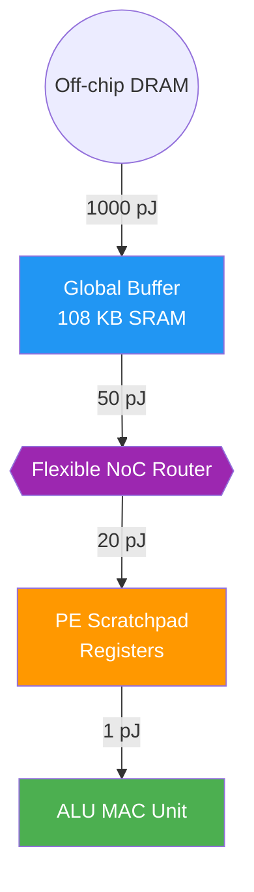

# Eyeriss Case Study: An Energy-Efficient Inference Accelerator

> **Learning Objectives**
> - Understand why standard 2D systolic arrays (like TPU) struggle with the variable dimensions of convolutions
> - Differentiate the specialized MIT Eyeriss architecture from massive datacenter architectures
> - See how Row Stationary (RS) dataflow is mapped onto a hierarchical PE grid
> - Learn how network compression handles zeroes in hardware via Run-Length Encoding 

---

## 1. Introduction to Eyeriss

In **2016, MIT** presented a groundbreaking spatial accelerator named **Eyeriss** at the International Solid-State Circuits Conference (ISSCC). While designs like Google’s TPU were brute-forcing their way through datacenter-scale inference workloads with hundreds of thousands of MAC units, Eyeriss targeted the opposite end of the spectrum: **Edge compute**. 

Eyeriss was specifically designed for vision processing on smartphones, IoT devices, and battery-powered cameras. It proved that how you move data (the dataflow) is far more important for energy consumption than simply having lots of multipliers.

---

## 2. The Problem with Large Weight Stationary Arrays

Let's look at the TPU v1’s massive 256×256 Weight Stationary systolic array. It is phenomenally powerful for **Fully Connected layers** and massive matrix multiplications.

However, convolutional layers in vision models like ResNet or MobileNet usually feature spatial dimensions like:
- **3×3 filters**
- **1×1 pointwise convolutions**

When you load a small 3×3 convolution into a 256×256 grid, **you suffer from massive hardware under-utilization.** If you only have 9 weights to lock down in a 65,536-size grid, 99.9% of the MACs in that tile sit idle. The massive array cannot easily flex to efficiently handle layers with tiny parameter sizes but massive activation maps.

---

## 3. The 1D Processing Element (PE)

Eyeriss solved this by breaking the convolution into its fundamental 1D building blocks. It invented the **Row Stationary (RS)** dataflow.

In Eyeriss, the fundamental logic dictates that:
1. A 1D row of weights stays completely stationary inside a single PE's local register.
2. A sliding 1D row of input pixels streams horizontally through that PE.
3. The PE accumulates partial sums for a 1D convolution linearly.

### 3.1 The Hierarchical 1D-to-2D Mapping

Eyeriss uses a $12 \times 14$ grid of specialized PEs (168 total MAC units). The mapping scales cleanly:

1. **1D Convolution (Inside a single PE):** A single PE handles a $1 \times 3$ filter row multiplied by a streaming $1 \times Width$ row of inputs.
2. **2D Convolution (Across a Column):** Three PEs stacked vertically handle the three rows of a $3 \times 3$ kernel. The partial sums flow downward to combine the 1D fragments into a complete 2D convolution map.
3. **Multi-Channel (Across Rows):** Multiple input channels (e.g. RGB) are spread horizontally across different columns. The results fold across the bottom of the grid.

Because the dataflow relies on flexible logical folding rather than a strictly rigid $N \times N$ matrix dot product layout, Eyeriss can map a $3 \times 3$ convolution or a $1 \times 1$ pointwise or an $11 \times 11$ AlexNet filter perfectly onto the hardware with minimal idle PEs.

---

## 4. The Eyeriss Memory Hierarchy

The Row Stationary structure allows Eyeriss to maximize reuse, but doing so requires a significantly more complex memory architecture than standard designs. Eyeriss features a **3-Level Hierarchical Memory** layout:



This hierarchy perfectly mirrors the relative energy costs table from Chapter 2. By capturing sliding window operands at the absolute lowest tier of memory (the SPad), Eyeriss minimized global wire trips and drastically drove down energy per inference.

### 5. Multi-Level Data Reuse
Eyeriss was the first chip to categorize reuse into two distinct types:
1. **Spatial Reuse (Inside the PE)**: Moving data from a register to the ALU (1x energy).
2. **Temporal Reuse (Across the PE Grid)**: Multicasting a weight to all PEs in a row simultaneously so they don't have to fetch it independently from DRAM.

By balancing these, Eyeriss achieved a **Total Reuse Factor** that was $10\times$ higher than standard designs, meaning it touched DRAM $10\times$ less frequently for the same CNN.

---

## 5. Exploiting Sparsity natively in Hardware

Eyeriss included one more massive innovation for energy efficiency: dealing with zeroes. After a ReLU activation layer, typically 40% to 60% of all feature map values become exactly **0.0**.

Every time you multiply by zero, the result is zero. Fetching the zero, moving the zero over the wires, and powering the MAC logic to do $W \times 0$ is completely wasted energy.

Eyeriss uses a technique called **Run-Length Encoding (RLE)** natively in its hardware.
- As the Global buffer reads out data, an encoder scans for zeros.
- If it sees `[4, 0, 0, 0, 7]`, it compresses this into a format like `(Value: 4, Skip: 0), (Value: 7, Skip: 3)`.
- The NoC router only transmits the non-zero data packets over the bus.
- **The PE is programmed to clock-gate (turn off) its MAC multiplier** when it receives the skip signal. 

This compression technique reduces memory bandwidth by 30-50% and literally turns off the power-hungry logic gates whenever sparsity occurs!

### Code Example: Simulating Zero-Skipping (RLE)

```python
def simulate_eyeriss_rle(data_stream):
    """Simulate hardware-level zero-skipping via RLE."""
    compressed_packets = []
    skip_count = 0
    energy_with_rle = 0
    
    for val in data_stream:
        if val == 0:
            skip_count += 1
        else:
            # Packet contains value and number of zeros skipped before it
            compressed_packets.append({"val": val, "skip": skip_count})
            skip_count = 0
            energy_with_rle += 1  # 1 unit for processing non-zero
            
    return compressed_packets, energy_with_rle

# Imagine a post-ReLU activation stream
stream = [12, 0, 0, 0, 8, 0, 0, 4, 0]
packets, energy = simulate_eyeriss_rle(stream)

print(f"Original Stream:   {stream}")
print(f"Compressed (RLE): {packets}")
print(f"Energy (Naive):   {len(stream)}")
print(f"Energy (Eyeriss): {energy} (Clock-gated the zeros!)")
```

---

## 6. Worked Example: Mapping a 3x3 Filter

Let's see how Eyeriss maps a single $3 \times 3$ filter onto its grid using Row Stationary logic.

**Filter ($W$):**
- Row 1 ($R_1$): `[w1, w2, w3]`
- Row 2 ($R_2$): `[w4, w5, w6]`
- Row 3 ($R_3$): `[w7, w8, w9]`

**Hardware Mapping:**
- **PE(x, 1)**: Loaded with $R_1$. Stays stationary.
- **PE(x, 2)**: Loaded with $R_2$. Stays stationary.
- **PE(x, 3)**: Loaded with $R_3$. Stays stationary.

**Data Flow:**
1. **Input Stream**: A row of pixels $I_{row}$ is multicast to the column.
2. **PE(x, 1)**: Computes 1D conv of $I_{row} * R_1$. Result passed down.
3. **Synchronization**: By the time $I_{row}$ reaches PE(x, 2) in the next cycle, it is combined with the partial sum from PE(x, 1).
4. **Efficiency**: Because the filter is stationary, we only read the 9 weights from global memory **once**. Because the input row is multicast, we read it from the buffer **once** for all three PEs.

---

## Key Takeaways

- Eyeriss represents the peak of edge accelerator efficiency, optimized to save energy over raw throughput.
- Large square 2D Arrays are inflexible and suffer under-utilization when handling small $3 \times 3$ or $1 \times 1$ convolutions.
- The **Row Stationary** dataflow breaks convolutions into 1D rows, mapped elegantly onto individual PEs and combined across columns.
- The **3-Level Memory Hierarchy** (Global Buffer -> NoC -> PE SPads) is heavily exploited by the RS algorithm to retain small sliding windows perfectly locally.
- Hardware-native **Run-Length Encoding (RLE)** allows the chip to compress Sparse datasets (zeroes) to radically reduce bus traffic and clock-gate the MAC logic down.

---

## Practice Problems

### Problem 1: Idle Grid Utilization

> **Context**: You have a $256 \times 256$ TPU-style dense grid, and a flexible Eyeriss style $16 \times 16$ grid. You are performing a $5 \times 5$ spatial convolution on a single-channel input map returning a single feature map.
>
> **Tasks**:
> - (a) On the tight, non-flexible TPU array mapping (which treats convolutions like matrix multiplication and locks the weights to an $N \times M$ corner), how many MACs are actively computing the $5 \times 5$ filter, and what is the utilization percentage of the $256 \times 256$ grid? [2]
> - (b) Why does the Eyeriss RS mapping not suffer from this? [1]

<details>
<summary><b>Solution</b></summary>

**(a)** TPU Utilization:
- A $5 \times 5$ filter has 25 weights. The grid locks them into a $5 \times 5$ grid of MAC units.
- Active MACs = 25. Total MACs = 65,536. 
- Utilization = 25 / 65,536 = **0.038%**.

**(b)** Eyeriss Flexibility:
- RS breaks the $5 \times 5$ grid down into five 1D rows of size $1 \times 5$. It assigns them to 5 PEs in a column. Due to the NoC, it can duplicate this work across different rows and columns dynamically, computing different sliding fragments of the input map in parallel across the rest of the PEs to keep utilization high.

### Problem 2: Energy Savings through RLE

> **Context**: An Eyeriss-like chip is processing a layer where $60\%$ of activations are zero. 
> - A standard MAC operation consumes **10 pJ**.
> - Clock-gating a PE (when a skip is detected) reduces its consumption to **0.5 pJ** for that cycle.
>
> **Tasks**:
> - Calculate the average energy consumption per MAC cycle for this layer. [2]

<details>
<summary><b>Solution</b></summary>

- $40\%$ of cycles are active: $0.4 \times 10 \text{ pJ} = 4 \text{ pJ}$.
- $60\%$ of cycles are gated: $0.6 \times 0.5 \text{ pJ} = 0.3 \text{ pJ}$.
- Average Energy = $4 + 0.3 = \mathbf{4.3 \text{ pJ}}$.
- **Result**: Even without pruning the weights, simple hardware-level zero-skipping reduces the active compute energy by over **57%**.

</details>

---

[← Previous Chapter: Roofline Model](03_memory_roofline_model.md) | [Next Module: Optimization Techniques →](../MODULE_5_OPTIMIZATION/README.md)
