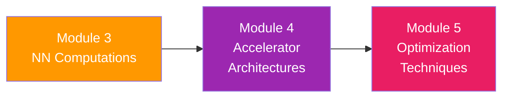

# Module 4: Accelerator Architectures

> **From Single Operations to Massive Arrays — Building Real Chips**

---

## Overview

In the previous modules, you learned the fundamental math behind AI operations and how to build single MAC units in hardware. Now we zoom out to the architectural level. How do you feed thousands of MAC units simultaneously without starving them for data? How do real-world chips like Google's TPU organize computation safely and efficiently? 

This module dives into the deep architectural concepts that distinguish average accelerators from world-class ones. You will learn how systolic arrays provide massive compute capability with localized wiring, how dataflow dictates what stays on-chip and what moves, and how to analyze system bottlenecks using the Roofline model. Finally, we'll put it all together by looking at MIT's Eyeriss—a landmark accelerator designed specifically for energy efficiency.

---

## Learning Objectives

After completing this module, you will be able to:

- ✅ Explain the mechanism behind a systolic array and simulate its operation pulse-by-pulse
- ✅ Compare the architecture of the Google TPU v1 with general-purpose spatial architectures
- ✅ Define the three major dataflow taxonomies: Weight Stationary (WS), Output Stationary (OS), and Row Stationary (RS)
- ✅ Construct and interpret a Roofline model to determine if an architecture is compute-bound or memory-bound
- ✅ Analyze the Eyeriss architecture and explain how Row Stationary dataflow enables extreme energy efficiency

---

## Chapters

| # | Chapter | Key Topics |
|:--|:--------|:-----------|
| 1 | [Systolic Arrays and the Google TPU](01_systolic_arrays_tpu.md) | The systolic paradigm, 2D processing element grids, data propagation, TPU v1 architecture |
| 2 | [Dataflow Taxonomies](02_dataflow_taxonomies.md) | Weight Stationary, Output Stationary, input and partial sum movement, energy tradeoffs |
| 3 | [Memory Hierarchy and the Roofline Model](03_memory_roofline_model.md) | Arithmetic intensity, peak performance, memory bandwidth constraints, Roofline plot construction |
| 4 | [Eyeriss Case Study](04_eyeriss_case_study.md) | Deep dive into MIT's Eyeriss, Row Stationary dataflow, hierarchical memory structures |

---

## Prerequisites

- Completion of **Module 2** (Control and data paths, hardware design basics)
- Completion of **Module 3** (MAC operations, convolutions, data reuse principle)
- Comfort with basic algebra and tracing data dynamically through a grid

---

## How This Module Connects

Module 3 introduced the concept of the *MAC array* and why data reuse is important. Here in Module 4, we define exactly *how* that array operates and *how* data is systematically reused across the global memory hierarchy. In Module 5, you'll learn software and hardware optimizations to squeeze even more performance out of these architectures.

---

*Estimated study time: 4–5 hours*
