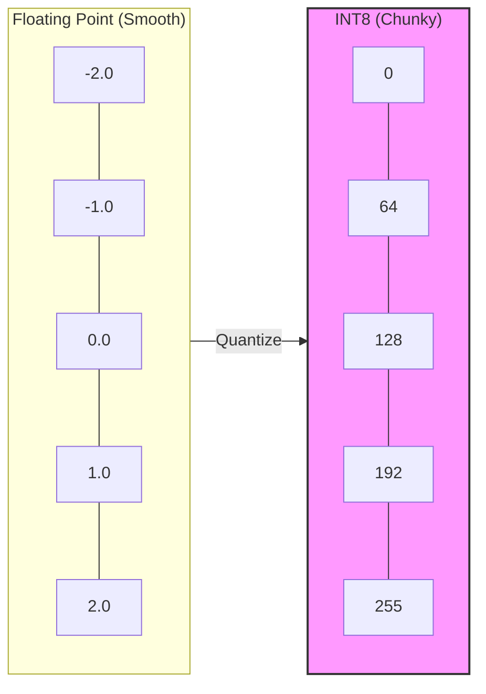

# Quantization: FP32 to INT8 and Beyond

> **Learning Objectives**
> - Understand the massive hardware disparity between Floating-Point (FP32) and Integer math (INT8)
> - Apply the affine quantization mathematical transformation mathematically ($r = S(q - Z)$)
> - Differentiate Post-Training Quantization (PTQ) from Quantization-Aware Training (QAT)
> - Explore the push toward sub-byte precision like INT4 and INT2

---

## 1. Why Quantize? The Hardware Reality

As you learned in Module 3, an IEEE 754 32-bit Floating Point (FP32) multiplier is an incredibly complex beast. It has to extract mantissas, multiply them, add exponents, and normalize the result.

A purely integer-based multiplier (like an INT8 MAC) just runs a standard grid of AND gates and full-adders. 

**Let's look at the numbers (approximate 45nm CMOS costs):**

| Operation | Bit-Width | Relative Energy | Relative Silicon Area |
|:----------|:----------|:----------------|:----------------------|
| **Float Add** | 32-bit | 30x | 30x |
| **Float Mult** | 32-bit | 100x | 100x |
| **Int Add** | 8-bit | 1x | 1x |
| **Int Mult** | 8-bit | 5x | 5x |

Furthermore, memory bandwidth relies directly on the size of the data. Sending an FP32 value through the global bus takes exactly **4x more energy and time** than sending an INT8 value. By dropping from FP32 to INT8, we instantly cut our memory bottleneck by 75% and our compute area by over 90%.

The catch? We lose decimal precision. **Quantization** is the math of compressing that precision into integers with as little accuracy loss as possible.



> **Analogy**: Quantization is like building a model of a smooth, rounded mountain using standard Lego bricks. If you use thousands of tiny clear bricks (FP32), the mountain looks perfectly smooth and realistic. If you are forced to use only 256 large chunky bricks (INT8), the mountain starts to look like a jagged staircase. Your goal in quantization is to choose exactly where to place those 256 bricks so that the "staircase" still captures the true shape of the peak.

---

## 2. The Affine Quantization Formula

The most standard approach to map real floating-point values ($r$) to quantized integers ($q$) is **Affine Quantization**. Affine refers to a linear mapping that includes an offset.

The formula relating the real (FP32) value to the quantized (INT8) value is:

$$ r = S \times (q - Z) $$

Where:
- **$r$**: The real FP32 value.
- **$q$**: The quantized Integer value (e.g., restricted to $[0, 255]$ for unsigned INT8, or $[-128, 127]$ for signed).
- **$S$** (Scale): A positive FP32 number that specifies the "step size" between integers.
- **$Z$** (Zero-Point): An integer value that dictates what the real value $0.0$ maps to in the quantized space.

### 2.1 Calculating $S$ and $Z$
To quantize a tensor, we first look at the minimum and maximum real values in the tensor (the range $[r_{min}, r_{max}]$). 

Suppose we are mapping to an 8-bit unsigned integer ($q_{min} = 0, q_{max} = 255$).

1. **Calculate the Scale (Step Size):**
   $$ S = \frac{r_{max} - r_{min}}{q_{max} - q_{min}} $$
   
2. **Calculate the Zero-Point:**
   We want the real value $0.0$ to map exactly to the integer zero-point without rounding errors (if possible), because padding and ReLU functions rely heavily on exact zeros.
   $$ Z = \text{round} \left( q_{min} - \frac{r_{min}}{S} \right) $$

*(If $Z$ falls outside the $[0, 255]$ range, we clip it to the minimum or maximum).*

### Example Calculation

You have a weight tensor with values ranging from $r_{min} = -2.0$ to $r_{max} = 4.0$. You want to quantize to INT8 `[0, 255]`.

1. $S = \frac{4.0 - (-2.0)}{255 - 0} = \frac{6.0}{255} \approx 0.0235$
2. $Z = \text{round}\left(0 - \frac{-2.0}{0.0235}\right) = \text{round}(85.1) = 85$

So, the real value $0.0$ is represented by the integer $85$. 
A real value of $4.0$ is represented by: $q = \text{round}(4.0 / 0.0235) + 85 = 170 + 85 = 255$.

---

## 3. PTQ vs. QAT

Dropping precision from infinitely smooth numbers down to 256 chunky steps inevitably introduces **quantization noise**. There are two primary strategies to handle this.

### 3.1 Post-Training Quantization (PTQ)
In PTQ, you train the model normally in FP32 on powerful GPUs. Once training is 100% complete, you freeze the weights.
You then push a "calibration dataset" through the network to observe the minimum and maximum ranges of all the intermediate activations to calculate the scales ($S$) and zero-points ($Z$). 

*Pros:* Fast, requires no retraining.
*Cons:* Can result in measurable accuracy drops (e.g., a Top-1 accuracy dropping from 78.1% to 76.5%).

### 3.2 Quantization-Aware Training (QAT)
If PTQ degrades the model too much, you use QAT. 
During the final phases of FP32 training, mathematical nodes are injected into the neural network that simulate the truncation and rounding effects of INT8 math. The network is "aware" that it will eventually be quantized, and the gradient descent process naturally adjusts the weights so that they are robust to the chunky INT8 steps.

*Pros:* Virtually recovers 100% of the original FP32 accuracy.
*Cons:* Extremely computationally expensive to train.

---

## 4. Sub-Byte Precision (INT4 and INT2)

As models scale to billions of parameters (like LLMs), even INT8 is occasionally too heavy. The industry is aggressively moving towards **Sub-Byte Precision**.

- **INT4 (16 discrete values):** Cuts memory bandwidth and storage by another 50% compared to INT8. However, representing a complex weight distribution with just 16 steps requires exotic non-linear mappings (like Nvidia's FP4 or block-wise floating point formats).
- **INT2 / Ternary ([-1, 0, 1]):** A multiplier operating on a ternary weight doesn't actually need to multiply! It just acts as a multiplexer (pass the value, negate the value, or pass zero).
- **Binary/1-bit ([-1, 1]):** Using XNOR gates instead of MACs. A network relying on this is called a BNN (Binary Neural Network).

While INT4 reduces memory drastically, the hardware MAC required to extract and compute 4-bit numbers packed tightly into 8-bit bus lines requires specialized unpacking logic. 

---

## 5. Worked Example: Quantizing a Weight Tensor

Let's walk through quantizing a small $2 \times 2$ weight matrix from FP32 to unsigned INT8.

**Weights ($W_{fp32}$):**
$$ W = \begin{bmatrix} -1.2 & 0.5 \\ 2.8 & 3.5 \end{bmatrix} $$

**Step 1: Identify Ranges**
- $r_{min} = -1.2, r_{max} = 3.5$.
- $q_{min} = 0, q_{max} = 255$.

**Step 2: Calculate Scale ($S$)**
- $S = \frac{3.5 - (-1.2)}{255 - 0} = \frac{4.7}{255} \approx \mathbf{0.01843}$.

**Step 3: Calculate Zero-Point ($Z$)**
- $Z = \text{round}\left(0 - \frac{-1.2}{0.01843}\right) = \text{round}(65.11) = \mathbf{65}$.

**Step 4: Quantize the Values ($q = \text{round}(r/S) + Z$)**
- $w_{1,1} \rightarrow \text{round}(-1.2 / 0.01843) + 65 = -65 + 65 = \mathbf{0}$. (Correct, $r_{min}$ should map to $q_{min}$)
- $w_{1,2} \rightarrow \text{round}(0.5 / 0.01843) + 65 = 27 + 65 = \mathbf{92}$.
- $w_{2,1} \rightarrow \text{round}(2.8 / 0.01843) + 65 = 152 + 65 = \mathbf{217}$.
- $w_{2,2} \rightarrow \text{round}(3.5 / 0.01843) + 65 = 190 + 65 = \mathbf{255}$. (Correct, $r_{max}$ should map to $q_{max}$)

**Resulting INT8 Matrix:**
$$ W_{int8} = \begin{bmatrix} 0 & 92 \\ 217 & 255 \end{bmatrix} \quad (S=0.01843, Z=65) $$

---

### Code Example: Affine Quantization

```python
import numpy as np

def quantize_affine(tensor, bits=8):
    """Quantize a floating-point tensor to unsigned integer using affine mapping."""
    q_min, q_max = 0, 2**bits - 1
    r_min, r_max = tensor.min(), tensor.max()
    
    scale = (r_max - r_min) / (q_max - q_min)
    zero_point = int(round(q_min - r_min / scale))
    zero_point = np.clip(zero_point, q_min, q_max)
    
    # Quantize: q = round(r/S) + Z
    q = np.clip(np.round(tensor / scale) + zero_point, q_min, q_max).astype(np.uint8)
    # Dequantize: r_hat = S * (q - Z)
    r_hat = scale * (q.astype(np.float32) - zero_point)
    
    return q, r_hat, scale, zero_point

# Simulate a weight tensor
weights = np.array([-2.0, -0.5, 0.0, 1.3, 4.0], dtype=np.float32)
q, r_hat, S, Z = quantize_affine(weights)

print(f"Scale: {S:.4f}, Zero-Point: {Z}")
print(f"Original:    {weights}")
print(f"Quantized:   {q}")
print(f"Dequantized: {r_hat}")
print(f"Max error:   {np.max(np.abs(weights - r_hat)):.4f}")
# Max error ≈ 0.0118 — less than 0.5% for 8-bit!
```

---

## Key Takeaways

- Floating-Point math hardware is massive, power-hungry, and consumes egregious amounts of memory bandwidth.
- **Affine Quantization** uses a Scale and Zero-point to map real values onto integer grids.
- Setting $Z$ accurately is critical because zeros appear frequently in padding and after ReLU activations.
- **PTQ** is a fast after-the-fact conversion; **QAT** retrains the network to learn to live with INT8 chunkiness.
- Extreme quantization (INT4, Ternary) is the frontier of edge AI, replacing complex multipliers with simple MUX or XNOR gates.

---

## Practice Problems

### Problem 1: Quantize an Activation

> **Context**: You are writing the quantization module for an accelerator's compiler. After feeding a calibration batch through an activation layer, you observe the outputs range from $r_{min} = -1.5$ to $r_{max} = 6.0$. 
> 
> **Tasks**:
> - (a) Calculate the Scale $S$ if quantizing to unsigned 8-bit integer (0 to 255). [1]
> - (b) Calculate the Zero-point $Z$. [1]
> - (c) How would the real value `3.0` be represented in this integer scheme? [1]

<details>
<summary><b>Solution</b></summary>

**(a) Scale Calculation:**
- $r_{range} = 6.0 - (-1.5) = 7.5$
- $q_{range} = 255 - 0 = 255$
- $S = 7.5 / 255 \approx \mathbf{0.02941}$

**(b) Zero-point Calculation:**
- $Z = \text{round}(0 - (-1.5 / 0.02941))$
- $Z = \text{round}(51.00)$
- $\mathbf{Z = 51}$

**(c) Quantizing '3.0':**
- $q = \text{round}(r / S) + Z$
- $q = \text{round}(3.0 / 0.02941) + 51$
- $q = \text{round}(102) + 51$
- $\mathbf{q = 153}$

### Problem 2: Dynamic Range vs. LSB

> **Context**: You have two model weights:
> 1. Weight A: Range $[-10.0, 10.0]$
> 2. Weight B: Range $[-0.1, 0.1]$
> Both are quantized to signed INT8 $(-128$ to $127)$.
> 
> **Tasks**:
> - (a) Calculate the precision (the value of the Least Significant Bit, $S$) for both. [1]
> - (b) Which weight suffers from higher relative rounding error if the true value is $0.005$? [1]

<details>
<summary><b>Solution</b></summary>

**(a) Precision ($S$):**
- In signed symmetric quantization, $S = \text{Max\_Abs\_Value} / 127$.
- Weight A: $S = 10.0 / 127 = \mathbf{0.0787}$.
- Weight B: $S = 0.1 / 127 = \mathbf{0.000787}$.

**(b) Rounding Error:**
- To represent $0.005$:
- **Weight A**: $q = \text{round}(0.005 / 0.0787) = \text{round}(0.06) = 0$. The value is completely lost (error = $0.005$).
- **Weight B**: $q = \text{round}(0.005 / 0.000787) = \text{round}(6.35) = 6$. The value is preserved (error = $0.00028$).
- **Result**: Weight A suffers more because its massive dynamic range forces a "coarse" staircase that cannot resolve small numbers.

</details>

---

[← Return to Module Overview](README.md) | [Next Chapter: Pruning and Sparsity →](02_pruning_and_sparsity.md)
