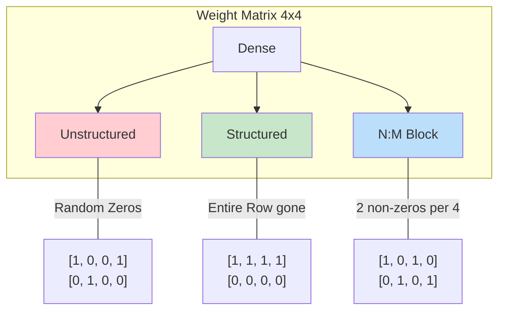

# Pruning and Sparsity Exploitation

> **Learning Objectives**
> - Understand the biological inspiration for Neural Network Pruning
> - Differentiate between Unstructured and Structured pruning, and why hardware hates the former
> - Analyze the N:M block sparsity hardware feature (specifically NVIDIA’s 2:4 sparsity)
> - Explain how gating logic handles dynamic activation sparsity to save power

---

## 1. Introduction: The Brain's Lesson on Efficiency

The human brain consumes barely 20 watts of power. How does it manage this while running trillion-parameter neural equivalents? Through **Synaptic Pruning**. As humans grow, our brains physically sever weak connections (synapses) that aren't necessary for cognitive tasks, leaving a sparse, highly efficient network.

Hardware engineers apply the exact same logic. Dense neural networks contain millions of parameters ($W$) that are infinitesimally close to $0.0$. Multiplying any input by $0.0001$ barely changes the output. **Pruning** is the algorithmic process of forcing those close-to-zero weights perfectly to $0.0$ and severing the connection entirely.

A network is considered **Sparse** when a large percentage (e.g., 50% to 90%) of its weights or activations are zero.



---

## 2. Unstructured vs. Structured Pruning

From a math perspective, pruning is easy: just set small numbers in a matrix to zero. From a hardware perspective, dealing with those zeros is incredibly complicated. 

### 2.1 Unstructured Pruning
In unstructured pruning, you look at the entire weight matrix and simply set the bottom X% of values to zero, wherever they randomly lie.

**The Math Result:** You get a matrix with scattered, random zeros.
**The Hardware Problem:** Hardware accelerators process data in dense, continuous blocks (e.g., a systolic array calculating a 16x16 tile). If the zeros are randomly scattered, the hardware still has to fetch the zero from memory and feed it into the MAC unit. 

**The Decompression Penalty:** 
To actually save memory space, you must use formats like **CSR (Compressed Sparse Row)**. This involves storing two extra arrays: one for the non-zero indices and one for the row pointers. 
For every weight you fetch, the hardware must now perform **metadata lookups** to figure out where that weight belongs. On a GPU, these irregular memory lookups cause massive "branch divergence," where the processing cores stall while waiting for pointers. The energy spent looking up the pointers often exceeds the energy saved by skip-calculating the zeroes.

### 2.2 Structured Pruning
To make the hardware happy, pruning must be **Structured**. 
Instead of pruning individual sub-threshold weights, we prune entire structural blocks that the hardware naturally computes together.

Examples of Structured Pruning:
1. **Filter Pruning:** Removing entire 2D filters (Feature maps) that do not contribute to the accuracy.
2. **Channel Pruning:** Removing entire depth slices.

**The Hardware Result:** If an entire filter is removed, the compiler simply tells the systolic array: "Run 63 loops instead of 64." There is no compression needed. The hardware simply does less work, resulting in a 1:1 ratio of pruned weights to actual speedup.

---

## 3. The Best of Both Worlds: Fine-Grained Structured Sparsity

Structured pruning (dumping entire filters) is great for hardware, but terrible for accuracy. Removing entire channels brutally degrades the AI's intelligence. 
Unstructured pruning is great for accuracy, but terrible for hardware.

In 2020, NVIDIA introduced a ground-breaking middle-ground in their Ampere architecture: **2:4 Block Sparsity**.

### 3.1 How N:M Sparsity Works
In an N:M sparsity pattern, the network guarantees that out of every block of $M$ weights, exactly $N$ of them are non-zero. 

For Nvidia's 2:4 sparsity:
In every contiguous block of 4 weights, exactly 2 must be zero.

`Original Weights: [ 0.9, -0.1, 0.05, 1.2 ]`
`Pruned Weights:   [ 0.9,  0.0,  0.0,  1.2 ]`

### 3.2 The Hardware Implementation
Because the pattern is highly predictable, the hardware engineers designed a specialized MAC unit. 
Instead of sending chunks of 4 weights and 4 activations, the memory unit compresses the weights. 

It sends:
1. The 2 non-zero weights (e.g., 0.9 and 1.2).
2. A small 2-bit index mask indicating *where* those weights were in the original group of 4.

The physical MAC unit has a MUX (Multiplexer) on the activation input line. It uses the index mask to grab only the 2 specific activations that correspond to the non-zero weights. 

By hardwiring this exactly into the silicon, Nvidia doubled the raw math throughput and halved the memory bandwidth requirements without suffering the brutal accuracy drops of removing entire filters.

---

## 4. Activation Sparsity and Power Gating

Weights are static (you know which ones are zero before inference begins). 
**Activations**, however, are dynamic. They depend entirely on the input image.

Because the ubiquitous **ReLU** activation function clamps all negative values to zero, the intermediate feature maps in a CNN are heavily sparse (often 40% to 60% zeroes).

Hardware cannot predict these zeroes ahead of time to compress them easily. Instead, hardware relies on **Clock-Gating** and **Power-Gating**.

1. As an activation pulse moves through the data bus toward the MAC unit, a simple zero-check logic gate tests if `Data == 0`.
2. If true, a control signal instantly disables the clock signal running to the Multiplier.
3. The multiplier logic gates freeze in place. Because CMOS transistors only consume significant power when they switch states, a frozen multiplier consumes practically zero dynamic power.

The operation still takes 1 clock cycle of time (so it doesn't speed up the latency of the systolic array), but it drastically drops the power draw of the chip. 

The operation still takes 1 clock cycle of time (so it doesn't speed up the latency of the systolic array), but it drastically drops the power draw of the chip. 

### Code Example: Magnitude-Based Pruning

```python
import numpy as np

def magnitude_pruning(weights, sparsity_ratio=0.5):
    """Force the smallest X% of weights to zero."""
    # 1. Calculate the absolute threshold
    abs_weights = np.abs(weights)
    threshold = np.percentile(abs_weights, sparsity_ratio * 100)
    
    # 2. Create the mask
    mask = abs_weights > threshold
    
    # 3. Apply pruning
    pruned_weights = weights * mask
    actual_sparsity = 1.0 - (np.count_nonzero(pruned_weights) / weights.size)
    
    return pruned_weights, threshold, actual_sparsity

# Simulate a weight matrix
np.random.seed(42)
W = np.random.randn(4, 4)
W_pruned, T, S = magnitude_pruning(W, sparsity_ratio=0.5)

print(f"Threshold: {T:.4f}")
print(f"Sparsity:  {S*100:.1f}%")
print("Pruned Matrix:")
print(np.around(W_pruned, 2))
```

---

## 5. Worked Example: The Cost of Sparsity (CSR Storage)

Suppose you have a $1000 \times 1000$ weight matrix that is **90% sparse** (only 100,000 non-zero values).

**A. Storage as Dense (INT8):**
- $10^6$ values $\times$ 1 byte = **1,000,000 Bytes**.

**B. Storage as CSR (Compressed Sparse Row):**
To store in CSR, you need:
1. **Values**: 100,000 non-zeros $\times$ 1 byte = $100,000$ Bytes.
2. **Column Indices**: 100,000 integers (say 2-byte uint16) = $200,000$ Bytes.
3. **Row Pointers**: 1001 integers (uint32, 4 bytes) $\approx 4,000$ Bytes.
- **Total CSR Storage**: $100,000 + 200,000 + 4,000 = \mathbf{304,000}$ **Bytes**.

**Conclusion**: Although we have 90% fewer non-zero weights, the memory footprint only drops by **~70%** because the "Index Overhead" eats up a significant portion of the savings. This is why hardware architects prefer structured sparsity where the indices are hardcoded into the silicon logic!

---

## Key Takeaways

- **Unstructured Pruning** randomly zeros weights, preserving accuracy but failing to deliver hardware speedups due to scattered memory accesses.
- **Structured Pruning** removes whole rows/columns, guaranteeing physical hardware speedups but degrading model intelligence at high pruning ratios.
- **N:M Block Sparsity (e.g., 2:4)** is specialized hardware logic that compresses vector math directly at the MAC unit, offering a 2x speedup with negligible accuracy loss.
- **Dynamic Activation Sparsity** utilizes clock-gating to detect runtime zeros coming out of ReLU functions, freezing the MAC physically to save massive amounts of dynamic switching power.

---

## Practice Problems

### Problem 1: 2:4 Sparsity Hardware Cost

> **Context**: You are designing a custom MAC accumulator for a 2:4 sparsity scheme. You need to process a block of 4 original weights interacting with 4 activations.
>
> **Tasks**:
> - (a) In a dense standard process, how many physical multipliers are required to parallel process the 4 pairs of values? [1]
> - (b) Under a 2:4 sparsity scheme, how many physical multipliers are required? [1]
> - (c) What extra hardware component must be added to route the correct activations to the remaining multipliers? [1]

<details>
<summary><b>Solution</b></summary>

**(a)** A standard parallel unit requires **4 multipliers** to compute the 4 pairs simultaneously.

**(b)** Because 2 of the weights are guaranteed to be zero, you only need **2 multipliers** to handle the non-zero pairs.

**(c)** You must add a **Multiplexer (MUX)**. Since you have 4 incoming activations but only 2 incoming non-zero weights, the MUX uses the stored structural index bits to select the 2 specific activations that correspond to the locations of the 2 non-zero weights.

### Problem 2: Theoretical vs. Physical Speedup

> **Context**: You are evaluating a research paper that claims "90% pruning of ResNet-50." You run this on a standard systolic array that does *not* have sparse metadata support.
>
> **Tasks**:
> - (a) If the layer took 10ms to run before pruning, how long does it take now on your standard hardware? [1]
> - (b) If you use an accelerator with **NVIDIA 2:4 sparsity** support, and you prune your model to exactly match that 2:4 pattern, what is your expected Tensor Core speedup? [1]

<details>
<summary><b>Solution</b></summary>

**(a)** It still takes **10ms**. Standard systolic arrays do not skip computations based on zero weights unless they have specialized logic (like Eyeriss). They fetch the zero, multiply by zero, and add zero. To the hardware, a 0 is just another number.

**(b)** The expected speedup is **2x**. By compressing 4 weights into 2, the hardware can perform twice as many logical operations in the same number of clock cycles on the same number of physical multipliers.

</details>

---

[← Previous Chapter: Quantization](01_quantization.md) | [Next Chapter: Data Reuse and Loop Tiling →](03_loop_tiling_reuse.md)
