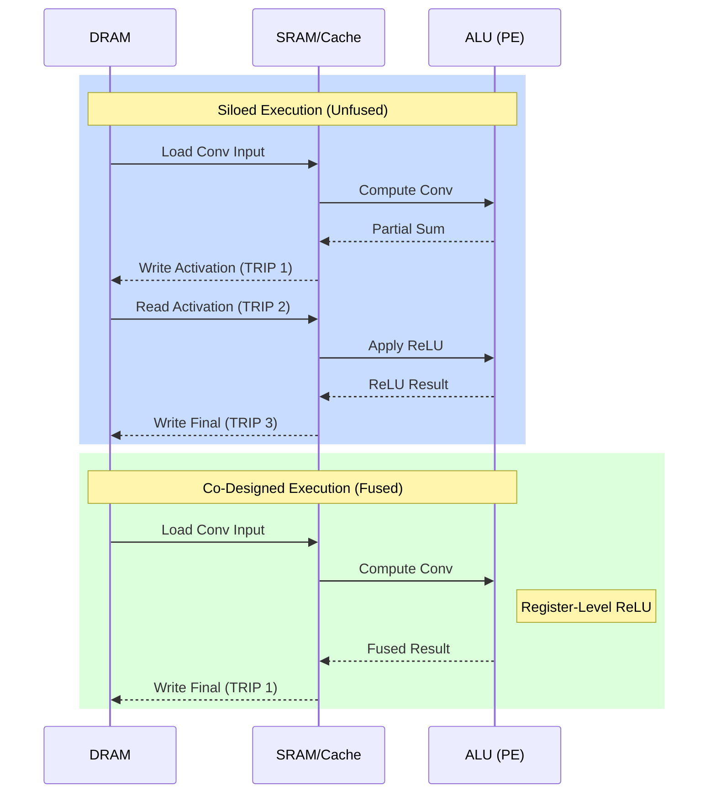

# Hardware-Software Co-Design

> **Learning Objectives**
> - Define the paradigm of Hardware-Software Co-Design
> - Discover how Operator Fusion mathematically merges layers to bypass DRAM completely
> - Identify the role of Neural Network Compilers (TVM, XLA) in heterogeneous deployments
> - Understand how AI architectures search (NAS) informs hardware topologies

---

## 1. Siloed Thinking vs. Co-Design

In traditional computer science, software engineers write code operating under the assumption that the hardware is a magical, perfectly efficient machine. Hardware engineers design arrays assuming that the software will feed them perfectly dense, predictable memory streams.

**Hardware-Software Co-Design** is the modern approach: the neural network topology, the precision, the dataflow mapping, and the physical silicon are designed jointly.

When these two sides operate in silos, the result is severely suboptimal AI inference. Consider a real-world example: 
- A machine learning engineer adds an exotic, non-linear activation function ($y = \text{Swish}(x) = x \cdot \sigma(x)$) to squeeze an extra 0.5% accuracy out of their model. 
- The hardware engineer didn't build a complex $e^{-x}$ exponential circuit in the MAC pipeline because it's too large.
- The accelerator must flush the entire data stream back to the CPU just to calculate the activation, tanking the inference speed by 400%.

### The Problem of Memory Alignment
A major co-design challenge is **Memory Alignment**. 
Hardware reads data in blocks (e.g., 64 bytes at a time). If your software tensor is sized so that a row starts at byte 63, the hardware has to perform two separate DRAM reads just to get one piece of data. 
Co-design compilers automatically **pad** tensors with extra zeros to ensure that every logical data row aligns perfectly with the physical memory banks of the chip, eliminating thousands of "unaligned access" stalls.

---

## 2. Operator Fusion (Layer Fusion)

One of the most powerful co-design techniques performed by Neural Machine Compilers is **Operator Fusion**.

Consider a standard Sequence in a ResNet block:
`Convolution -> Batch Normalization -> ReLU -> Convolution`

### The Unoptimized Physical Execution
1. Fetch weights and inputs from DRAM.
2. Run **Convolution**. Write massive intermediate feature map to DRAM.
3. Fetch intermediate map from DRAM. Run **Batch Normalization** (CPU). Write to DRAM.
4. Fetch intermediate map from DRAM. Run **ReLU**. Write to DRAM.
5. Fetch map from DRAM. Run **Convolution 2** in the MAC array.

In this scenario, a single pixel was written to and read from DRAM roughly 6 times. For a $224 \times 224 \times 64$ tensor, this is hundreds of megabytes of completely wasted bandwidth.

### The Fused Co-Design Execution
A smart compiler realizes that Batch Normalization is just a linear equation: $y = \frac{x - \mu}{\sigma} \times \gamma + \beta$.
Because Convolution is also linear ($Wx + b$), the compiler can pre-calculate the Batch Norm statistics and mathematically **fold them directly into the original $W$ and $b$ Convolution weights!**

Furthermore, ReLU is just a threshold check. 



**We reduced the DRAM traffic from 3 trips down to 1.** This is Hardware-Software Co-Design in its purest form. The compiler structurally manipulates the software graph to accommodate the specific physical pipeline depth of the hardware array.

### Code Example: Folding BatchNorm into Convolution

```python
import numpy as np

def fold_batchnorm(conv_w, conv_b, bn_gamma, bn_beta, bn_mean, bn_var, eps=1e-5):
    """Mathematically merge BN params into Conv weights."""
    # Precompute BN denominator
    denom = np.sqrt(bn_var + eps)
    
    # New Fused Weights: W_f = W * (gamma / sqrt(var + eps))
    fused_w = conv_w * (bn_gamma / denom).reshape(-1, 1, 1, 1)
    
    # New Fused Bias: b_f = ((b - mean) * gamma / sqrt(var + eps)) + beta
    fused_b = ((conv_b - bn_mean) * (bn_gamma / denom)) + bn_beta
    
    return fused_w, fused_b

# 1 channel conv, 3x3 filter
w = np.random.randn(1, 1, 3, 3)
b = np.array([0.5])
# BN params
mean, var = np.array([0.1]), np.array([0.2])
gamma, beta = np.array([0.8]), np.array([1.2])

f_w, f_b = fold_batchnorm(w, b, gamma, beta, mean, var)
print("Fusion complete. The hardware now only runs 1 Conv layer.")
```

---

## 3. The Neural Network Compilers (XLA, TVM, MLIR)

How does a high-level PyTorch string of Python get transformed into these fused, tiled, expertly-scheduled systolic pulses? Through heavily specialized **Deep Learning Compilers**.

1. **XLA (Accelerated Linear Algebra):** Google's tensor compiler. It takes TensorFlow or PyTorch graphs, figures out which nodes can be fused, calculates exactly how memory will be addressed, and compiles it specifically for the TPU architecture.
2. **Apache TVM:** An open-source compiler that acts as a universal translator. You can input an ONNX model from any framework, and TVM will automatically search the space of possible Loop Reorderings and Tilings to find the optimum dataflow for your specific target hardware (be it an ARM CPU, Nvidia GPU, or custom FPGA accelerator).

Compilers like TVM don't just "guess" the mappings. They use Machine Learning! They run thousands of trials on the actual piece of hardware, timing how long certain tensor folds take, and use a cost-model to literally *learn* how to compile the software to perfectly match the hardware.

---

## 4. Hardware-Aware Neural Architecture Search (NAS)

The ultimate frontier of Co-Design is **NAS (Neural Architecture Search)**.
Instead of a human manually designing an architecture like "ResNet-50", we use AI to find the best neural networking topology.

Early NAS algorithms only cared about raw accuracy. They resulted in monstrous, disjointed networks that were impossible to run on mobile hardware.

**Hardware-Aware NAS** changes the loss function. The search algorithm is given physical constraints:
- "Find the most accurate model that uses less than 4 Megabytes of RAM."
- "Find the model with the best bounding-box detection, but it must run at 30 FPS on a 2 TOPS integer accelerator."

Projects like **MobileNetV3** and **EfficientNet** were born from these algorithms. The AI discovered that replacing standard 3D Convolutions with "Depthwise-Separable Convolutions" perfectly balanced the workload between the compute units and the memory bandwidth, resulting in a network inherently designed for edge accelerator hardware.

---

## 5. Worked Example: Bandwidth Reduction through Fusion

Consider an activation tensor of size $224 \times 224$ with $64$ channels (FP32 precision, 4 bytes per pixel).

**The Workflow**: `Conv1 -> ReLU -> Pool -> Conv2`

**A. Siloed execution (No Fusion):**
1. Conv1 Write: $224 \times 224 \times 64 \times 4 = \mathbf{12.8 \text{ MB}}$.
2. ReLU Read ($12.8 \text{ MB}$) + ReLU Write ($12.8 \text{ MB}$) = $\mathbf{25.6 \text{ MB}}$.
3. Pool Read ($12.8 \text{ MB}$) + Pool Write ($12.8 \text{ MB}$) = $\mathbf{25.6 \text{ MB}}$. (Assume 1:1 for simplicity)
- **Total DRAM traffic**: $\approx \mathbf{64 \text{ MB}}$.

**B. Fused execution (Conv+ReLU+Pool in one pass):**
1. Conv1 Write (After internal ReLU and Pool logic inside the chip): $\mathbf{12.8 \text{ MB}}$.
- **Total DRAM traffic**: $\mathbf{12.8 \text{ MB}}$.

**Conclusion**: By simply merging the activation and pooling logic into the convolution hardware pipeline, we achieved a **$5\times$ reduction** in DRAM bandwidth demand.

---

## Key Takeaways

- Operating software and hardware engineering in isolation leads to disastrous performance bottlenecks across the memory wall.
- **Operator Fusion** mathematically collapses adjacent linear layers (like Conv and BatchNorm) or chains them with activation functions directly inside the ALU to completely bypass intermediate DRAM access.
- **Neural Compilers (TVM, XLA, MLIR)** analyze computational graphs and physically schedule Loop Tilings, Reorderings, and Fusions specifically tuned for individual chips.
- **Hardware-Aware NAS** uses AI to invent network architectures that inherently align with the limited SRAM, precision, and Arithmetic Intensity constraints of Edge Hardware.

---

## Practice Problems

### Problem 1: Mathematical Operator Fusion

> **Context**: You have a 1D Convolution with a single weight $W = 4.0$ and a bias $B_{conv} = 2.0$. It is immediately followed by a Batch Normalization layer consisting of a multiplier $\gamma = 0.5$ and an addition $\beta = 1.0$.
>
> **Tasks**:
> - (a) Suppose the input pixel is $X = 3$. If the operations run sequentially as $y = \text{Conv}(x)$ followed by $z = \text{BatchNorm}(y)$, what are the intermediate $y$ value and the final output $z$ value? [1]
> - (b) Derive the mathematically fused singular Weight ($W_{fused}$) and Bias ($B_{fused}$). [2]
> - (c) Prove your fused parameters generate the exact same final output $z$ for input $X = 3$ in a single step hardware operation. [1]

<details>
<summary><b>Solution</b></summary>

**(a)** Sequential Execution:
- $y = W \cdot X + B_{conv} = (4.0 \times 3) + 2.0 = 14.0$
- $z = \gamma \cdot y + \beta = (0.5 \times 14.0) + 1.0 = \mathbf{8.0}$

**(b)** Deriving the Fused Parameters:
- Total operation: $z = \gamma \cdot (W \cdot X + B_{conv}) + \beta$
- Expand it: $z = (\gamma \cdot W) \cdot X + (\gamma \cdot B_{conv} + \beta)$
- This maps to a new single convolution $z = W_{fused} \cdot X + B_{fused}$
- $W_{fused} = \gamma \cdot W = 0.5 \times 4.0 = \mathbf{2.0}$
- $B_{fused} = \gamma \cdot B_{conv} + \beta = (0.5 \times 2.0) + 1.0 = \mathbf{2.0}$

**(c)** Verification:
- $z = W_{fused} \cdot X + B_{fused} = (2.0 \times 3) + 2.0 = \mathbf{8.0}$
- The results match exactly, but the network requires only 1 MAC operation instead of 2 MAC operations, and it saves a trip to DRAM between operations!

### Problem 2: The Fusion Breaker

> **Context**: You are compiling a Transformer model. The graph contains: `MatMul -> Add -> Softmax -> MatMul`.
> 
> **Tasks**:
> - (a) Why is **Softmax** significantly harder to fuse into a systolic array pipeline than **ReLU**? [1]
> - (b) What happens to your DRAM traffic when the compiler hits the Softmax node? [1]

<details>
<summary><b>Solution</b></summary>

**(a) Global vs Local**: ReLU is a "Pointwise" operator; you only need the current pixel to decide the output. Softmax requires the **Sum of ALL Exponentials** across the entire vector before it can calculate a single output. This requires a global synchronization point that cannot be processed in a streaming systolic way.

**(b) The Pipeline Flush**: The compiler is forced to "flush" the intermediate MatMul results back to DRAM. The CPU or a specialized vector unit must read the entire vector, find the maximum, sum the exponentials, and write it back before the next MatMul can begin. Softmax acts as a **Memory Wall** that breaks the beautiful fusion chain.

</details>

---

[← Previous Chapter: Data Reuse and Loop Tiling](03_loop_tiling_reuse.md) | [Next Module: Neuromorphic Computing →](../MODULE_6_NEUROMORPHIC/README.md)
