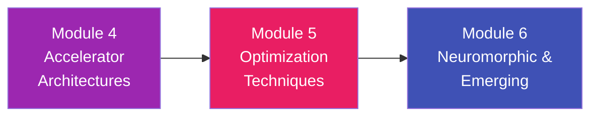

# Module 5: Optimization Techniques

> **Squeezing Every Last Drop of Performance — Making Hardware Lean and Fast**

---

## Overview

Designing a systolic array or formulating a dataflow is only the beginning. The real magic in modern AI hardware lies in **Optimization Techniques**. State-of-the-art accelerators don't just brute-force computations; they aggressively compress, skip, and reorder data to avoid doing useless work altogether.

In this module, you will learn the four pillars of hardware-aware optimization. We will strip away the excess fat of 32-bit floating-point numbers, surgically remove unnecessary neural connections, block memory into cache-friendly geometry, and blend hardware limitations with software compilation.

---

## Learning Objectives

After completing this module, you will be able to:

- ✅ Understand Post-Training Quantization (PTQ) and Quantization-Aware Training (QAT)
- ✅ Quantify how moving from FP32 to INT8 to INT4 exponentially decreases hardware area and energy
- ✅ Explain the difference between unstructured pruning and structured pruning
- ✅ Calculate loop tiling dimensions to perfectly fit multi-level caches
- ✅ Appreciate the synergy of Hardware-Software Co-design (e.g., how the compiler maps PyTorch onto raw gates)

---

## Chapters

| # | Chapter | Key Topics |
|:--|:--------|:-----------|
| 1 | [Quantization: FP32 to INT8 and Beyond](01_quantization.md) | Affine transforms, scale factors, zero-points, sub-byte precision (INT4) |
| 2 | [Pruning and Sparsity Exploitation](02_pruning_and_sparsity.md) | Unstructured vs. structured pruning, 2:4 block sparsity (Nvidia Ampere), zero-skipping logic |
| 3 | [Data Reuse and Loop Tiling](03_loop_tiling_reuse.md) | Nested loop reordering, blocking for SRAM caches, optimal tile sizing |
| 4 | [Hardware-Software Co-Design](04_hw_sw_codesign.md) | The role of the compiler (TVM, MLIR), fusing layers to minimize memory trips |

---

## Prerequisites

- Completion of **Module 3** (MAC operations and numerical representations)
- Completion of **Module 4** (Accelerator architectures and the Memory Wall)
- Familiarity with basic calculus/algebra for tensor transformations

---

## How This Module Connects

Module 4 established the baseline of how an accelerator is physically constructed. Module 5 shows you how to program and manipulate algorithms so that they extract **10x to 100x** more efficiency out of that very same hardware. In Module 6, we'll abandon traditional digital design entirely to explore the exotic world of brain-inspired circuits.

---

*Estimated study time: 4 hours*
