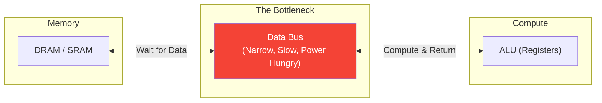
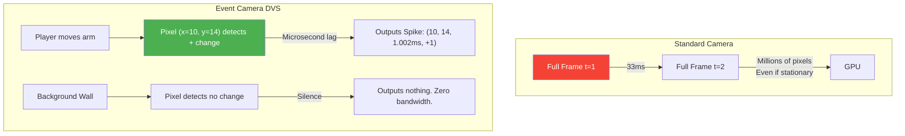

# Brain-Inspired Computing

> **Learning Objectives**
> - Understand the fundamental bottlenecks of the Von Neumann Architecture for AI
> - Define physical separation of memory and compute, and why it is inefficient
> - Learn how biological brains avoid these bottlenecks (co-location, asynchronous spikes)
> - Introduce Event-Driven architectures, specifically Dynamic Vision Sensors (DVS)

---

## 1. The Von Neumann Bottleneck

Nearly every computer built since the 1940s—including CPUs, GPUs, and TPUs—is based on the **Von Neumann Architecture**.

The core principle of this architecture is the **physical separation** of memory (where data is stored) and computation (where data is processed). 



For traditional software (like a word processor), this is fine. But Artificial Intelligence requires thousands of weights and activations to be continuously pumped back and forth across this bus just to calculate a single output pixel. 

This creates **The Von Neumann Bottleneck**: The bus physically limits how fast the ALU can work. Pumping electrical signals across macroscopic distances (centimeters of motherboard traces or millimeters of silicon) generates immense heat and takes up 90% of the energy used during an inference task.

No matter how fast you make the compute array, the chip will spend most of its time waiting for the memory to respond.

---

## 2. Looking at Biology

A human brain has approximately **86 billion neurons** and **100 trillion synapses**. It operates at an estimated 1 ExaFLOP ($\approx 10^{18}$ operations per second) of equivalent processing power. 
*A massive GPU cluster running ChatGPT also operates around 1 ExaFLOP.*

The difference? The GPU cluster consumes **Megawatts** of power and requires industrial water cooling. The human brain consumes **20 Watts** and runs on a sandwich.

How is biology $100,000\times$ more energy efficient?

### 2.1 Co-location of Memory and Compute
In a biological brain, there is no Von Neumann bottleneck because there is no separation between memory and compute.
- **The Synapse (The Memory):** Stores the weight (chemical connection strength).
- **The Neuron (The Compute):** Accumulates the signals and fires.

These two structures are physically interwoven. When a neuron computes, it uses its own local synapses. No data is ever transmitted across a "bus". 

### 2.2 Asynchronous and Sparse Firing
Digital chips run on a **Global Clock** (e.g., a 2 GHz oscillator). Every single transistor on the chip ticks 2 billion times a second, consuming power whether it is doing useful math or just holding zeros.

Biological brains are **Asynchronous**. There is no global clock. A neuron is physically off until it receives enough input to trigger an *Action Potential* (a spike). Because firing costs metabolic energy, brains are heavily sparse—at any given millisecond, perhaps less than 1% of your neurons are actively firing. The remaining 99% consume minimal baseline energy.

---

## 3. Neuromorphic Engineering

**Neuromorphic Engineering** is the discipline of designing custom silicon circuits that physically mimic these biological phenomena to break the Von Neumann bottleneck.

Instead of writing software (like PyTorch) that *simulates* a neural network on top of a Von Neumann CPU, Neuromorphic hardware builds physical, analog circuits that *are* the neural network.

The two main strategies in this field are:
1. **Time-domain computing:** Spiking Neural Networks (SNNs). Encoding data as discrete voltage spikes in time.
2. **Physical-domain computing:** Compute-in-Memory (CIM). Performing Ohm's law analog math physically inside the SRAM or ReRAM.

*(We will cover these in detail in Chapters 2 and 3).*

---

## 4. Event-Driven Sensors (Silicon Retinas)

To feed asynchronous neuromorphic chips, we need asynchronous data. Standard digital cameras are terrible for this. 

A standard camera takes frames at exactly 30 FPS. If you have a security camera staring at an empty room:
- It takes a 2-Megapixel photo.
- It sends 2 million digital pixels to the CPU.
- 33 milliseconds later, it does it again. 
- It wastes massive amounts of bandwidth transmitting redundant, unchanging background data.

### The Solution: Dynamic Vision Sensors (DVS)
A DVS (often called an Event Camera or Silicon Retina) mimics the biological eye.
Each pixel works completely independently and asynchronously. A pixel only fires a signal (an "event") when it detects a **change in brightness**.

**The output format:** Instead of a `(Height, Width, 3)` matrix every frame, a DVS outputs an asynchronous stream of spikes: `(x, y, timestamp, polarity)`.



**Why it matters for Hardware:**
1. **Power:** DVS sensors consume microwatts.
2. **Latency:** Because they don't wait for a 33ms global shutter, event cameras can capture bullets in flight with microsecond temporal resolution. 
3. **Data Bandwidth:** By only sending the *changes* (the edges of moving objects), the data bandwidth to the processor drops by 99%. 

When an Event Camera is paired with an asynchronous Spiking Neural Network hardware chip (like Intel's Loihi), you get true brain-inspired edge AI.

### Code Example: Simulating DVS Event Generation

```python
import numpy as np

def simulate_dvs_pixel(prev_brightness, curr_brightness, threshold=0.1):
    """Simulate the logic of a single DVS pixel."""
    diff = curr_brightness - prev_brightness
    
    if diff > threshold:
        return (True, +1)  # ON Event (Brighter)
    elif diff < -threshold:
        return (True, -1)  # OFF Event (Darker)
    else:
        return (False, 0)  # No Event (Silent)

# Imagine a pixel watching a moving object
brightness_over_time = [0.5, 0.51, 0.7, 0.75, 0.2, 0.21]
prev = brightness_over_time[0]

print("Time | Value | Event")
print("-" * 22)
for t, val in enumerate(brightness_over_time[1:], 1):
    fired, polarity = simulate_dvs_pixel(prev, val)
    event_str = f"Spike({polarity:+})" if fired else "Silent"
    print(f"t={t}  | {val:.2f}  | {event_str}")
    prev = val
```

---

## 5. Worked Example: The Energy of a Single Bit Move

Let's calculate why the Von Neumann Bottleneck is essentially a thermal problem.

**The Parameters**:
- **ALU Operation**: $0.1 \text{ pJ}$ (pico-Joules) per bit multiplication.
- **Memory Move**: $100 \text{ pJ}$ per bit move from DRAM to ALU.

**Scenario A: Von Neumann (TPU/GPU)**
- To multiply a Weight $W$ and Activation $X$, we must fetch both from DRAM.
- Energy = $(100 \text{ pJ} \times 2 \text{ fetches}) + 0.1 \text{ pJ} = \mathbf{200.1 \text{ pJ}}$.
- **Analysis**: $99.95\%$ of the energy was wasted just moving the data.

**Scenario B: Neuromorphic (Co-located Synapse)**
- Weight is stored directly in the synapse circuit. Only Activation flows.
- Energy = $100 \text{ pJ (Input fetch)} + 0.1 \text{ pJ} = \mathbf{100.1 \text{ pJ}}$.
- **Analysis**: By co-locating memory, we instantly cut the power draw of the chip by half.

---

## Key Takeaways

- The **Von Neumann Bottleneck** limits performance and burns extreme energy by physically separating data storage from data processing.
- The biological brain operates at phenomenal efficiency because memory (synapses) and logic (neurons) are physically collocated.
- Biological networks are **asynchronous** and **sparse**, meaning they only consume energy when an event physically happens, rather than ticking to a synchronized global clock.
- **Event Cameras (DVS)** replace redundant framed video with asynchronous streams of pixel-level changes, cutting bandwidth and latency tremendously, acting as the perfect sensory input for neuromorphic chips.

---

## Practice Problems

### Problem 1: Bandwidth Savings of Event Cameras

> **Context**: You are building a traffic camera. A standard digital camera records at $1920 \times 1080$ resolution (8-bit grayscale) at $30 \text{ FPS}$. A car drives through the frame. The event camera monitors the same scene. Only $2\%$ of the physical pixels in the scene experience a brightness change during one second of recording.
>
> **Tasks**:
> - (a) What is the data bandwidth (in Bytes per second) of the standard digital camera? [1]
> - (b) Event camera format: An event packet requires $4 \text{ Bytes}$ (`x`, `y`, `time`, `polarity`). If $2\%$ of pixels fire exactly one event per second, what is the bandwidth of the event camera? [2]
> - (c) Calculate the bandwidth reduction factor. [1]

<details>
<summary><b>Solution</b></summary>

**(a)** Standard Camera Bandwidth:
- $1920 \times 1080 = 2,073,600 \text{ pixels per frame}$.
- $2,073,600 \text{ pixels} \times 1 \text{ Byte/pixel} \times 30 \text{ FPS} = \mathbf{62,208,000 \text{ Bytes/second} \ (\approx 62 \text{ MB/s}) }$

**(b)** Event Camera Bandwidth:
- $2\%$ of $2,073,600 = 41,472 \text{ pixels fire}$.
- Each event is $4 \text{ Bytes}$.
- $41,472 \times 4 = \mathbf{165,888 \text{ Bytes/second} \ (\approx 165 \text{ KB/s}) }$

**(c)** Reduction Factor:
- $62,208,000 / 165,888 = \mathbf{375\times \text{ Reduction}}$.
- The event camera uses 375 times less bandwidth while inherently tracking the motion of the car.

### Problem 2: Clock Power vs. Event Power

> **Context**: You have two chips processing a surveillance feed:
> 1. **Chip A (Synchronous)**: Refreshes all 1 million pixels at $30 \text{ Hz}$ regardless of content.
> 2. **Chip B (Asynchronous)**: Consumes energy only when a pixel changes.
>
> **Tasks**:
> - If only $1,000$ pixels change per second (a very still scene), and both chips consume $10 \text{ nJ}$ per pixel refresh, calculate the power ratio. [2]

<details>
<summary><b>Solution</b></summary>

- **Chip A (Sync)**: $1,000,000 \text{ pixels} \times 30 \text{ Hz} = 30,000,000 \text{ operations/sec}$.
- **Chip B (Async)**: $1,000 \text{ events/sec} = 1,000 \text{ operations/sec}$.
- **Ratio**: $30,000,000 / 1,000 = \mathbf{30,000\times}$
- **Conclusion**: In idle scenes, Neuromorphic hardware is tens of thousands of times more efficient because it doesn't waste energy "confirming the background is still there."

</details>

---

[← Return to Module Overview](README.md) | [Next Chapter: Spiking Neural Networks →](02_spiking_neural_networks.md)
