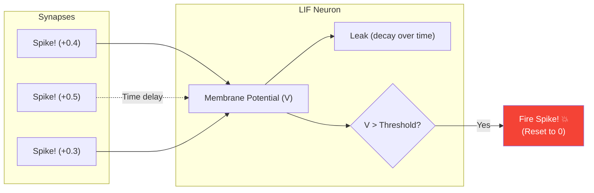

# Spiking Neural Networks (SNNs)

> **Learning Objectives**
> - Understand the Leaky Integrate-and-Fire (LIF) neuron model versus standard Artificial Neurons
> - Distinguish between Rate Coding and Temporal Coding in SNNs
> - Learn how Time functions as an active variable in neuromorphic computations
> - Describe the mechanism of Spike-Timing-Dependent Plasticity (STDP) for unsupervised learning

---

## 1. The Death of the Floating-Point Matrix

In traditional Artificial Neural Networks (ANNs), information is represented as a static, continuous real number (e.g., $0.783$). The standard mathematical formula for an artificial neuron is a MAC followed by a static activation function:

$$ y = \text{ReLU} \left( \sum W_i X_i + b \right) $$

In biological brains, neurons DO NOT pass numbers to each other. They pass **Action Potentials (Spikes)**. A spike is a binary event: it either happened at time $t$, or it didn't. 

**Spiking Neural Networks (SNNs)** are the third generation of neural networks, designed to operate natively via these discrete time-based events. 
- There are no floating-point MACs. 
- You do not multiply inputs by weights. 
- If an input spike arrives on a synapse, you simply **ADD** the synaptic weight to the neuron's internal voltage.

---

## 2. The Leaky Integrate-and-Fire (LIF) Model

The most common computational model used in neuromorphic hardware (like Intel's Loihi or IBM's TrueNorth) is the **Leaky Integrate-and-Fire (LIF)** neuron.

The LIF neuron holds a chemical "voltage" state, called the Membrane Potential ($V_{mem}$).

### The Three Phases of an LIF Neuron:
1. **Integrate:** When a spike arrives from a preceding neuron, the weight of that synapse is immediately added to $V_{mem}$. 
2. **Leak:** Just like a leaky bucket, if no spikes arrive, the voltage $V_{mem}$ decays over time back to a resting state ($0.0$). This forces the neuron to care about *recent* events, forgetting the distant past.
3. **Fire:** If a rapid burst of incoming spikes causes $V_{mem}$ to cross a specific threshold (e.g., $1.0$), the neuron physically fires a single boolean spike out of its axon to the next layer. It then resets its voltage to $0.0$.



### Hardware Advantage
Instead of dense MAC arrays pulling megawatts to multiply fractions, an LIF hardware accelerator acts merely as a massive memory accumulator array. It performs integer additions only when triggered by asynchronous routing events. 

---

## 3. How do Spikes Encode Information?

If a neuron only sends boolean spikes (`1` or `0`), how can we represent complex values like the brightness of a pixel ($0.78$) or a speech frequency? SNNs encode continuous data into discrete spikes using two primary methods.

### 3.1 Rate Coding
In rate coding, the value is represented by the **frequency of spikes**.
- A bright pixel ($1.0$) causes the input neuron to fire 100 times per second.
- A dim pixel ($0.2$) causes the neuron to fire 20 times per second.
- A black pixel ($0.0$) results in total silence.

*Pros:* Highly fault-tolerant.
*Cons:* Extremely energy-inefficient. To pass one simple value, the hardware has to execute up to 100 separate physical spike events, negating the primary benefit of neuromorphic computing.

### 3.2 Temporal Coding (Time-To-First-Spike)
In temporal coding, the value is represented by **WHEN the spike fires**. 
- A bright pixel ($1.0$) causes the neuron to fire exactly one spike instantly at $t = 1 \text{ ms}$.
- A dim pixel ($0.2$) causes the neuron to fire exactly one spike delayed at $t = 50 \text{ ms}$.

**The Hardware Win:** 
In temporal coding, the **time dimension perfectly replaces the bit-depth**. 
In a digital CPU, representing a value with 32-bit precision requires 32 physical wires and a giant multiplier. In a neuromorphic chip, that same 32-bit precision can be represented by the *exact millisecond* a single wire pulses. We have traded complex physical logic (space) for high-resolution timing (time). 
Every pixel requires only **1 physical spike** to transmit its entire value, resulting in the absolute theoretical minimum energy per inference.

---

## 4. Spike-Timing-Dependent Plasticity (STDP)

How do these SNNs learn? Traditional backpropagation requires the chain-rule of calculus, which demands continuous, smooth mathematical derivatives. Binary spikes ($1$ or $0$) are entirely non-differentiable (you cannot do calculus on a stair-step function).

While modern researchers use approximations (Surrogate Gradients) to force backprop onto SNNs, Neuromorphic hardware prefers a biological learning rule called **STDP (Spike-Timing-Dependent Plasticity)**.

STDP is a localized, unsupervised learning rule. It requires no labels, no loss functions, and no central GPU calculating global gradients. 

**The Rule:** The weight of a synapse changes based purely on the physical time delay between the Pre-Synaptic spike (input) and the Post-Synaptic spike (output).

1. **Long-Term Potentiation (LTP):** If the input spike arrives *just before* the neuron fires, it means the input helped cause the firing. **Increase the weight.**
2. **Long-Term Depression (LTD):** If the input spike arrives *shortly after* the neuron already fired, it was useless. **Decrease the weight.**

```mermaid
XYChart
    title "STDP Function"
    x-axis "Time Difference (t_post - t_pre) in ms" -20 --> 20
    y-axis "Weight Change (Δw)"
    line [ -0.1, -0.4, -0.8, -0.2, 0, 0.8, 0.4, 0.1, 0.05 ]
```

**Why this is "Opus-level" efficient:**
Traditional AI (backpropagation) requires a global "God's Eye" view of the network to calculate errors and pass them backward. **STDP is strictly local**. A synapse only needs to "know" the timing of the two neurons it is physically connected to. This allows learning to happen **asynchronously and distributedly** across a chip, with no central controller. 

---

## Key Takeaways

- SNNs replace floating-point activations with binary spikes, and replace heavy MAC arrays with simple **Integrate-and-Fire** addition accumulators.
- The **Leaky** aspect of LIF forces neurons to evaluate temporal proximity.
- **Temporal Coding** allows a single spike arriving at a specific millisecond to convey exactly as much information as a 32-bit floating-point number, enabling colossal energy savings.
- **STDP** offers an unsupervised, biologically plausible alternative to backpropagation, allowing physical neuromorphic chips to learn "at the edge" by observing local spike timings without calculating global calculus derivatives.

---

## Practice Problems

### Problem 1: Integrate-and-Fire Dynamics

> **Context**: You are analyzing a digital LIF neuron executing at $1 \text{ ms}$ timesteps. 
> - Resting potential is $0.0$.
> - Firing threshold is $1.0$.
> - Leak rate: The voltage loses $0.1$ every millisecond step that passes.
> - An input spike arrives with a synaptic weight of $0.5$.
> 
> Timeline of incoming input spikes:
> - $t=1$: Spike arrives.
> - $t=2$: Silence.
> - $t=3$: Spike arrives.
> - $t=4$: Spike arrives.
>
> **Tasks**:
> - (a) Trace the internal membrane voltage at the **end** of each timestep $t=1$ through $t=4$. Assumed the leak occurs *before* adding the spike for that step if a spike exists. [3]
> - (b) At what timestep does the neuron fire? [1]

<details>
<summary><b>Solution</b></summary>

**(a) Voltage Tracing:**
- **$t=1$**: Starts at $0$. Leak is $0$. Receives spike ($+0.5$). 
  - $V_{t=1} = \mathbf{0.5}$
- **$t=2$**: No incoming spike. Leak occurs ($-0.1$). 
  - $V_{t=2} = 0.5 - 0.1 = \mathbf{0.4}$
- **$t=3$**: Spike arrives ($+0.5$). Leak occurs ($-0.1$). 
  - $V_{t=3} = 0.4 - 0.1 + 0.5 = \mathbf{0.8}$
- **$t=4$**: Spike arrives ($+0.5$). Leak occurs ($-0.1$). 
  - $V_{temp} = 0.8 - 0.1 + 0.5 = 1.2$
  - Since $1.2 \ge 1.0$, the biological threshold is crossed!
  - It fires and resets to $0$. So ending voltage is $\mathbf{0.0}$.

**(b)** The neuron reaches the threshold and fires at **$t=4$**.

</details>

---

[← Previous Chapter: Brain-Inspired Computing](01_brain_inspired_computing.md) | [Next Chapter: Compute-in-Memory with ReRAM →](03_compute_in_memory_reram.md)
