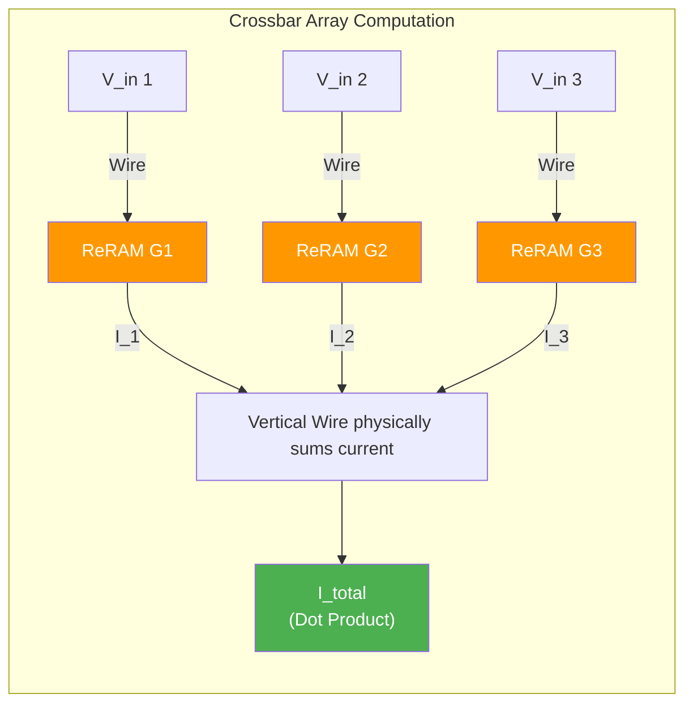

# Compute-in-Memory with ReRAM

> **Learning Objectives**
> - Define the physical concept of Compute-in-Memory (CIM)
> - Understand how Memristors (ReRAM) function as tunable analog resistors
> - Map the mathematical equation for Matrix Multiplication directly onto Ohm's and Kirchhoff's physical laws
> - Evaluate the overhead challenges of CIM arrays (ADC and DAC conversions)

---

## 1. Escaping the Von Neumann Bottleneck

We've established that pumping data back and forth between memory and MAC units consumes immense power. Spiking neural networks encode data temporally, but they still typically require physical adder logic distinct from the SRAM itself.

What if we didn't just place the compute *next* to the memory? What if **the memory cell itself performed the computation physically?** 

This is the principle of **Compute-in-Memory (CIM)**. 
Instead of requesting $W$ from memory, sending it to an ALU, and feeding it $X$, we simply blast $X$ *into* the memory array as a voltage. The laws of physics will instantly calculate the dot product inside the structure without a single digital logic gate turning on.

### Analog (AIMC) vs. Digital (DIMC)
While the "purest" form of CIM is analog (using resistors), the industry is split into two paradigms:
1. **Analog In-Memory Computing (AIMC)**: Uses physics (currents and voltages) to compute. Extremely efficient but noisy and requires expensive converters.
2. **Digital In-Memory Computing (DIMC)**: Uses logic gates physically collocated within the memory bitcells. More robust to noise and doesn't need ADCs, but takes up more silicon area than a raw resistor grid.

---

## 2. The Memristor (ReRAM)

To achieve CIM for AI, we need a special kind of memory component called a **Memristor** (Memory + Resistor), typically implemented as **ReRAM** (Resistive Random Access Memory).

A typical SRAM cell locks a `1` or `0` using a cage of 6 transistors. It is volatile (loses data when powered off).

A Memristor is physically continuous. It consists of a thin metal oxide layer between two electrodes. By applying specific high-voltage programming pulses across the electrodes, oxygen ions are literally pushed into or pulled out of the oxide layer, which changes the physical **resistance** of the material.
Because this alters the physical chemistry of the wire, the resistance stays locked permanently, even when power is turned off (non-volatile memory). 

### Modeling the Synapse
Because the resistance can be programmed to discrete analog levels (e.g., $1000 \ \Omega$, $2000 \ \Omega$, $3000 \ \Omega$), a single ReRAM cell acts as an analog storage container for our Neural Network Weights ($W$). 
Rather than resistance $R$, electrical engineers prefer to use **Conductance ($G$)**, which is simply the inverse: $G = \frac{1}{R}$.

A highly conductive wire ($G$ is high) represents a strong neural connection (large weight $W$). A highly resistive wire ($G$ is low) represents a weak or pruned connection (small weight). 

---

## 3. Physical Matrix Multiplication 

Once the weights are programmed into a microscopic grid grid of ReRAM cells (a Crossbar Array), we can execute an entire neural network layer at the speed of light.

To understand how, we align the math of Neural Networks with the fundamental laws of electrical physics.

### 3.1 Unpacking the Math

**The Neural Math (One element):**
$$ \text{Output} = \text{Input} \times \text{Weight} $$

**Ohm's Law:**
If we apply a Voltage ($V$) across a component with Conductance ($G$), the resulting physical electric Current ($I$) is:
$$ I = V \times G $$

Notice that it is the exact same equation! 
- If we encode our Input Activations as **Voltages**.
- If we encode our Neural Weights as physical **Conductances**.
- Then the flowing **Electrical Current** is instantly equivalent to the MAC multiplication.

### 3.2 Unpacking the Matrix (Kirchhoff's Law)

**The Neural Math (Dot Product):**
$$ \text{Total Output} = (W_1 X_1) + (W_2 X_2) + (W_3 X_3) $$

**Kirchhoff's Current Law:**
The total current flowing out of a common wire is exactly equal to the sum of all the currents flowing into it.
$$ I_{total} = I_1 + I_2 + I_3 $$

When we pulse all our Voltage inputs simultaneously along horizontal wires, and the currents drop through the ReRAM "weights" into vertical wires, the vertical wires physically sum the total current. 

**The Power of CIM:** A massively parallel digital TPU needs thousands of discrete logic gates to do this. An analog ReRAM crossbar does it in a single step merely by pulsing electricity through a grid of programmable resistors. The memory *is* the multiplier. The wires *are* the adders.

---

## 4. The Overhead Penalty (ADC and DAC)

Because the rest of the computer (and the software) is digital, we must translate digital values (INT8) into analog pulses (Voltages), and then translate analog results (Currents) back to digital to send them to the next layer.

### The Conversion Bottleneck
1. **DAC (Digital-to-Analog Converter):** Required at the edge of horizontal rows to turn an 8-bit digital pixel into a specific analog voltage.
2. **ADC (Analog-to-Digital Converter):** Required at the bottom of the vertical columns to read the specific amperage of the summed current and snap it back to a discrete digital output.

**The "85/15" Problem:** 
In a real-world AIMC accelerator, **the ADCs and DACs often take up $80\%$ to $90\%$ of the chip area and power**. 
- The crossbar math itself is nearly "free" (femtojoules).
- The ADC conversion is expensive (picojoules).
Furthermore, as we increase precision (e.g., from 4-bit to 8-bit), the ADC size and power consumption grow **exponentially**. This is why most CIM chips today are limited to low-precision 1-bit or 4-bit operations.

### The SRAM Alternative
While ReRAM is the future, many researchers use **SRAM-based CIM** today. By activating multiple "Wordlines" simultaneously in a standard SRAM bank, you can force the bitlines to discharge at a rate proportional to the stored bits. This allows us to use mature silicon manufacturing processes while still gaining the benefits of collocated compute.

---

## Key Takeaways

- **Compute-in-Memory (CIM)** breaks the Von Neumann bottleneck by physically turning the memory storage array into the math processing unit.
- **AIMC** uses analog physics for density, while **DIMC** uses collocated digital logic for noise robustness.
- **ReRAM/Memristors** are non-volatile hardware cells whose physical resistance can be programmed to represent neural *Weights*.
- **Ohm's Law ($I = V \times G$)** and **Kirchhoff's Law** perform the dot product physically in a single step.
- The massive hardware overhead of **ADCs and DACs** is the "hidden cost" of analog CIM, often consuming >80% of total system power.

---

## Practice Problems

### Problem 1: Ohm's Law and Crossbar Logic

> **Context**: You are analyzing a $2 \times 2$ section of an analog RRAM crossbar array. 
> - Input 1 is driven at $V_1 = 0.5 \text{ V}$
> - Input 2 is driven at $V_2 = 1.0 \text{ V}$
> 
> The crossbar cells attached to the first vertical output column are programmed to conductances:
> - $G_{11} = 20 \ \mu S \ (10^{-6} \text{ Siemens})$ 
> - $G_{21} = 50 \ \mu S$
>
> **Tasks**:
> - (a) What is the physical current contribution from input 1 traversing through cell $(1,1)$? [1]
> - (b) What is the physical current contribution from input 2 traversing through cell $(2,1)$? [1]
> - (c) At the bottom of the vertical wire (column 1), what is the total current $I_{out}$ read by the ADC? [1]

<b>Solution</b>

**(a)** Ohm's Law for Cell 1,1:
- $I_1 = V_1 \times G_{11}$
- $I_1 = 0.5 \text{ V} \times 20 \ \mu S = \mathbf{10 \ \mu A}$

**(b)** Ohm's Law for Cell 2,1:
- $I_2 = V_2 \times G_{21}$
- $I_2 = 1.0 \text{ V} \times 50 \ \mu S = \mathbf{50 \ \mu A}$

**(c)** Kirchhoff's Current Law (Total current):
- $I_{total} = I_1 + I_2$
- $I_{total} = 10 \ \mu A + 50 \ \mu A = \mathbf{60 \ \mu A}$
- The ADC array must be calibrated to recognize `60 Micro-Amps` as the specific Integer equivalent for that neural output.

---

[← Previous Chapter: Spiking Neural Networks](02_spiking_neural_networks.md) | [Next Module: Transformers & LLMs →](../MODULE_7_TRANSFORMERS_LLM/README.md)
