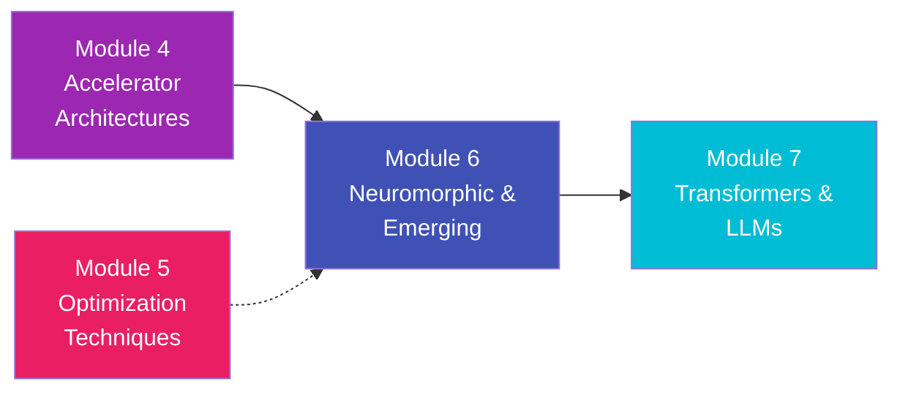

# Module 6: Neuromorphic & Emerging Computing

> **Beyond the Von Neumann Architecture — Circuits that compute like the Brain**

---

## Overview

Up to this point in the tutorial, every optimization and architecture we have designed—from the TPU to Eyeriss—has relied on standard digital logic. They use distinct memory pools, explicit clock cycles, and boolean math gates. 

While incredibly powerful, digital execution is still fundamentally inefficient compared to biological brains. This module abandons traditional digital computing to explore **Neuromorphic Engineering** and **Compute-in-Memory (CIM)**. Here, we encode data in time rather than bits, and compute analog math physically within the memory cells themselves.

---

## Learning Objectives

After completing this module, you will be able to:

- ✅ Identify the fundamental flaws of the Von Neumann Architecture for AI
- ✅ Understand the basic biological mechanisms of neurons (Membranes, Action Potentials)
- ✅ Explain how Spiking Neural Networks (SNNs) process information chronologically
- ✅ Describe how a Memristor (ReRAM) works as an analog weight
- ✅ Differentiate between digital systolic arrays and analog crossbar arrays (Compute-in-Memory)

---

## Chapters

| # | Chapter | Key Topics |
|:--|:--------|:-----------|
| 1 | [Brain-Inspired Computing](01_brain_inspired_computing.md) | Breaking the Von Neumann bottleneck, asynchronous computing, event-driven sensors (DVS) |
| 2 | [Spiking Neural Networks (SNNs)](02_spiking_neural_networks.md) | Integrate-and-Fire neurons, rate vs. temporal coding, STDP (Spike-Timing-Dependent Plasticity) |
| 3 | [Compute-in-Memory with ReRAM](03_compute_in_memory_reram.md) | Memristors, Ohm's law for Matrix Multiplication, Analog-to-Digital conversion (ADC/DAC) overhead |

---

## Prerequisites

- It is highly recommended to complete **Module 4** (Accelerator architectures and the Memory Wall) to fully appreciate why compute-in-memory is necessary.
- A basic understanding of Ohm's Law ($V = I \times R$) from high school physics will be extremely helpful for Chapter 3.

---

## How This Module Connects

Module 4 and 5 taught you how to build the ultimate digital machine. Module 6 asks the question: "What if digital representation itself is the bottleneck?" Once you understand analog crossbars, we will jump back to digital computing in Module 7 to tackle the massive architectures behind ChatGPT and LLMs.

---

*Estimated study time: 3 hours*
