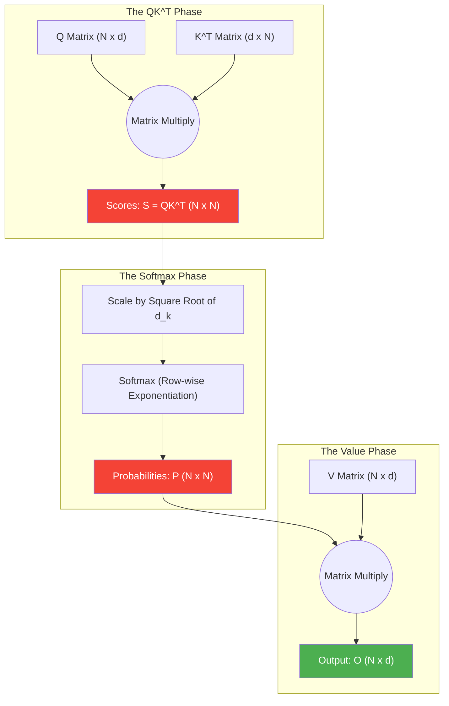

# Self-Attention Hardware

> **Learning Objectives**
> - Understand the core Self-Attention equation: $Attention(Q, K, V) = \text{softmax}\left(\frac{QK^T}{\sqrt{d_k}}\right)V$
> - Analyze the computational phases of Attention and how they map to hardware
> - Identify why the $O(N^2)$ sequence scaling breaks traditional memory architectures

---

## 1. The Core Equation

In Convolutional Neural Networks (CNNs), a filter slides across an image examining *local* pixels. In a Transformer, every token (word) looks at *every other token* in the entire sequence to understand global context.

This is achieved via the **Self-Attention Mechanism**.

For an input sequence of $N$ tokens, the model projects each token into three distinct vectors using learned weight matrices:
- **$Q$ (Queries):** What I am looking for in other words.
- **$K$ (Keys):** What information I contain that others might want.
- **$V$ (Values):** My actual content.

> **Analogy: The Library Search**: Imagine you are in a library. Your **Query** is the topic you are researching (e.g., "AI Hardware"). The **Keys** are the titles on the book spines. The **Values** are the actual information inside the books. To find the best information, you compare your Query against every single Key in the library to see which books are relevant. Once you have a "match score" for every book, you read the Values of the most relevant ones.

The equation that hardware has to compute is:

$$ 
Attention(Q, K, V) = \text{softmax}\left(\frac{Q \cdot K^T}{\sqrt{d_k}}\right) \cdot V 
$$

Where $d_k$ is the hidden dimension size (used as a scaling factor to keep gradients stable).

---

## 2. Hardware Mapping: The 4 Phases

To a GPU or TPU, this equation is broken down into four distinct computational kernels, which cycle heavily between the SIMD Arithmetic Logic Units (ALUs) and the various memory hierarchies.



### Phase 1: Score Computation ($Q \cdot K^T$)
This is an enormous matrix multiplication.
- **Sizes:** $Q$ is $[N \times d]$, $K^T$ is $[d \times N]$.
- **Hardware Profile:** Compute-bound. Massive systolic arrays churn through the dot products.
- **Output:** Transforms into an $[N \times N]$ matrix.

### Phase 2/3: Scaling and Softmax
The hardware must scale the numbers, exponentiate them $e^{x_i}$, and sum them to divide for the probability distribution.
- **Hardware Profile:** Highly Memory-Bound. Exponentials require special transcendental function units (SFUs). Furthermore, calculating the softmax denominator requires reading the entire $N$-length row from memory, summing it, storing it, and then rereading the row to divide it.

### Phase 4: Combining Values ($P \cdot V$)
We multiply the resulting $[N \times N]$ probability matrix by the original $V$ matrix $[N \times d]$.
- **Hardware Profile:** Compute-bound matrix multiplication again.

---

## 3. The $O(N^2)$ Hardware Crisis

Let's look closely at the middle matrix, the $S$ (unnormalized score) and $P$ (probability score). It has a dimension of **$N \times N$**.

This is the Achilles' heel for Hardware Designers. **The size of the attention matrix scales quadratically with the sequence length.**

- If $N = 1k$ tokens: The $N \times N$ matrix has 1 million elements.
- if $N = 8k$ tokens: The $N \times N$ matrix has 64 million elements.
- If $N = 100k$ tokens: The matrix has **10 Billion elements... for just a single layer.**

**The Physical Wall:** 
Modern GPUs have massive compute power (Teraflops), but their on-chip **SRAM** (L1/L2 Cache) is tiny—usually between **$20 \text{ MB and 100 \text{ MB}}$.** 
As you calculate the $[N \times N]$ matrix, it rapidly explodes past the size of the SRAM. The hardware is forced to "spill" the data out to the **DRAM (HBM)**, which is $100\times$ slower and $100\times$ more energy-expensive. 

**The Catastrophic Result:**
Because it doesn't fit in SRAM, the GPU is forced to calculate pieces of the $N \times N$ matrix and constantly ferry them off-chip to the slow HBM (High Bandwidth Memory/DRAM), only to immediately ferried back on-chip to perform the Softmax operation.

Standard Attention spends 90% of its time moving the intermediate $N \times N$ matrix across the memory bus rather than actually computing the final answer.

### Code Example: Calculating the "Quadratic Wall"

```python
def calculate_attention_memory(N, heads=12, byte_precision=2):
    """Calculate memory footprint of the intermediate NxN attention matrix."""
    elements = heads * (N ** 2)
    bytes_total = elements * byte_precision
    return bytes_total / (1024 ** 2)  # Return in MB

for n in [512, 1024, 4096, 16384]:
    mb = calculate_attention_memory(n)
    print(f"Sequence Length {n:5} | Memory: {mb:8.2f} MB")

# At 16k tokens, we need 6GB just for a single layer's intermediate scores!
```

---

## 4. Worked Example: The Attentional Memory Wall

Suppose you have a GPU with **40 MB** of fast SRAM and **2,000 GB/s** of HBM bandwidth. You are processing a sequence of $N = 8192$.

**1. Calculate Matrix Size**:
- $N \times N = 8192^2 = 67,108,864$ elements.
- In FP16 (2 bytes): $67.1M \times 2 = \mathbf{134.2 \text{ MB}}$.

**2. The SRAM Overflow**:
- Since $134.2 \text{ MB} > 40 \text{ MB}$, the GPU cannot hold the attention weights for even *one* head in its fast cache.
- The GPU must compute the scores, write them to DRAM, read them back for Softmax, and write them again.

**3. The Traffic Jam**:
- Total bytes moved for this layer (simplified): $\text{Score Write} + \text{Softmax Read} + \text{Softmax Write} + \text{Value Read}$
- $134 \text{ MB} \times 4 = 536 \text{ MB}$.
- Even at $2000 \text{ GB/s}$, moving this much intermediate data for every single attention head across 96 layers causes the massive "HBM bottleneck" that slows down LLM training.

---

## Key Takeaways

- Self-Attention is fundamentally two large matrix multiplications bonded by a Softmax operation.
- The intermediate calculations produce an **$N \times N$ Matrix** representing every token's attention toward every other token.
- This results in an **$O(N^2)$ memory and compute requirement**. 
- Because the $N \times N$ matrix rapidly exceeds the size of on-chip SRAM, standard attention becomes severely **Memory-Bound**.

---

## Practice Problems

### Problem 1: Memory Footprint Scaling

> **Context**: You are estimating memory allocations for typical multi-head attention. You are calculating the memory required **just to optionally store the intermediate $P$ matrix** (the $N \times N$ probability matrix) across one complete layer before multiplying by $V$.
>
> **Parameters**:
> - Hidden Dimension ($d$): 1024
> - Precision: FP16 (2 Bytes per element)
> - Batch Size: 1
> - Number of Attention Heads: 12
>
> **Tasks**:
> - (a) What is the total memory storage required for the $P$ matrix across all heads if Sequence Length $N = 512$? [1]
> - (b) What is the memory required if Sequence Length $N = 32,768$? [2]

<details>
<summary><b>Solution</b></summary>

**(a) Short Sequence ($N = 512$):**
- Matrix size per head: $N \times N = 512 \times 512 = 262,144 \text{ elements}$.
- Across all 12 heads: $262,144 \times 12 = 3,145,728 \text{ elements}$.
- Storage (2 Bytes): $3,145,728 \times 2 = \mathbf{6,291,456 \text{ Bytes} \ (\approx 6.3 \text{ MB})}$.
- *Fits easily inside a GPU cache.*

**(b) Long Sequence ($N = 32,768$):**
- Matrix size per head: $N \times N = 32,768 \times 32,768 = 1,073,741,824 \text{ elements}$.
- Across all 12 heads: $1,073,741,824 \times 12 = 12,884,901,888 \text{ elements}$.
- Storage (2 Bytes): $12,884,901,888 \times 2 = \mathbf{25,769,803,776 \text{ Bytes} \ (\approx 25.8 \text{ GB})}$.
- *Crushes the SRAM. Requires massive, slow DRAM swapping for a single layer.*

### Problem 2: Softmax Tiling Constraints

> **Context**: You are trying to optimize the Softmax operation ($e^{x_i} / \sum e^{x_j}$) in a systolic array. 
>
> **Tasks**:
> - (a) Why can't we compute the final Softmax value for the 1st element of a row if we only have the first half of the row in the local SRAM? [1]
> - (b) Contrast this with a **ReLU** operation. Can ReLU be tiled? [1]

<details>
<summary><b>Solution</b></summary>

**(a)** Because Softmax requires the **global sum** (the denominator) of the entire row. You cannot normalize the first element until you have seen the very last element to know the total sum. This "Global Dependency" is what forces the entire $N \times N$ matrix to be materialized in memory.

**(b)** Yes. ReLU is a **Pointwise** operation. To compute `max(0, x)`, you only need `x`. You don't need to know anything about the other pixels in the row. This makes ReLU perfectly "tileable" and "fusable," whereas standard Softmax is a "Fusion-Breaker."

</details>

---

[← Return to Module Overview](README.md) | [Next Chapter: Flash Attention →](02_flash_attention.md)
