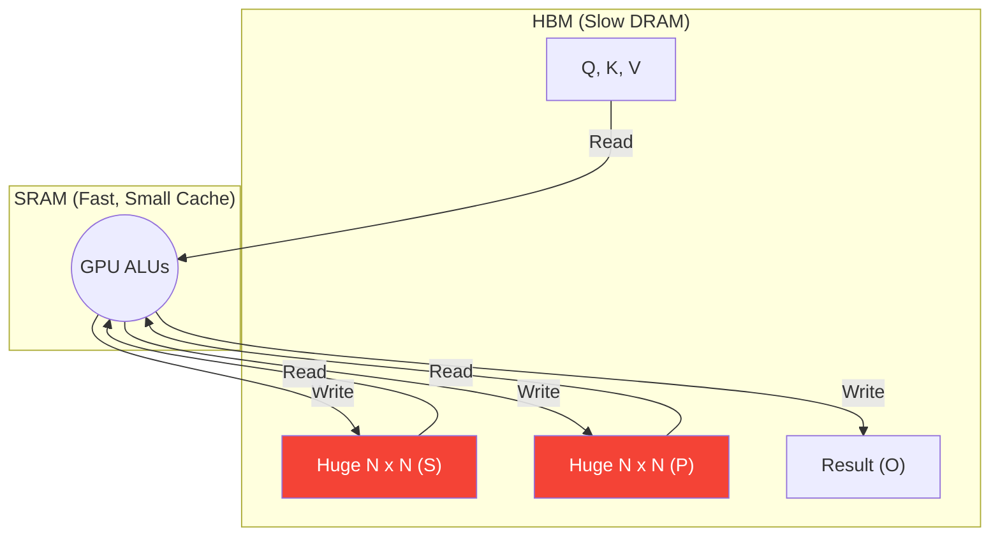
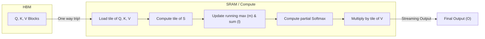

# Flash Attention

> **Learning Objectives**
> - Understand why standard attention implementations on GPUs are bottlenecked by HBM (DRAM) read/writes.
> - Explain the concept of Kernel Fusion and why it is difficult for Attention.
> - Analyze how Flash Attention uses hardware-aware Tiling and Recomputation to bypass the Memory Wall.

---

## 1. The HBM Bottleneck

Building on the previous chapter, we know that standard hardware runs Self-Attention as a sequence of distinct GPU operations (kernels) written in PyTorch/CUDA:

1. Multiply $Q \times K^T \rightarrow S$ ($S$ written back out to massive, slow HBM)
2. Read $S$ from HBM $\rightarrow$ exponentiate and sum $\rightarrow$ write denominator out to HBM (Softmax step 1)
3. Read $S$ and denominator $\rightarrow$ divide $\rightarrow$ write $P$ to HBM (Softmax step 2)
4. Read $P$ and $V$ from HBM $\rightarrow$ multiply $\rightarrow$ write $O$ to HBM.



**Notice the massive arrows!** The intermediate $N \times N$ matrices ($S$ and $P$) are fully written to and read from the slow HBM multiple times. This memory traffic completely throttles the hardware.

---

## 2. Kernel Fusion & The Softmax Problem

In traditional optimization (Module 5), we solve memory bottlenecks with **Kernel Fusion**—stitching steps together inside the fast SRAM so we never have to write intermediate values to HBM.

**Why is fusing Attention hard?**
Because of the `softmax` operation. To properly calculate the denominator for a Softmax distribution, you need the sum of the *entire row* of exponentially scaled scores. 
You cannot proceed to Phase 4 (multiplying by $V$) until the Softmax operation for that row is mathematically fully complete. Because the row length is $N$, and $N$ is massive, you run out of fast SRAM trying to hold the row while summing it.

---

## 3. Flash Attention: The Breakthrough

In 2022, researchers introduced **Flash Attention**, an algorithmic optimization fundamentally co-designed with GPU hardware hierarchies.

Flash Attention eliminates the HBM bottleneck using two brilliant techniques: **Tiling** and **Safe Softmax Recomputation**.

### Tiling
Flash Attention breaks the massive $Q, K, V$ matrices into smaller "blocks" or "tiles" that perfectly fit within the GPU's ultra-fast SRAM.
Instead of computing the full $N \times N$ matrix at once, it computes a block of $Q$ against a block of $K$, yielding a tiny sub-block of $S$.

### The Softmax Trick (Safe Math)
How does it do Softmax on a tile if Softmax strictly requires the full row?

Flash Attention uses a mathematical trick known as Online Softmax. It maintains two running variables inside the fast SRAM:
1. $m(x)$: The maximum value seen *so far* in the row.
2. $l(x)$: The running sum of the exponentials *so far*.

When it processes the next tile from HBM, it updates the running max, recalculates the running sum based on the new max, and adjusts the probabilities retroactively. 

**Wait, why is recomputation okay?** 
In standard computing, we avoid repeating work to save time. But in the modern Memory Wall era (Module 4), **math is cheap, but memory is expensive**. 
Doing the Softmax math twice is $100\times$ faster than writing the massive $N \times N$ matrix to DRAM and reading it back once. This is the central counter-intuitive insight of Flash Attention.



### Result: The $N \times N$ Matrix is Never Stored
In Flash Attention, the terrifying $N \times N$ matrices ($S$ and $P$) **never exist in HBM**. They are born, processed, and consumed entirely inside the fast SRAM tile by tile. Only the final output $O$ (which is $N \times d$) is written back to HBM.

### Code Example: Simulating the Online Softmax Trick

```python
import numpy as np

def online_softmax_step(m_prev, l_prev, p_prev, tile_scores):
    """
    Simulate updating the softmax denominator and scaling 
    previous partial results without having the full row.
    """
    # 1. Find local max of new tile
    m_tile = np.max(tile_scores)
    
    # 2. Update global max
    m_new = max(m_prev, m_tile)
    
    # 3. Scale previous sum and partial result to the new max
    l_new = l_prev * np.exp(m_prev - m_new) + np.sum(np.exp(tile_scores - m_new))
    
    # The actual hardware then rescales the output P based on l_new/l_prev
    return m_new, l_new

# Imagine processing two tiles of scores: [2, 4] and [1, 5]
row_tile_1 = np.array([2.0, 4.0])
m1, l1 = np.max(row_tile_1), np.sum(np.exp(row_tile_1 - np.max(row_tile_1)))

print(f"After Tile 1: Max={m1}, SumExp={l1}")

row_tile_2 = np.array([1.0, 5.0])
m2, l2 = online_softmax_step(m1, l1, None, row_tile_2)

print(f"After Tile 2: Max={m2}, SumExp={l2}")
# This allows us to keep computing without ever storing the full row!
```

---

## 4. Worked Example: Flash Attention Memory Traffic (N=32k)

Let's calculate the physical traffic on the HBM bus for a sequence length of **32,768** with hidden dimension **1,024**.

**Standard Attention Traffic**:
1. Write Score Matrix ($N^2$): $32k \times 32k = 1.07 \text{ billion elements}$.
2. Read Score Matrix for Softmax: $1.07 \text{ billion elements}$.
3. Write Prob Matrix: $1.07 \text{ billion elements}$.
4. Read Prob Matrix for Value Mult: $1.07 \text{ billion elements}$.
- **Total intermediate traffic**: $4.28 \text{ billion elements} \times 2 \text{ bytes} \approx \mathbf{8.5 \text{ GB}}$.

**Flash Attention Traffic**:
1. Load $Q, K, V$ ($3 \times N \times d$): $3 \times 32k \times 1k = 98 \text{ million elements}$.
2. Write Output $O$ ($1 \times N \times d$): $32k \times 1k = 32 \text{ million elements}$.
- **Total traffic**: $130 \text{ million elements} \times 2 \text{ bytes} \approx \mathbf{0.26 \text{ GB}}$.

**Conclusion**: Flash Attention reduced the HBM traffic for this layer by **$32\times$**. Instead of waiting for the memory bus, the GPU is now constantly busy doing math.

---

## Key Takeaways

- Standard Attention implementations are heavily crippled by HBM read/write limits, forcing huge $O(N^2)$ intermediate matrices on and off the chip.
- **Flash Attention** is a hardware-aware algorithm that fundamentally aligns the math of Attention with the physical SRAM/HBM boundary.
- Through **Tiling**, memory is processed in small chunks.
- Through an **Online Softmax** mathematical restructuring, partial probabilities can be integrated with $V$ immediately.
- This eliminates the materialization of the $N \times N$ matrices entirely, accelerating transformer training and inference by $2\times$ to $4\times$.

---

## Practice Problems

### Problem 1: HBM Traffic Reduction

> **Context**: You are analyzing a single Attention Head calculation comparing standard PyTorch attention to Flash Attention. Assume sequences are length $N$ and hidden dimension is $d$.
>
> **Task**: Explain conceptually (without exact algebra) why the memory Bandwidth (Bytes read/written to HBM) algorithmically scales differently between Standard Attention and Flash Attention.

<details>
<summary><b>Solution</b></summary>

- **Standard Attention**: Requires allocating and storing the $N \times N$ matrices ($S$ and $P$) in HBM. Furthermore, it reads and writes these massive matrices multiple times across the kernels. The memory bandwidth scales at **$O(N^2)$**, exactly following the matrix size.
- **Flash Attention**: Tiling means that $Q$, $K$, and $V$ matrices (which are $N \times d$) are loaded from HBM, and the output $O$ (which is $N \times d$) is written to HBM. The $N \times N$ matrices only ever exist ephemerally inside the internal SRAM. Therefore, traversing the HBM bus only happens for the core sequences, resulting in memory bandwidth scaling that is **$O(N)$**. 
- Flash Attention changes the memory bandwidth complexity from quadratic to linear!

### Problem 2: The Block Size Constraint

> **Context**: You are implementing Flash Attention on a custom ASIC with only **512 KB** of SRAM. You need to load blocks of $Q$, $K$, and $V$ simultaneously. Each element is 2 bytes (FP16).
> 
> **Tasks**:
> - (a) If your blocks are square ($B \times d$) and your hidden dimension $d$ is **1024**, what is the maximum block height $B$ you can afford if you must hold 3 blocks in memory ($Q_{tile}, K_{tile}, V_{tile}$)? [2]

<details>
<summary><b>Solution</b></summary>

- Total SRAM = $512 \times 1024 = 524,288$ bytes.
- Size of one block ($B \times 1024 \times 2$ bytes) = $2048 \times B$ bytes.
- 3 blocks must fit: $3 \times (2048 \times B) \le 524,288$.
- $6144 \times B \le 524,288$.
- $B \le 85.3$.
- **Result**: You would pick a block size of **$B=64$** (to keep it a power of 2 for easy addressing). 

</details>

---

[← Previous Chapter: Self-Attention Hardware](01_self_attention_hardware.md) | [Next Chapter: KV Cache in LLM Inference →](03_kv_cache_inference.md)
