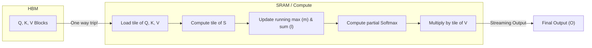

# Flash Attention

> **Learning Objectives**
> - Understand why standard attention implementations on GPUs are bottlenecked by HBM (DRAM) read/writes.
> - Explain the concept of Kernel Fusion and why it is difficult for Attention.
> - Analyze how Flash Attention uses hardware-aware Tiling and Recomputation to bypass the Memory Wall.

---

## 1. The HBM Bottleneck

Building on the previous chapter, we know that standard hardware runs Self-Attention as a sequence of distinct GPU operations (kernels) written in PyTorch/CUDA:

1. Multiply $Q \times K^T \rightarrow S$ ($S$ written back out to massive, slow HBM)
2. Read $S$ from HBM $\rightarrow$ exponentiate and sum $\rightarrow$ write denominator out to HBM (Softmax step 1)
3. Read $S$ and denominator $\rightarrow$ divide $\rightarrow$ write $P$ to HBM (Softmax step 2)
4. Read $P$ and $V$ from HBM $\rightarrow$ multiply $\rightarrow$ write $O$ to HBM.

```mermaid
flowchart TD
    subgraph HBM (Slow DRAM)
        QKV["Q, K, V"] 
        S["Huge N x N (S)"]
        P["Huge N x N (P)"]
        O["Result (O)"]
    end
    
    subgraph SRAM (Fast, Small Cache)
        ALU(("GPU ALUs"))
    end
    
    QKV -->|Read| ALU
    ALU -->|Write| S
    S -->|Read| ALU
    ALU -->|Write| P
    P -->|Read| ALU
    ALU -->|Write| O
    
    style S fill:#F44336,color:#fff
    style P fill:#F44336,color:#fff
```

**Notice the massive arrows!** The intermediate $N \times N$ matrices ($S$ and $P$) are fully written to and read from the slow HBM multiple times. This memory traffic completely throttles the hardware.

---

## 2. Kernel Fusion & The Softmax Problem

In traditional optimization (Module 5), we solve memory bottlenecks with **Kernel Fusion**—stitching steps together inside the fast SRAM so we never have to write intermediate values to HBM.

**Why is fusing Attention hard?**
Because of the `softmax` operation. To properly calculate the denominator for a Softmax distribution, you need the sum of the *entire row* of exponentially scaled scores. 
You cannot proceed to Phase 4 (multiplying by $V$) until the Softmax operation for that row is mathematically fully complete. Because the row length is $N$, and $N$ is massive, you run out of fast SRAM trying to hold the row while summing it.

---

## 3. Flash Attention: The Breakthrough

In 2022, researchers introduced **Flash Attention**, an algorithmic optimization fundamentally co-designed with GPU hardware hierarchies.

Flash Attention eliminates the HBM bottleneck using two brilliant techniques: **Tiling** and **Safe Softmax Recomputation**.

### Tiling
Flash Attention breaks the massive $Q, K, V$ matrices into smaller "blocks" or "tiles" that perfectly fit within the GPU's ultra-fast SRAM.
Instead of computing the full $N \times N$ matrix at once, it computes a block of $Q$ against a block of $K$, yielding a tiny sub-block of $S$.

### The Softmax Trick (Safe Math)
How does it do Softmax on a tile if Softmax strictly requires the full row?

Flash Attention uses a mathematical trick known as Online Softmax. It maintains two running variables inside the fast SRAM:
1. $m(x)$: The maximum value seen *so far* in the row.
2. $l(x)$: The running sum of the exponentials *so far*.

When it processes the next tile from HBM, it updates the running max, recalculates the running sum based on the new max, and adjusts the probabilities retroactively. 

**Wait, why is recomputation okay?** 
In standard computing, we avoid repeating work to save time. But in the modern Memory Wall era (Module 4), **math is cheap, but memory is expensive**. 
Doing the Softmax math twice is $100\times$ faster than writing the massive $N \times N$ matrix to DRAM and reading it back once. This is the central counter-intuitive insight of Flash Attention.



### Result: The $N \times N$ Matrix is Never Stored
In Flash Attention, the terrifying $N \times N$ matrices ($S$ and $P$) **never exist in HBM**. They are born, processed, and consumed entirely inside the fast SRAM tile by tile. Only the final output $O$ (which is $N \times d$) is written back to HBM.

---

## Key Takeaways

- Standard Attention implementations are heavily crippled by HBM read/write limits, forcing huge $O(N^2)$ intermediate matrices on and off the chip.
- **Flash Attention** is a hardware-aware algorithm that fundamentally aligns the math of Attention with the physical SRAM/HBM boundary.
- Through **Tiling**, memory is processed in small chunks.
- Through an **Online Softmax** mathematical restructuring, partial probabilities can be integrated with $V$ immediately.
- This eliminates the materialization of the $N \times N$ matrices entirely, accelerating transformer training and inference by $2\times$ to $4\times$.

---

## Practice Problems

### Problem 1: HBM Traffic Reduction

> **Context**: You are analyzing a single Attention Head calculation comparing standard PyTorch attention to Flash Attention. Assume sequences are length $N$ and hidden dimension is $d$.
>
> **Task**: Explain conceptually (without exact algebra) why the memory Bandwidth (Bytes read/written to HBM) algorithmically scales differently between Standard Attention and Flash Attention.

<details>
<summary><b>Solution</b></summary>

- **Standard Attention**: Requires allocating and storing the $N \times N$ matrices ($S$ and $P$) in HBM. Furthermore, it reads and writes these massive matrices multiple times across the kernels. The memory bandwidth scales at **$O(N^2)$**, exactly following the matrix size.
- **Flash Attention**: Tiling means that $Q$, $K$, and $V$ matrices (which are $N \times d$) are loaded from HBM, and the output $O$ (which is $N \times d$) is written to HBM. The $N \times N$ matrices only ever exist ephemerally inside the internal SRAM. Therefore, traversing the HBM bus only happens for the core sequences, resulting in memory bandwidth scaling that is **$O(N)$**. 
- Flash Attention changes the memory bandwidth complexity from quadratic to linear!

</details>

---

[← Previous Chapter: Self-Attention Hardware](01_self_attention_hardware.md) | [Next Chapter: KV Cache in LLM Inference →](03_kv_cache_inference.md)
