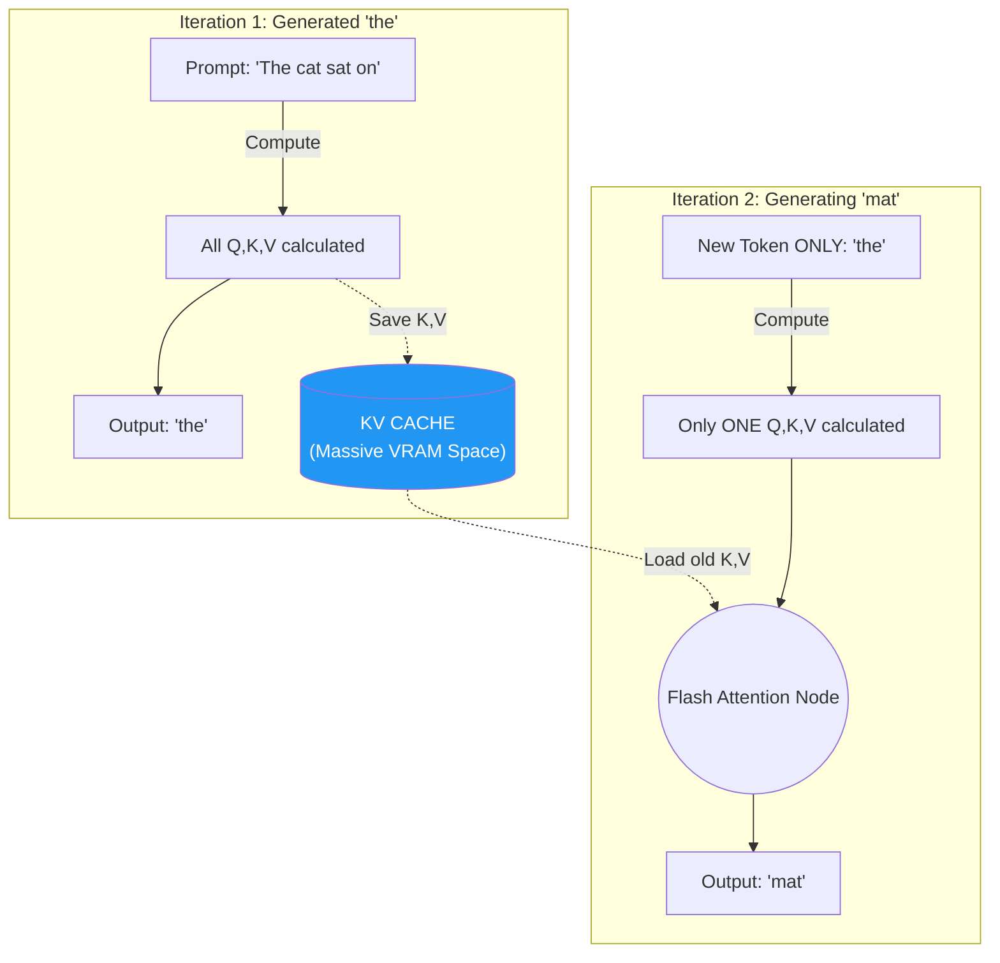

# KV Cache in LLM Inference

> **Learning Objectives**
> - Distinguish the differing computational paradigms between Transformer *Training* and *Inference*.
> - Identify the redundancy bottleneck in Autoregressive Generative Models.
> - Explain the architecture and memory footprint of the Key-Value (KV) Cache.

---

## 1. Training vs. Autoregressive Inference

During **Training**, a Transformer operates in parallel. We pass the entirety of a thousand-word document into the $Q$, $K$, and $V$ matrices all at once. The hardware performs one massive series of matrix multiplications (as explored in Chapters 1 and 2), calculates the loss, and backpropagates.

During **Inference** (generating text like ChatGPT), the Transformer is **Autoregressive**.
- It reads the prompt.
- It generates Token $1$.
- It appends Token $1$ back into the prompt, and runs the entire network *again* to generate Token $2$.
- It runs the network *again* to generate Token $3$.

Generating an 800-word essay requires running the 100-Billion-parameter Transformer model 800 consecutive times. 

---

## 2. The Redundancy Problem

Let's look at the mathematical redundancy here. 

Imagine our input sequence is: `["The", "cat", "sat", "on"]`. We want to predict `"the"`.
The model converts all four tokens into $Q, K, V$ vectors, computes the massive attention matrices, and successfully outputs `"the"`.

Now we feed the new sequence: `["The", "cat", "sat", "on", "the"]`. We want to predict `"mat"`.
The model again converts *all five* tokens into $Q, K, V$ vectors. 
**Notice the waste:** We just recalculated the exact same $K$ and $V$ vectors for the words `"The", "cat", "sat", "on"` that we already calculated a fraction of a second ago.

Because the underlying weight projections ($W_K$ and $W_V$) do not change, the resulting $K$ and $V$ vectors for past tokens are completely static. Recomputing them every single iteration burns massive amounts of FLOPs.

---

## 3. The KV Cache Solution

To solve this, AI engineers use the **KV Cache**.

Instead of recomputing the entire sequence, we simply save the resulting $K$ and $V$ vectors for every token we generate and store them in the GPU's memory. 

### The Two-Phase Rhythm
LLM inference is split into two physically different hardware profiles:
1. **The Pre-fill Phase (Prompting)**: The model reads your 500-word prompt. Since it has all the words at once, it can use massive **matrix-matrix** operations. Like training, this phase is high-intensity and **Compute-Bound** (Right side of the Roofline).
2. **The Decode Phase (Generation)**: The model generates tokens one by one. For every new word, it performs a **matrix-vector** multiplication. Because $N=1$, the data reuse is near zero. This phase is extremely **Memory-Bound** (Left side of the Roofline). You are reading 140GB of weights from HBM just to do a tiny bit of math for one word.

### How the Cache Works Step-by-Step:
1. **Pre-fill (Iter 0):** 
   - Compute the initial prompt of $N$ tokens in parallel ($Q, K, V$).
   - Load $N$ vectors into the KV Cache.
2. **Decoding (Iter 1):** 
   - Input the predicted token $N+1$ only.
   - Calculate one $q_{N+1}$ vector.
   - Read all $1$ to $N$ keys from memory.
   - Calculate attention scores $\text{dot}(q_{N+1}, \text{Cache}_K)$.
   - Sum with all $1$ to $N$ values.
3. **Decoding (Iter 2):**
   - Repeat. Now you read $1$ to $N+1$ keys.

**Observation**: Every word you generate makes the next word **more expensive** to calculate because the KV Cache grows longer!

### Code Example: Simulating KV Cache Growth

```python
import torch

class KVCacheSimulator:
    def __init__(self, layers, heads, dim):
        self.cache_k = [[] for _ in range(layers)]
        self.cache_v = [[] for _ in range(layers)]
        
    def generate_token(self, new_k, new_v):
        """Append new token projections to the cache."""
        for i in range(len(self.cache_k)):
            self.cache_k[i].append(new_k[i])
            self.cache_v[i].append(new_v[i])
            
        # The 'context length' is now the number of items in the cache
        return len(self.cache_k[0])

# Simulating a small model (2 layers, 4 heads, 64 dim)
sim = KVCacheSimulator(layers=2, heads=4, dim=64)

for i in range(5):
    # Dummy projections for a new word
    k = torch.randn(2, 4, 64)
    v = torch.randn(2, 4, 64)
    length = sim.generate_token(k, v)
    print(f"Token {i+1} generated. Total KV Cache Context: {length} tokens")
```

---

## 4. Worked Example: Decoding - The Memory Bandwidth Wall

Let's calculate the Arithmetic Intensity (Module 4) for generating one single token.

**Model**: Llama-3-70B (70 Billion Parameters)
**Hardware**: H100 GPU (2000 GB/s HBM bandwidth)

**1. The Data Load**:
- To predict one token, the GPU must read every single model weight from memory once.
- Weight data = $70 \text{ Billion} \times 2 \text{ bytes (FP16)} = \mathbf{140 \text{ GB}}$.

**2. The Compute**:
- A 70B parameter model doing one token inference does roughly 140 Billion FLOPs ($2 \times \text{Params}$).

**3. Arithmetic Intensity**:
- $Intensity = \text{FLOPs} / \text{Bytes} = 140 \text{ GFLOPs} / 140 \text{ GB} = \mathbf{1}$.

**Conclusion**: On an H100 (which has an intensity threshold of $\approx 150$), an Intensity of **1** is deep in the "Memory-Bound" region. The GPU will spend **$149 \times$** more time waiting for the 140GB of weights to travel from HBM than it will actually spending calculating the new word. This is why LLMs feel "slow" relative to the massive teraflops of the chip.

---



### The Cost: VRAM Explosion
For large contexts (e.g., a 100k token window), a single user's KV cache can consume **tens of Gigabytes of strict GPU VRAM**. 

**The Scaling Nightmare:** 
In traditional web serving, 10,000 users just take up a bit of CPU time. In LLM serving, 10,000 users require **10,000 sets of KV Caches**. 
If each user takes 2GB of VRAM (see Problem 1), you need $20,000 \text{ GB}$ of VRAM just to keep those conversations "alive" in memory. This is why LLM providers like OpenAI or Anthropic require thousands of H100 GPUs—not because they are doing so much math, but because they are "VRAM Packing" to hold all the active KV Caches.

---

## Key Takeaways

- LLM inference is fundamentally Autoregressive, generating sequences one token at a time.
- Standard generation is highly redundant because it re-projects old words into static Keys and Values repeatedly.
- The **KV Cache** physically saves the historic Keys and Values in VRAM, eliminating recomputation.
- The KV Cache trades compute speed for memory capacity, making long-context LLM inference one of the most heavily memory-bound workloads in modern hardware.

---

## Practice Problems

### Problem 1: Sizing the KV Cache

> **Context**: You are estimating the memory required to serve one user on an LLM using a KV Cache.
> 
> **Parameters of the Model**:
> - Layers ($L$): 32
> - Attention Heads ($h$): 32
> - Dimension per Head ($d_k$): 128
> - Precision: FP16 (2 Bytes)
>
> **Task**: If the user's prompt is exactly $N = 4096$ tokens, how many Megabytes (MB) of VRAM are required just to store this user's initial KV Cache?
> *(Hint: Remember you must store BOTH the K vectors and the V vectors for every single layer).*

<details>
<summary><b>Solution</b></summary>

**1. Sizing a single token across the model:**
- Each token has a Key vector and a Value vector ($2$).
- The size of the vector across all heads is $h \times d_k$: $32 \times 128 = 4096$ values.
- Precision is 2 Bytes: $4096 \times 2 = 8192 \text{ Bytes/token/layer}$.
- Number of layers ($L = 32$): $8192 \times 32 = 262,144 \text{ Bytes/token}$.
- Multiply by the two vectors (K and V): $262,144 \times 2 = \mathbf{524,288 \text{ Bytes per single token in the sequence.}}$

**2. Multiply by the sequence length:**
- Sequence $N = 4096$.
- Total Cache Size: $524,288 \text{ Bytes} \times 4096 \text{ tokens} = 2,147,483,648 \text{ Bytes}$.

**3. Convert to MB:**
- $2,147,483,648 / (1024 \times 1024) = \mathbf{2048 \text{ MB} \ (\text{or } 2 \text{ GB})}$.
- *It costs 2 GB of ultra-expensive HBM VRAM just to hold the context for this one user.*

</details>

---

### Problem 2: Parameter Efficiency (MHA vs. MQA)

> **Context**: To save VRAM, some models use **Multi-Query Attention (MQA)**. Instead of $h$ unique Key/Value heads, all Query heads share a **single** Key/Value head.
> 
> **Tasks**:
> - (a) Using the model from Problem 1 (32 heads, 32 layers, $d_k=128$), how much VRAM would the 4096-token KV Cache take if it used **MQA**? [2]
> - (b) What is the VRAM reduction factor? [1]

<details>
<summary><b>Solution</b></summary>

**(a) MQA Calculation:**
- In MHA (Problem 1), we stored 32 KV heads.
- In MQA, we store **1** KV head per layer.
- Previous size = $2048 \text{ MB}$.
- New size = $2048 \text{ MB} / 32 = \mathbf{64 \text{ MB}}$.

**(b) Reduction Factor:**
- $2048 / 64 = \mathbf{32\times}$.
- By sharing the KV vectors across all Query heads, we cut our memory requirements by 96%. This allows us to serve 32 times more users on the same GPU!

</details>

---

[← Previous Chapter: Flash Attention](02_flash_attention.md) | [Next Chapter: Vision Transformers →](04_vision_transformers_vit.md)
