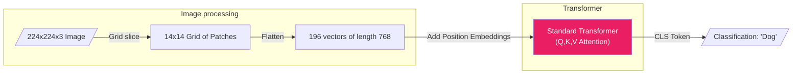

# Vision Transformers (ViT)

> **Learning Objectives**
> - Understand how an image is processed to fit into a 1D Transformer sequence.
> - Contrast the computational profile of a ViT with a standard Convolutional Neural Network (CNN).
> - Analyze the hardware implications of patchification on latency and bandwidth.

---

## 1. Bridging Text and Vision

As we explored in Module 3, the standard for computer vision for a decade was the Convolutional Neural Network (CNN). CNNs have strict *inductive biases*—they physically slide over images, enforcing spatial locality (pixels close together are related) and translational invariance (a dog is a dog whether it's in the top left or bottom right). 

Transformers lack these hardware-native sliding windows. They treat everything as an amorphous 1D sequence of tokens. 

In 2020, Google researchers proposed the **Vision Transformer (ViT)**, effectively asking: *"Can we treat an image exactly like a sentence of words?"*

---

## 2. Patchification: Treating Pixels as Words

To feed a 2D image into a standard 1D language Transformer, we must first "tokenize" the image. We cannot feed in every single pixel as a token (sequence length $N = 224 \times 224 = 50,000 \text{ pixels}$) because the $O(N^2)$ Self-Attention matrix would crash the GPU.

Instead, the ViT algorithm uses **Patchification**.
1. It splits a $224 \times 224$ image into a grid of non-overlapping $16 \times 16$ pixel "patches".
2. This creates exactly $(224 / 16) \times (224 / 16) = 14 \times 14 = 196$ patches.
3. Each $16 \times 16 \times 3$ (RGB) patch is physically flattened into a single 1D vector of length $768$.
4. These 196 vectors are treated exactly like 196 "words" in a sentence and fed into a standard Transformer block.

**The Hardware Reality:** 
Patchification is essentially a massive memory re-arrangement. To a GPU, fetching a $16 \times 16$ patch from a $224 \times 224$ image means jumping around in memory (non-contiguous access), which typically results in poor cache utilization. Efficient ViT hardware usually includes specialized **DMA (Direct Memory Access)** engines that can "gather" these patches from DRAM and stream them into SRAM in a single cycle.



### Code Example: Simulating Patchification

```python
import numpy as np

def patchify(image, patch_size=16):
    """Reshape a 2D image into 1D patches."""
    H, W, C = image.shape
    # 1. Split into grid
    patches = image.reshape(H // patch_size, patch_size, 
                            W // patch_size, patch_size, C)
    
    # 2. Swap axes to bring patch pixels together
    patches = patches.transpose(0, 2, 1, 3, 4)
    
    # 3. Flatten each patch into a 1D vector (P*P*C)
    num_patches = (H // patch_size) * (W // patch_size)
    patch_dim = patch_size * patch_size * C
    flat_patches = patches.reshape(num_patches, patch_dim)
    
    return flat_patches

# Simulation: 224x224 RGB image
image = np.random.rand(224, 224, 3)
p_vecs = patchify(image)

print(f"Original Shape: {image.shape}")
print(f"Number of Patches: {p_vecs.shape[0]}")
print(f"Vector Length per Patch: {p_vecs.shape[1]}")
```

---

## 3. Hardware Profile: CNN vs. ViT

Why does hardware care whether the software uses a CNN or a ViT? The performance profiles are vastly different.

### The CNN (Local, Dense Math)
- **High Data Reuse**: Standard convolutions reuse the same sliding weight filter across the whole image. This creates excellent cache locality.
- **Sparse Activations**: After ReLU, many activations go to zero, allowing for compression (like in the Eyeriss accelerator).
- **Latency**: Very low latency, highly efficient for edge devices.

### The ViT (Global, Memory Intensive)
- **Massive Parameters**: ViTs often have $3\times - 10\times$ more parameters than equivalent CNNs. Consequently, reading the initial weights completely saturates memory bandwidth.
- **Dense Attention Matrices**: The $196 \times 196$ self-attention matrices calculate relationships between distant corners of the image immediately. There is no sliding mechanism.
- **Batch Processing**: ViTs scale brilliantly with gigantic batches on massive TPU pods (Compute bound), but struggle with processing a single image on a tiny mobile phone due to parameter fetching.

### Which is better?
At lower data scales, CNNs outperform ViTs because their hardware-friendly inductive biases naturally understand 2D reality. However, at massive data scales (billions of images), ViTs pull ahead due to **Scaling Laws**. 
CNNs reach a point of diminishing returns because their sliding windows are limited to local context. ViTs, with their global attention, can learn complex global relationships that CNNs physically cannot "see," provided the hardware can handle the massive memory bandwidth required to fetch the weights.

---

## 4. Worked Example: Computational Intensity (CNN vs. ViT)

Let's estimate the raw FLOPs for one layer on a standard $224 \times 224 \times 64$ feature map.

**Scenario A: Standard 3x3 CNN Layer**
- Kernel size = $3 \times 3 \times 64 = 576$ weights.
- Multiplications = $224 \times 224 \times 64 \times 576 \approx \mathbf{1.8 \text{ Billion FLOPs}}$.
- **Hardware Profile**: High data reuse. We use the same 576 weights for all 50,000 pixels.

**Scenario B: Self-Attention (ViT with 16x16 patches)**
- Sequence $N = 196$. Head Dim $d = 768$.
- Attention Matrix Multiplications ($2 \times N^2 \times d$): $2 \times 196^2 \times 768 \approx \mathbf{59 \text{ Million FLOPs}}$.
- Projection weights ($3 \times N \times d^2$): $3 \times 196 \times 768^2 \approx \mathbf{346 \text{ Million FLOPs}}$.
- **Total**: $\approx \mathbf{0.4 \text{ Billion FLOPs}}$.

**Conclusion**: For a standard resolution, a ViT actually uses **fewer math operations** than a dense CNN. However, because its weights are much larger and not reused spatially, the ViT feels "heavier" on hardware because it is constantly waiting for DRAM to provide the next set of weights.

---

## Key Takeaways

- The **Vision Transformer (ViT)** applies standard Language Transformer architecture to images by treating non-overlapping pixel patches as discrete "words".
- **Patchification** keeps the sequence length $N$ low enough (e.g., $N=196$) to avoid crushing the hardware under $O(N^2)$ Self-Attention complexity.
- While CNNs are highly localized and allow massive data reuse (perfect for edge accelerators), ViTs calculate global context instantly but require fetching massive weight matrices from DRAM.

---

## Practice Problems

### Problem 1: Patch Mathematics

> **Context**: You are designing a custom Vision Transformer for a satellite imagery accelerator. 
> - Input imagery is immense: $1024 \times 1024 \times 3$ RGB.
> - Your dedicated on-chip SRAM for the Attention matrix ($S = QK^T$) is limited.
> - The Attention matrix needs to fit within $12 \text{ Megabytes}$ (assuming FP16 storage, 2 Bytes per element).
>
> **Task**: Can you use standard $16 \times 16$ patches? If not, what is the smallest square patch size ($P \times P$) that ensures the Self-Attention matrix size ($N \times N$) fits inside the $12 \text{ MB}$ limit?

<details>
<summary><b>Solution</b></summary>

**Step 1: Test the standard $16 \times 16$ patch size.**
- Sequence length ($N$) = $(1024/16) \times (1024/16) = 64 \times 64 = 4096 \text{ patches}$.
- Matrix size $N \times N = 4096 \times 4096 = 16,777,216 \text{ elements}$.
- FP16 Storage: $16,777,216 \times 2 = \mathbf{33.5 \text{ MB}}$.
- *Result:* **NO.** $33.5 \text{ MB}$ is larger than the $12 \text{ MB}$ SRAM limit. We must reduce the sequence length $N$ by using a **larger** patch size.

**Step 2: Find the maximum allowable sequence length ($N_{max}$).**
- Limit = $12 \text{ MB} = 12 \times 1024 \times 1024 = 12,582,912 \text{ Bytes}$.
- Since each element is 2 Bytes, the maximum matrix size is $6,291,456 \text{ elements}$.
- We know the matrix size is $N^2$. Therefore $N = \sqrt{6291456} \approx \mathbf{2508 \text{ patches}}$.

**Step 3: Connect sequence length to patch size ($P \times P$).**
- We know $N = (1024/P) \times (1024/P) = 1,048,576 / P^2$.
- We require $N \le 2508$.
- $2508 = 1,048,576 / P^2  \rightarrow  P^2 = 418.09  \rightarrow  P = \mathbf{20.44}$.
- Since patch sizes must ideally be powers of 2 (or at least integers), we must round **up** to lower the sequence length further. 
- A patch size of **$32 \times 32$** yields $N = (1024/32)^2 = 32^2 = 1024$. The matrix size is $1024^2 \times 2 = \mathbf{2.09 \text{ MB}}$, nicely fitting our target.

### Problem 2: Inductive Bias and Data Scaling

> **Context**: You are deciding whether to deploy a CNN (ResNet) or a ViT for a new industrial defect detection task.
>
> **Tasks**:
> - (a) If your training dataset only contains **1,000 images**, which architecture is likely to achieve higher accuracy? [1]
> - (b) Why do CNNs have a "lower ceiling" for accuracy even as you add trillions of images? [1]

<details>
<summary><b>Solution</b></summary>

**(a)** The **CNN**. With very little data, the CNN's "Inductive Bias" (knowing that images have local structure) acts as a helpful hint. The ViT, starting with no spatial knowledge, will likely overfit and fail to learn anything meaningful from only 1,000 images.

**(b)** Because of the **Local Reception**. A CNN is limited by its kernel size (e.g., $3 \times 3$). To understand a relationship between the top-left and bottom-right of an image, the information must travel through dozens of layers, possibly losing detail and "signal" along the way. A ViT connects every pixel to every other pixel in human-scale context in the very first layer, giving it a much higher capacity for complex global understanding.

</details>

---

[← Previous Chapter: KV Cache in LLM Inference](03_kv_cache_inference.md) | [Next Chapter: The Groq LPU & The Future →](05_groq_lpu_and_future.md)
