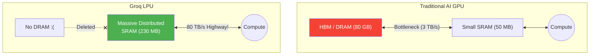

# The Groq LPU & The Future of Inference

> **Learning Objectives**
> - Recall the fundamental limits of HBM and GPU memory bandwidth in LLM inference.
> - Understand how the Groq LPU entirely removes DRAM from the equation by utilizing massive distributed SRAM.
> - Define execution determinism and how compilers can bypass hardware dynamic scheduling.

---

## 1. The GPU Dilemma (Again)

We have learned that generating text (Autoregressive LLM Inference) is fundamentally memory-bound.

To generate a single token on a GPU:
1. The GPU must fetch billions of weight parameters from the slow HBM (DRAM) into the fast SRAM.
2. The GPU must fetch the history of the conversation (the KV cache) from the slow HBM into the fast SRAM.
3. The massively powerful GPU computes the matrix multiplication in almost zero time.
4. The GPU goes back to wait for the next token's data to arrive from HBM.

Nvidia H100 GPUs are mathematical juggernauts, capable of nearly 1 PetaFLOP ($10^{15}$ operations). Yet, when running a batch-size of 1 for a ChatGPT user, the GPU sits idle 95% of the time waiting for weights to travel across the memory bus.

---

## 2. Enter the LPU (Language Processing Unit)

In 2024, a company named Groq gained massive attention by generating LLM text at an astounding ~500 to 1000 tokens per second (approx. 10x faster than standard cloud GPUs). 

They achieved this with a custom architecture called the **LPU (Language Processing Unit)**.

### The Bold Move: Delete the DRAM
Groq engineers looked at the memory wall and made a radical design decision: **Eliminate DRAM completely.** 

A single Groq LPU chip contains exactly $0 \text{ Gigabytes}$ of High-Bandwidth Memory (HBM). 
Instead, the entire chip is paved with an enormous $230 \text{ Megabytes}$ of ultra-fast on-chip SRAM.

**The Physics:**
- Moving data from HBM to an ALU takes ~hundreds of clock cycles.
- Moving data from local SRAM to an ALU takes ~$1$ clock cycle.
- The memory bandwidth of a Groq chip is approximately **80 Terabytes per second (TB/s)**, compared to an Nvidia H100's $3 \text{ TB/s}$.

### The Scale-Out Requirement
Wait, an open-source LLM like LLaMa-3 70B requires $\approx 140 \text{ Gigabytes}$ of memory just to hold the weights. How do you fit $140 \text{ GB}$ of weights onto a chip with only $230 \text{ MB}$ of SRAM?

**You don't. You use 800 chips.**

Groq strings hundreds of LPUs together. Instead of putting all the weights into the cheap DRAM of 4 GPUs, Groq physically distributes the weights across the ultra-fast SRAM of hundreds of LPUs. 
When a token is being generated, it physically flits from chip to chip over optical cables, grabbing the matrix multiplications it needs in microseconds.

---

## 3. High-Determinism Software

Beyond the massive SRAM, the Groq architecture leverages profound **Compiler-Driven Determinism**.

A standard CPU or GPU uses **Hardware Dynamic Scheduling**. The hardware guesses what will be needed next: it preemptively moves memory, predicts branch logic, and resolves cache misses on the fly. This requires complex silicon logic (Branch Predictors, Cache Controllers) that consumes area and power.

The Groq LPU is completely "dumb" at the hardware level. It has no cache controllers and no branch predictors. 
Instead, the compiler analyzes the Neural Network graph *before* it runs and calculates exactly, down to the nanosecond, which piece of data will arrive at which ALU at exactly what cycle. 

**The Silicon Benefit:** 
In a standard GPU, nearly **$20\% - 30\%$ of the silicon area** is dedicated to managing the complexity of dynamic scheduling (figuring out what to do next). By moving this entire burden to the **software compiler**, Groq can reclaim that silicon area to pack in thousands of additional ALUs and more SRAM. 
This is the "Software-Defined Hardware" paradigm: the hardware only exists to execute a perfectly choreographed, pre-scheduled dance of bytes.

---

## 4. The Future of AI Hardware

The progression from CPUs $\rightarrow$ GPUs $\rightarrow$ TPUs $\rightarrow$ LPUs/Neuromorphic chips demonstrates the constant battle against physics.

As we scale toward Artificial General Intelligence (AGI), we are seeing deep divergence in hardware architectures:
1. **Training Accelerators (GPUs/TPUs):** Focused on massive parallel throughput, HBM scaling, and handling exabytes of data.
2. **Inference Accelerators (LPUs):** Focused purely on latency, minimizing the memory wall, and delivering instant deterministic AI generation for consumers.
3. **Edge AI (Neuromorphic/CIM/NPU):** Focused entirely on pulling watts down to milliwatts by co-locating memory, utilizing sparsity, and imitating biology so AI can live on batteries.

---

## Key Takeaways

- Autoregressive LLM generation is severely **Memory-Bound**, causing GPUs with TeraFLOPs of compute to idle while waiting for HBM.
- The **Groq LPU** bypasses this by eliminating DRAM entirely and building massive arrays of localized **SRAM**.
- This requires deploying hundreds of interconnected chips to hold a single large model entirely in SRAM, trading massive upfront cluster hardware costs for unparalleled single-batch inference speed.
- **Determinism**, mapping the exact data movement in software *before* execution, eliminates the need for hardware-level schedulers, streamlining silicon efficiency.

---

## Practice Problems

### Problem 1: Time to Token

> **Context**: An LLM token generation cycle requires $100 \text{ GB}$ of weights to be touched exactly once to perform matrix multiplication. The ALUs on both chips are infinitely fast ($0 \text{ ms}$ processing time). Memory Bandwidth is the only limit.
>
> **GPU constraints**: Reads the $100 \text{ GB}$ of weights from HBM. The bandwidth is $3.0 \text{ TB/s}$.
> **LPU Cluster constraints**: Reads the $100 \text{ GB}$ from distributed SRAM. The bandwidth is $80 \text{ TB/s}$.
>
> **Task**: Calculate the memory-bound latency to generate ONE single token on both architectures. Translate your answer to "Tokens per second".

<b>Solution</b>

**A: The GPU Calculation**
- Fetching $100 \text{ GB}$ at $3.0 \text{ TB/s}$.
- $100 \text{ GB} = 0.1 \text{ TB}$.
- Time = $0.1 / 3.0 = \mathbf{0.0333 \text{ seconds (33 ms) per token.}}$
- Speed = $1 / 0.0333 = \mathbf{30 \text{ Tokens / second.}}$

**B: The LPU Calculation**
- Fetching $100 \text{ GB}$ at $80.0 \text{ TB/s}$.
- Time = $0.1 / 80.0 = \mathbf{0.00125 \text{ seconds (1.25 ms) per token.}}$
- Speed = $1 / 0.00125 = \mathbf{800 \text{ Tokens / second.}}$

*Because generation cannot proceed until the weights cross the memory physical bus, the LPU's shift to SRAM allows it to type words out $26\times$ faster than the standard GPU.*

---

[← Previous Chapter: Vision Transformers](04_vision_transformers_vit.md) | **[Return to Curriculum Root](../README.md)**
